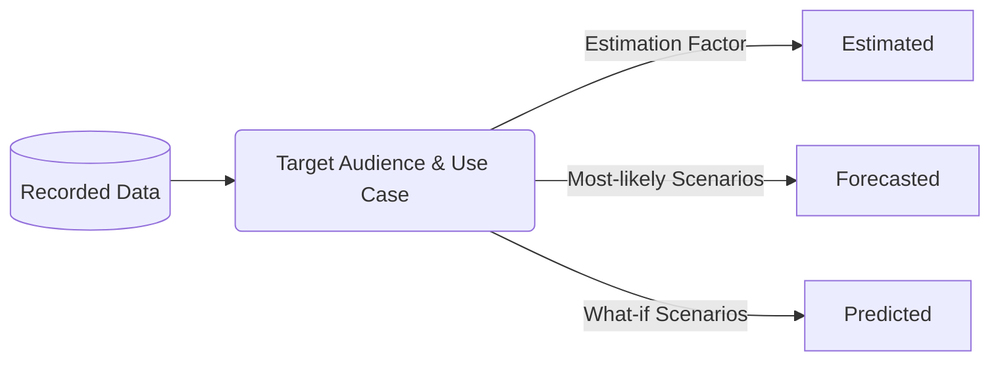

## On this page
{:.no_toc .hidden-md .hidden-lg}

- TOC
{:toc .toc-list-icons .hidden-md .hidden-lg}

---

## Overall Look and Feel

`coming soon`

### Choosing the Right Chart

#### Pie charts

Try to avoid using pie charts and use bar charts instead. The human eye is not well suited to easily grasp the difference in the sizes of the slices of the pie chart, a problem aplified with every added slice over two. If you must use pie charts, reserve them only for use cases where only two dimensional values need to be represented (although even there bar charts may be preferable).

For an in-depth explanation of the limitations of pie charts, please read Stephen Few's excellent [article](https://www.perceptualedge.com/articles/visual_business_intelligence/save_the_pies_for_dessert.pdf).

## Colors, Labels, and Data Values

### Standard Color Pallete

`coming soon`

### Rounding

To round or not to round? Know your audience. Present numbers suitable for your target audience and analysis use cases.
- Executive-level charts do not normally require multiple digits of precision and rounding to the nearest ten, hundred, or thousand is sufficient.
- Depending on the chart, 1 or 2 significant digits on percentages may be required for totals to equal 100%.
- In general except for currency, numbers should be displayed in their full form.

### Currency

- All currency is presented in USD.
- At $10,000 and above, each `000` is replaced with a k; example $10k instead of $10,000.
- At $1,000,000 and above, each `000,000` is replaced with a m; example $10m instead of $10,000,000.

For any numeric values of a 1000 million or more, be mindful of international differences in the [definition of billion](https://pages.ucsd.edu/~dkjordan/cgi-bin/moreabout.pl?tyimuh=bignum).

### Data and Time 

Fiscal Dates should be extracted from the DIM_DATE dimension table.

Date formats must adhere to the [GitLab Writing Style Guidelines](https://about.gitlab.com/handbook/communication/#writing-style-guidelines):
- Dates are yyyy-mm-dd
- Time is presented as a 24 hour clock using UTC
- Fiscal Quarter is Qn, example Q1
- Fiscal Year is FYyy, example FY21. 2021 would denote the calendar year.
- Fiscal Year and Quarter is FYyy-Qn, example FY21-Q2 

### Recorded and Calculated Data

Data is prepared for presentation, or reporting, for a specific target audience and use case. **Recorded Data** is the basis for all **Calculated Data**.

- **Recorded Data** - "Factual" data which originates from a verifiable source and observable events. To aid in verification, recorded data commonly includes audit metadata such as the name of data creator/source, the date and time of data capture, and the location where the event occurred.
- **Estimated Data** - calculated data based on Recorded data plus an Estimation Factor. The Estimation Factor is typically based on historical data trends over a meaningful and relevant period of time. [Estimation](https://en.wikipedia.org/wiki/Estimation) is widely used across all industries and domains.
- **Forecasted Data** - calculated data based on historical Recorded data plus assessments based on "most-likely" future scenarios. [Forecasting](https://en.wikipedia.org/wiki/Forecasting) is commonly used in Financial Planning.
- **Predicted Data** - calculated data based on historical Recorded data plus assessments based on "what-if" future scenarios.

#### Presentation

Recorded data does not require special labeling, but Calculated data does. Calculated data should _always_ be:
- clearly labeled, such as in the chart title and legend (E.g. use "Estimated Seats" instead of "Seats")
- clearly identified in the chart elements (E.g. use different line styles when mixing Calculation types on the same chart)
