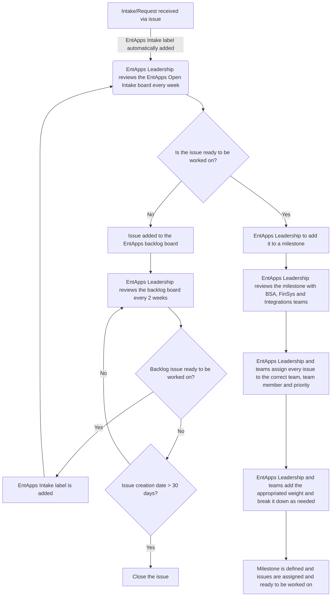

{::options parse_block_html="true" /}

<link rel="stylesheet" type="text/css" href="/stylesheets/biztech.css" />

## On this page
{:.no_toc .hidden-md .hidden-lg}

- TOC
{:toc .hidden-md .hidden-lg}

# <i class="fas fa-users" id="biz-tech-icons"></i> Who We Are

The **Enterprise Applications Team** implements and supports specialized applications that support our business processes within GitLab.

We are directly responsible for all of GitLab's finance systems and Enterprise Applications Integrations.  We build and extend these applications to support the processes of our business partners and rationalize our application landscape to ensure it is optimized for efficiency and spend.

Our team ensures the availability of these applications and integrations through monitoring and alerting. These internal-facing applications include a multitude of different applications and environments, including Zuora, Adaptive Planning, Netsuite, Expensify, etc.  We are also responsible for the IT Audit and Compliance function to ensure we pass SOX Audit for our IT General Controls (ITGC).

Our Enterprise Applications team is made up of a combination of roles to best support the services we offer. Learn more about each by clicking on the tiles:

  <a href="/handbook/business-technology/enterprise-applications/bsa/" class="btn btn-purple-inv" style="width:25%;height:100%;margin:1px;display:flex;justify-content:center;align-items:center;">Business Systems Analysts</a>
  <a href="/handbook/business-technology/enterprise-applications/financeops/" class="btn btn-purple-inv" style="width:25%;height:100%;margin:1px;display:flex;justify-content:center;align-items:center;">Finance Operations</a>
  <a href="/handbook/business-technology/enterprise-applications/integrations/" class="btn btn-purple-inv" style="width:25%;height:100%;margin:1px;display:flex;justify-content:center;align-items:center;">Integrations Engineering</a>

# <i class="fas fa-bullseye" id="biz-tech-icons"></i> Our Vision

- To enable end to end business processes within the enterprise applications that seamlessly hand off to each other and ensure it provides a great user experience to our business partners
- Ensure data integrity between systems  and security of that data
- Constantly iterate to simplify and ensure processes are efficient and automated as much as possible..
- Leveraging out of the box best practices as much as possible. We buying and extend applications where we don't see building them as GitLabs core engineering competency
- IT Audit and Compliance - Ensuring that all customer / business data is secure and can pass key audits for attestations and compliance with SOX, SOC, etc.

# <i class="fas fa-bullhorn" id="biz-tech-icons"></i> Services We Offer

### Business Process Improvements
* Being business process first, means that the Enterprise Applications team will firm up requirements, use cases, and process flows as we implement systems, enhance them or deliver fixes.   Learn more [here](https://about.gitlab.com/handbook/business-technology/enterprise-applications/bsa/).

### Application Evaluations & Implementations 
*  We provide templates for vendor evaluations, can help write and review your user stories, and are happy to participate in tool evaluations that integrate with other applications or intersect with multiple departments. Once an application is selected, our team will align with vendor teams to implement Enterprise Applications that are coming on board. We follow a process that ensures we keep multiple groups aligned as we iterate to get the systems up quickly and efficiently. Learn more [here](https://about.gitlab.com/handbook/business-technology/enterprise-applications/bsa/#system-implementations).

### Finance Systems Administration
*  Enterprise Applications supports all of the core finance systems with experienced admins that streamline and enhance current processes, turn on new features, and improve end to end process cycle time.

### Integrations Engineering
* Our integration team manages all of the integrations between Enterprise Applications at GitLab.  Focusing on building out failover, redundant and auditable integrations that are constantly monitored. Learn more [here](https://about.gitlab.com/handbook/business-technology/enterprise-applications/integrations/).

### Project Retrospectives
* We can host your project retrospective. Please open an issue in the [Business Technology tracker](https://gitlab.com/gitlab-com/business-technology/business-technology/-/issues/new)

### Architectural Troubleshooting

* We have high level views of the enterprise application ecosystem and can help troubleshoot where a business process has broken down or a system flow is not working as expected. You can open an issue in the [Business Technology Tracker](https://gitlab.com/gitlab-com/business-technology/business-technology/-/issues/new).

# <i class="fas fa-building" id="biz-tech-icons"></i> Results We Delivered in FY22

### New Application Implementations
- [Zuora Revenue Implementation](https://gitlab.com/groups/gitlab-com/business-technology/-/epics/76)
- [Adaptive Insights Implementation](https://gitlab.com/gitlab-com/business-technology/enterprise-apps/financeops/finance-systems/-/wikis/2.-Adaptive-Insights)
- [Coupa P2P Implementation](https://gitlab.com/groups/gitlab-com/business-technology/enterprise-apps/-/epics/168)
- [DocuSign Implementation](https://gitlab.com/groups/gitlab-com/business-technology/-/epics/215)

### Other Initiatives
- [Zuora CPQ & 360 upgrade to latest version](https://gitlab.com/groups/gitlab-com/business-technology/enterprise-apps/-/epics/75)

# <i class="fas fa-file-alt" id="biz-tech-icons"></i>  Templates We Use
*  [Rollout Plan](https://gitlab.com/gitlab-com/www-gitlab-com/issues/new?issuable_template=public-rollout-plan)
*  [Change Management: Third Party Applications Changes](https://gitlab.com/gitlab-com/business-technology/change-management/issues/new?issuable_template=Third%20Party%20Change%20Management)
*  [Change Management: Internal Tool Changes](https://gitlab.com/gitlab-com/business-technology/change-management/issues/new?issuable_template=Internal_Change_Management)

# <i class="fas fa-database" id="biz-tech-icons"></i>  Applications We Own

1. Zuora
1. Z-Revenue (RevPro)
1. Netsuite
1. Coupa
1. Tipalti
1. Expensify
1. Stripe
1. TripActions
1. Avalara
1. CaptivateIQ
1. Workiva
1. FloQast
1. Adaptive Planning
1. Xactly
1. Mavenlink
1. DocuSign

# <i class="fas fa-book" id="biz-tech-icons"></i>  Documentation We Support
- [Enterprise Application guides for internal training](./guides)
- [Tech Stack](/handbook/business-technology/tech-stack-applications/)
- [Change Management](/handbook/business-technology/change-management/)

For process flows, integration diagrams and more, check out our Business Systems Documentation pages:

- [Quote to cash](/handbook/business-technology/enterprise-applications/quote-to-cash)

# <i class="fas fa-tasks" id="biz-tech-icons"></i>  Our Process

## Intake
The first step to engage the Enterprise Applications team is opening an [intake issue](https://gitlab.com/gitlab-com/business-technology/enterprise-apps/intake/-/issues/new?issue%5Bmilestone_id%5D=#) using the “Request” template under the [Enterprise Application Group](https://gitlab.com/gitlab-com/business-technology/enterprise-apps) | [Intake Project](https://gitlab.com/gitlab-com/business-technology/enterprise-apps/intake/-/issues).

Every week, the Enterprise Applications Leadership reviews the [EntApps Intake board](https://gitlab.com/gitlab-com/business-technology/enterprise-apps/intake/-/boards/2798638?label_name%5B%5D=EntApps%20Intake) and there are only 2 possible outputs for the issues on the _Open_ list:

- The issue is ready to be worked on and so it will be added to a milestone.
   - Enterprise Applications Leadership is responsible for removing the label _EntApps Intake_, adding the correct team label (~"BSA", ~"BT Finance System or ~"BT Integrations::Backlog") and appropriated milestone following the [Milestone Planning](/handbook/business-technology/enterprise-applications/#milestone-planning) process.
   - Additional information might be requested in the issue.
- The issue is not ready to be picked up and will be added to the [EntApps Backlog board](https://gitlab.com/groups/gitlab-com/-/boards/4710080?label_name[]=BT%3A%3ABacklog).
   - Enterprise Applications Leadership is responsible for adding the ~"BT::Backlog" label and removing ~"EntApps Intake" as well as adding a justification in the issue as a comment.

## Backlog
The [EntApps Backlog](https://gitlab.com/groups/gitlab-com/-/boards/4710080?label_name[]=BT%3A%3ABacklog) board is used by the EntApps team to review and act on Backlog requests. The Enterprise Applications Leadership reviews the board every 2 weeks, before a new milestone starts.

The EntApps Backlog board has 2 lists:
- The `BT Backlog` list is dedicated to issues that are **not yet ready** to start.
   - When a backlog issue is ready to be worked on, Enterprise Applications Leadership will remove the ~"BT::Backlog" label and add the ~"EntApps Intake" so it will be included in the weekly review of the [EntApps Intake](https://gitlab.com/gitlab-com/business-technology/enterprise-apps/intake/-/boards/2798638?label_name%5B%5D=EntApps%20Intake) board.
- The `Closed` list works as a history of all the issues that did not progress and so were closed.
   - It is the responsibility of the requestor to be clear on what the scope of their issue is. Issues that are in the backlog for 30 days without engagement from the requestor will be closed. If the issue needs to be picked back up, the requestor must re-open it and manually add the ~"EntApps Intake" label.
   - If the issue is in the backlog because it is blocked, the ~"BT::Blocked" label must be added to keep the issue open for longer than 30 days.

Both [EntApps Intake](https://gitlab.com/gitlab-com/business-technology/enterprise-apps/intake/-/boards/2798638?label_name%5B%5D=EntApps%20Intake) and [EntApps Backlog](https://gitlab.com/groups/gitlab-com/-/boards/4710080?label_name[]=BT%3A%3ABacklog) boards are at gitlab.com level so that issues created in other team's projects can appear on the board.
The _~"EntApps Intake"_ label is not limited to the Intake project, it can be used in different issues across all gitlab.com.
{: .alert .alert-warning}

## Milestone Planning

EntApps milestones run for 2 weeks from Wednesday-Tuesday to avoid pushing changes over the weekend. This is also in line with the [Business Technology blocked periods](https://about.gitlab.com/handbook/business-technology/change-management/#procedure) and the GitLab calendar.

Every Tuesday, Enterprise Applications Leadership is responsible for:
- Reviewing the [EntApps Intake board](https://gitlab.com/gitlab-com/business-technology/enterprise-apps/intake/-/boards/2798638?label_name%5B%5D=EntApps%20Intake) and:
   - Add a milestone to every intake issue that is ready to be worked on.
      - The [Enterprise Applications Portfolio Management tracker](https://docs.google.com/spreadsheets/d/1_GLer7B_2egKnJH5tcZ5ZxGQtyPcZeOrLRhk7SvqMrQ/edit#gid=613831191) and the [Project Weights](/handbook/business-technology/enterprise-applications/#project-weights) will be used to help understand the team capacity.
- Reviewing the current milestone dashboard to monitor issues and re-prioritize / update milestones as needed.

#### Considerations
Once the Enterprise Applications Leadership creates the first version of an upcoming milestone, before the milestone begins, input from BSA, FinSys and Integrations team members is required (sync or async) in order to:
1. Assign every issue to the correct team and team member.
2. Add an [issue weight](/handbook/business-technology/enterprise-applications/#issue-weights). The goal is to go over the problem statement raised in the issue with the team that will be working on it and put it into one of 5 buckets: XS, S, M, L, XL as a way to group the unit of work.
   - The issue can be broken down into smaller issues (less weights) as needed. 
2. Add the appropriated [priority label](/handbook/business-technology/enterprise-applications/#issue-labels) to every issue in the milestone.

#### Prioritization

EntApps milestones run for 2 weeks meaning that a request that comes when a milestone is already ongoing, will be placed in the queue and follow the [Intake process](/handbook/business-technology/enterprise-applications/#intake). If your request is urgent, please open an [intake issue](https://gitlab.com/gitlab-com/business-technology/enterprise-apps/intake/-/issues) and tag @awestbrook and @broncato in a comment. Enterprise Applications Leadership will work with the requestor to prioritize it and place it in the appropriated milestone.
{: .alert .alert-warning}

### Milestone Expectations
For issues that are added to a milestone with [8+ points/weights](/handbook/business-technology/enterprise-applications/#issue-weights), the expectation is that by the end of the 2 weeks milestone, the problem statement has been defined but a solution might require extra investigation in order to be identified and implemented. Surprises are expected, different teams might have to be involved and so the issue will be carried over to the following milestone. 

### Milestone Schedule (Q3 and Q4 FY23)
- [1 - EntApps - 2022-09-07](https://gitlab.com/groups/gitlab-com/-/milestones/794#tab-issues) (to 2022-09-20)
- [2 - EntApps - 2022-09-21](https://gitlab.com/groups/gitlab-com/-/milestones/795#tab-issues) (to 2022-10-04)
- [3 - EntApps - 2022-10-05](https://gitlab.com/groups/gitlab-com/-/milestones/811#tab-issues) (to 2022-10-18)
- [4 - EntApps - 2022-10-19](https://gitlab.com/groups/gitlab-com/-/milestones/812#tab-issues) (to 2022-11-01)
- [5 - EntApps - 2022-11-02](https://gitlab.com/groups/gitlab-com/-/milestones/813#tab-issues) (to 2022-11-15)
- [6 - EntApps - 2022-11-16](https://gitlab.com/groups/gitlab-com/-/milestones/814#tab-issues) (to 2022-11-29)
- [7 - EntApps - 2022-11-30](https://gitlab.com/groups/gitlab-com/-/milestones/815#tab-issues) (to 2022-12-13)
- [8 - EntApps - 2022-12-14](https://gitlab.com/groups/gitlab-com/-/milestones/816#tab-issues) (to 2022-12-27)
- [9 - EntApps - 2022-12-28](https://gitlab.com/groups/gitlab-com/-/milestones/817#tab-issues) (to 2023-01-10)
- [10 - EntApps - 2023-01-11](https://gitlab.com/groups/gitlab-com/-/milestones/818#tab-issues) (to 2023-01-24)
- [11 - EntApps - 2023-01-25](https://gitlab.com/groups/gitlab-com/-/milestones/819#tab-issues) (to 2023-02-07)

### Issue Weights
Issue weight is an estimate of how much time is required to complete the request from an issue, using the [Fibonacci Sequence](https://www.techtarget.com/whatis/definition/Fibonacci-sequence). 

| Size | Dedicated Person Time | Weight (issue points) | Description / Examples |
| ------ | ------ | ------ | ------ |
| XS | 4 hours / Half Day | 1 | A task. The simplest possible change. We are confident there will be no side effects, and interaction with stakeholders is minimal.    **Example:**  - Update existing handbook page/documentation.   - Deprecation of an [unused Hosted Payment Page](https://gitlab.com/gitlab-com/business-technology/enterprise-apps/financeops/finance-systems/-/issues/515) in Zuora. |
| S | 1 Day | 2-3 | The problem statement has been determined and a solution identified. No need for (extra) discussion with other teams.   **Example:**  - Modification of [Reason Codes](https://gitlab.com/gitlab-com/business-technology/enterprise-apps/financeops/finance-systems/-/issues/768) in Zuora.  - [Update CSS](https://gitlab.com/gitlab-com/business-technology/enterprise-apps/financeops/finance-systems/-/issues/738) for Zuora Hosted Payment Page (affects self-service, requires testing and interfacing with engineering department). |
| M | 1 Week | 5 | The problem statement has been defined with understood requirements. Extra investigation is required but the expectation is that once a solution is identified, it should be relatively easy to implement.   **Example:**  - Most system bugs or performance issues.  - [Stripe Account for Boundless / BigCommerce](https://gitlab.com/gitlab-com/business-technology/enterprise-apps/financeops/finance-systems/-/issues/725)|
| L | 2-3 Weeks | 8 | The problem statement has been defined but a solution will require extra investigation in order to be identified and implemented. Surprises are expected, different teams will have to be involved. Significant investigation will be required and once the problem is found, a solution may not be straightforward.   **Example:**   - Bugs or system workflows that negatively impact the work of other people.  - [Stripe V2 Implementation](https://gitlab.com/gitlab-com/business-technology/enterprise-apps/financeops/finance-systems/-/issues/462) |
| XL | > 4 weeks | 13 | The problem statement has been defined but it's a significant change that has dependencies and the requirements are probably not fully understood or known. It's unlikely we would resolve this in just one issue and the preference would be to further clarify requirements and/or break into smaller issues.    **Example:**  - A new system or module implementation.  - [E-Disty Epic](https://gitlab.com/groups/gitlab-com/business-technology/enterprise-apps/financeops/-/epics/16), which involves multiple changes, and has been broken down into smaller issues. |

### Project Weights
Following an activity-based estimate, beginning with the requirements of the project and the size of the application and then, based on this information, defining the required tasks, which will serve to identify the overall effort that will be required.

#### Business Systems Analysts Activities

| Stage | Tasks |
| ------ | ------ |
| 0 - Intake | Confirm the project scope, initiate project activities and establish project management processes and controls. |
| 1 - Define | Ensure project goals, plan, timeline, milestones, deliverables, resources and responsibilities are drafted and reviewed. Book and lead meetings as need to ensure project work streams are initiated to align on approach, resources and schedules. |
| 2 - Design | Book workshops/discovery sessions, lead meetings with internal and external participants and provide a summary of the key decisions, actions, and meeting notes. |
| 3 - Build | Assist the technical teams as needed, document all functional and integration configuration according to decisions made during the Define & Design sessions. |
| 4 - Test | Help unblock and keep project on schedule. Assist the project team by ensuring the configuration sufficiently meets the needs of the business based on the criteria identified during Define & Design. |
| 5 - Deploy | Assist the project team with tasks that will facilitate/allow the move into the production environment (go-live checklist, sponsors sign-off, documentation is in place). |
| 6 - Live + Hypercare | Monitor and provide support for the deployed application following the project go-live. |

#### Finance System Admins Activities

| Stage | Tasks |
| ------ | ------ |
| 0 - Intake | Assist the project team validating the project scope. |
| 1 - Define | Join meetings as needed to review the overall project, including a draft of the plan and timelines and discuss all in scope functionality. Provide the necessary information through documentation/workbooks. |
| 2 - Design | Review modifiable business processes, identify potential adjustments, and review data and configuration. |
| 3 - Build | Build the functional and integration configurations in preparation for the Test stage. |
| 4 - Test | Execute the in-scope scenarios, documenting any issues to be researched. |
| 5 - Deploy | Prepare the pre-production environment with signed off configuration and integrations. |
| 6 - Live + Hypercare | Assist end users with any functional or process issues, and work with the project team and SMEs to ensure the new interfaces are operating properly. |

## Issue Labels
Prioritization labels
- High ~"BT-Priority::1"
   - For Incidents:
      - The damage caused by the Incident increases rapidly.
      - Several users are affected.
      - A minor Incident that can be prevented from becoming a major Incident by acting immediately.
   - For Projects:
      - The project is business critical and has a due date linked to a legal/security/compliance due date.
- Medium ~"BT-Priority::2"
   - For Incidents:
      - The damage caused by the Incident increases considerably over time.
      - A single user is affected.
   - For Projects:
      - The project is linked to an OKR in the current or upcoming quarter
- Low ~"BT-Priority::3"
   - For Incidents:
      - The damage caused by the Incident only marginally increases over time.
      - Work that cannot be completed by team member is not time sensitive.
   - For Projects:
      - The project can be completed in our spare time and can be paused for higher priority work

Every issue will have a scope tracking tag showing the current status:
- ~"BT::Backlog" - Unless a due date is indicated or urgency specified, non-access related issues will go into the backlog and prioritized bi-weekly
- ~"BT::To Do" - Team will look at the issue within a week of submitting
- ~"BT::In Progress" - Team is currently actively working on scoping out and gathering requirements
- ~"BT::Done" - Completed

We also use labels to identify the responsible group within Enterprise Applications:
- ~"BSA" - Business Systems Analysts issue
- ~"BT Finance Systems" - Finance Admin issue
- ~"BT Integrations::Kanban" - Integrations Team issue

# <i class="fas fa-headset" id="biz-tech-icons"></i> Contact Us
### Slack Channels
- `#enterprise-apps`
- `#business-technology`
- `#bt-finance-operations`
- `#financesystems_help`
- `#bt-integrations`
