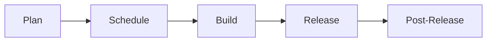

## On this page
{:.no_toc .hidden-md .hidden-lg}

- TOC
{:toc .hidden-md .hidden-lg}

## Discussions

Discussions are documented [separately](https://docs.google.com/document/d/18vGk6dQs7L0oGQOb_bNiFa5JhwLq5WBS7oNxQy09ml8/edit#heading=h.p295wb40mdh4).

## Planning

### Kanban

We work in a continuous Kanban manner while still aligning with Milestones.

Epics and issues have the following lifecycle:

Three boards are used to monitor this process
- [Plan](https://gitlab.com/groups/gitlab-org/-/boards/1181258)
- [Schedule](https://gitlab.com/groups/gitlab-org/-/boards/981066)
- [Build](https://gitlab.com/groups/gitlab-org/-/boards/1181257)

#### Plan

We use the [Kanban Plan board](https://gitlab.com/groups/gitlab-org/-/boards/1181258)
to triage issues that are not yet planned for a milestone. Issues in this board are labelled "geo::planning".

The Product Manager(PM) owns this board and uses it to advance issues through to becoming feasible Epics. When work leaves this
board, it is in a fit state for the engineering team to implement the issue.

In this stage, the PM establishes new work that they would like to see in the Geo feature. The planning process is as follows:

##### Problem validation

The PM tries to establish that the issue describes a problem with the Geo feature that is customer-relevant (internal and external),
or has some other clear merit (e.g. a technical improvement in the backend). The PM will draw on other group members, customers and the UX organisation where necessary.
If the problem is validated, the issue is moved forward to the next stage, otherwise it is closed with a short explanation on *why* the problem will not be considered. This explanation should also contain
a link [to the category strategy](/handbook/product/product-processes/#category-direction).

##### Solution validation

Once the problem is validated, the PM will consider creating an Epic if [the scope of the solution is large enough](/handbook/product/product-processes/#epics-for-a-single-iteration).
They will then reach out to the Engineering Manager(EM) for a technical contact in the team. The EM assigns [ownership](#epic-ownership) to an engineer. The engineer will work with the PM
to determine a technical solution for the problem.

Occasionally, a proof-of-concept (POC) is necessary to determine a feasible technical path. When one is required, the PM
will create a POC issue that contains the context of the research to be conducted along with the goals of the POC. This
issue will be scheduled for work before any further breakdown of tasks is performed.

POC issues are also time-boxed with a due date applied to these items and should be labeled ~"POC". On the due date, the engineer is expected to
provide a comment on the issue regarding the outcome of the POC. Time-boxing these issues is meant to constrain the
scope of the work.

It is also important to note that not all POCs will be successful, and that is OK! Some avenues of research may not be
successful, and the POC will have saved us from investing significant time in a solution that will not meet our needs. The goal is to fail fast!

The PM and the engineer will work together to create all of the issues required to build the solution. This includes
- documentation issues
- testing that is broader than the scope of individual issues
- post-release items such as rake tasks, migrations or monitoring issues

Ideally, epics and issues should be broken down by external functionality rather than by implementation details. There will be exceptions such as refactors and performance improvements.

Post-release tasks that need to be performed by SRE's are created in the Infrastructure team project and cannot be
added to Epics as related issues. For these, it's useful to list them in the Epic description.

When they are satisfied that they have a reasonable solution with all issues weighted, they will send the Epic link out
for discussion and feedback. Planning is transparent anyway, but this serves to notify the team that the Epic is ready
for development.

Issues are then given the "geo::scheduling" label.

This signifies that from both a product and engineering point of view, this issue is prepared and ready to be built as
soon as there is space in the schedule.

#### Schedule
We use the [Kanban Scheduling board](https://gitlab.com/groups/gitlab-org/-/boards/981066?&label_name[]=geo%3A%3Ascheduling) for this phase.

Once per week, the PM and EM will meet to discuss the work that is currently active, and queue prepared items for development.

In this meeting, prepared items will be given the label "geo::active", which will pull items into the Build board.

This meeting is recorded and open for anyone to join. Attendance for the Geo Team is optional as it is recorded. We will
also try to move the time of the meeting around to suit epic owners when their epics are due to be scheduled.

The agenda for the meeting is:

1. What is active now?
1. What needs to be active next?
1. Are there any deliverables?
1. Is the active list in priority order?
1. Bugs list
1. Technical debt items arising

#### Build

We use the [Kanban Build board](https://gitlab.com/groups/gitlab-org/-/boards/1181257)
to look at issues that have the `geo::active` label in combination with the `group::geo` label.

The Engineering Manager(EM) owns this board and uses it to facilitate building out the Epics and issues that the team have decided
are ready for development.

Issues are added in the "ready for development" column in priority order. When an engineer is open, they can pick
unassigned issues from the top of this list. As their work progresses, they advance the issue through the "in dev" and
"in review" columns. Engineers need to keep the issues aligned with the status of the corresponding merge requests.

When an issue is "in review", the MR should be assigned to both the original engineer and the reviewer so that it is
clear that the merge request has an active reviewer. This helps the EM to see how much work is allocated to each person.

The column for "verification" is where the owner of the Epic, or the PM will ensure that the issue fits into the context
of the solution. This is also where we confirm if a release note is required for this issue, and assign the correct
milestone.

#### Release and Post-Release

For some issues, there are tasks that need to be performed by SRE's after the release is completed. Because these tasks
are often in the infrastructure project, they cannot be added to Epics. We still need to track these and follow them
through to completion.

Finally, we ensure that any communication that needs to go out for this issue is delivered. These can take the form of
release posts, blog posts, video tutorials, or demos.

### Epic Ownership

The Geo team uses epics to describe features or capabilities that will increase the maturity of the Geo categories over time.

Each Epic should be owned by an engineer who is responsible for all technical aspects of that Epic. If at any point, the
owner needs to take leave that is more than a few days, they should assign another engineer to act as owner until they return.

**In the planning phase**, the engineering owner will work closely with the Product Manager to understand what the requirements
are and why they are important to customers. The engineer will decide on how best to deliver the solution and create issues
that encapsulate the technical work required. They may need to consult with other team members and stable counterparts
to come up with the right approach to delivering the requirements.

They should include issues for documentation changes and additional testing requirements that are required. There should
be an issue created to inform Geo experts in the Support group about the change if needed. The engineer
should also consider if there is any technical debt that is appropriate to address at the same time. Issues are also
needed for any rollout or post-release tasks.

Each issue needs to be weighted and contain enough information for any other engineer on the team to be able
to pick up that work.

When they are satisfied that all of the issues are created, and ready for development, they (with the PM) should present
this information to the team for feedback. Preparation is still transparent and open to feedback at any point, this step
is just a way to tell the team that the Epic is ready to be built and confirm that everyone is aware of what needs to be done.

**For the duration of building the epic**, the engineer does not need to be the only person implementing the issues.
They should keep watch of the work that is done on the issues so that they can verify that the work is progressing correctly.
Ideally, they should also be an approver on each MR for the Epic. If there are problems with the work, or lengthy delays,
they need to make sure the Product Manager and Engineering Manager are aware.

**When work is nearing completion**, the engineer should check the release note and work with the PM on any changes.
They should also make sure that any additional issues that may have come up during the build process are either
addressed, or scheduled for work. This will help to make sure that we do not build up technical debt while building.

**Finally**, they should also monitor any work that needs to occur while rolling out the Epic in production. If there are
rake tasks, database migrations, or other tasks that need to be run, they need to see those through to being
run on the production systems with the help of the Site Reliability counterpart. They may also need to assist the
Product Manager with creating the release note for the Epic.

This places a lot of responsibility with the owner, but the PM and EM are always there to support them. This ownership
removes bottlenecks and situations where only the PM or EM is able to advance an idea. In addition, the best people
to decide on how to implement an issue are often the people who will actually perform the work.

The responsibility of the Product Manager is to make sure that there is enough information for the engineer to develop the
correct solution that meets the requirements. They are also available to answer clarifying questions or consider how to
approach edge cases. At the end of an epic they also communicate this out to customers and other interested parties.

The Engineering Manager is responsible for clearing the path. They need to make sure the engineers performing the work
have the access to the right information, people, tools, and other resources to get the work done. They try to foresee
problems and clear any blockers that may arise while the work is in progress.

### Addressing new issues quickly

When new issues arise (through testing, customer support issues, or other means) we still want to be able to address them
quickly without being delayed by process.
If you think a new issue needs to be worked on immediately:

1. Make sure there is enough detail on the ticket for someone else to understand the issue and for someone else to have
enough context to review your work
1. Make sure there is a weight
1. Assign it into the current milestone
1. Add the `workflow::STATUS`, `geo::active` `group::geo` and the `unplanned` label
1. Assign it to yourself

### Weights

We use the weights from the set [1, 2, 3, 4, 5, 10] where the value represents a "best work day". A "best work day" means
a day where there are no interruptions, emails or other demands on your time.
For example, if an issue is assigned a weight of 5 then an engineer should be able to complete the work in 5 days if
this were the only thing that they needed to do for those five days.

If an issue is assigned a weight of 10, then the issue is too big and will need to be broken down further. This usually means promoting the issue to an epic and raising individual issues that have a lower weight.

If any issue is weighted above a 3, we should ask ourselves if it can be further broken down. We should do this even if the issue was already broken out from an even larger issue.

### Bug Triage

Every month, a Geo engineer is assigned to be the DRI for triaging issues labeled as `bug`. A different backend engineer is assigned to triage rotation each month and we schedule monthly shifts 3 to 6 months in advance.

Process summary:
1. Every week, the Engineering Manager assigns the automated triage issue to the triage DRI. The Due Date is set to the Monday of the following week, the DRI is expected to close the issue with the quick update: how many bugs were triaged, if one fixed any themself, and if there are any awaiting feedback.
1. The DRI will examine the issues in the `Bug Section` that do not yet have a [severity](https://about.gitlab.com/handbook/engineering/quality/issue-triage/#severity) applied yet. We have a [bug triage board](https://gitlab.com/groups/gitlab-org/-/boards/1077712) for easier viewing of bugs without [severity](https://about.gitlab.com/handbook/engineering/quality/issue-triage/#severity).
1. For a given issue, the DRI will:
    1. Determine if the bug is easily reproducible. If more information is required, follow up with the issue author. If the issue does not fall under the Geo team's domain, ping the EM of the appropriate team or ask for Quality team's help by mentioning `@gitlab-org/issue-triage` in the comments.
        1. If you are awaiting feedback from an issue author, assign yourself and apply the `awaiting feedback` label.
        1. If the author has not provided feedback at the end of your rotation, re-assign the issue to the next triager. If there is still no reply at the end of the next triager's rotation, that person may close the issue or assign to the EM or PM for further action.
    1. Attempt to reproduce the bug if verification is needed.
    1. Attempt to fix the bug if it meets the following criteria.
        1. A weight less than 2, regardless of severity.
        1. Severity of 1 or 2.
    1. If the bug requires further investigation or implementing the fix will require significant effort, the DRI should:
        1. Determine whether a workaround for the issue exists and document it.
        1. Apply a [severity](https://about.gitlab.com/handbook/engineering/quality/issue-triage/#severity) label based on the impact of the bug and feasibility of any workarounds.
        1. Apply the `workflow::scheduling` label so that the PM and EM can decide whether to schedule the issue or put in the `Backlog`.
1. At the end of the month, the triage DRI will schedule a hand off meeting with the next triage DRI to cover any ongoing issues and any strategies for dealing with the backlog of issues.

Expectations:
- The DRI should spend 3-5 hours per week on triage/verification and a maximum of 20% work time (about 1 day per week) on resolving bugs.
- If the DRI is unable to perform triage responsibilities due to PTO, they are expected to find a backup or notify the EM to find a backup.

#### Bug Triage Schedule

| Month     | Name |
| -------   | ---- |
| **2022**  |      |
| October   | [`@dbalexandre`](https://gitlab.com/dbalexandre) |
| September | [`@brodock`](https://gitlab.com/brodock) |
| August    | [`@jbobadilla-ext`](https://gitlab.com/jbobadilla-ext) |
| July      | [`@cat`](https://gitlab.com/cat) |
| June      | [`@dbalexandre`](https://gitlab.com/dbalexandre) |
| May       | [`@mkozono`](https://gitlab.com/mkozono) |
| April     | @ibaum |
| March     | @cat |
| February  | @dbalexandre |
| January   | @mkozono |
| **2021**  |      |
| December  | @dbalexandre |
| November  | @vsizov |
| October   | @ibaum |
| September | @aakriti.gupta |
| August    | @vsizov |
| July      | @mkozono |
| June      | @dbalexandre |
| May       | @mkozono |
| April     | @dbalexandre |
| March     | @mkozono |
| February  | @alexives |

## Retrospectives

Retrospectives are a [crucial component](https://www.retrium.com/blog/i-was-wrong-retrospectives-are-not-the-most-critical-part-of-agile-but-they-are-close) of the agile methodology. However, having a retro should not be about checking-off a mark in our agile todo list. The purpose of the retro is to learn and then take action that leads to a better place. We learn from our past actions and results and we use that knowledge to improve our future execution. 

At GitLab there is a general guideline to conduct [group retrospectives](/handbook/engineering/management/group-retrospectives/) and a process automation to run retrospectives [asynchronously](https://gitlab.com/gitlab-org/async-retrospectives). The Geo team however is working with a new process that combines elements of asynchronous work with the benefits of synchronous conversation and the increased level of engagement that these types of interactions bring.

The details of this process is documented in our [Geo Team Retrospectives](./retrospectives.html) page. 

## FAQ

### What work should I pick up next?

"Pull from the right". That means, start at the right hand side of the build board, and move towards the left.

In order, that means:
- Can you help anyone with reviews?
- Can you unblock anyone in development?
- Pick from the top of the "ready for development" column on the [Kanban Build board](https://gitlab.com/groups/gitlab-org/-/boards/1181257?milestone_title=%23started&&label_name[]=Geo).
