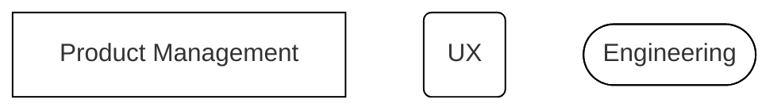

# On this page
{:.no_toc .hidden-md .hidden-lg}

- TOC
{:toc .hidden-md .hidden-lg}

## Product Development Flow Diagram

This flow is a visual representation of the [Product Development
Flow](/handbook/product-development-flow/#validation-phase-1-validation-backlog)
handbook page. It does not include many of the detailed steps and interactions occurring within
phases nor the transitions of various workflows labels. It's also worth noting that, while Product
Management, UX and Engineering have ownership of some phases, all teams work collaboratively
throughout the entire process.

**Legend**

Box colours represent the type of issue:

Box shapes represents whose responsibility it is to get it done:

And issue labels look like this:

### Validation

#### Validation Backlog

#### Problem Validation

#### Design

We use Epics to contain all issues related to a Solution so that when an Epic is closed, it
indicates the Solution is live and available. Key points about Epics:

1. A Feature Epic always exists. At the early stage of Design we can't tell whether a solution will
   need multiple iterations to deliver, so we err on the side of caution and always create an Epic.
1. The Epic always has a "Design Issue", even if design artefacts are not needed. This is so we have
   an issue where we can discuss requirements that will then be copied to the Epic once agreed.
1. Once an Epic enters the [Develop](#develop--test) phase, we do not increase its scope. Small
   changes to adjust direction due to new information are fine (rule of thumb: up to 10% change).
1. Epics have a Due Date. If your Epic can't have a due date, consider using a Label instead.

#### Solution Validation

### Build

#### Plan

The Feature Epic proceeds to `~"workflow::planning breakdown"` along with the Design Issue. Here,
the Design Issue goes through a final review with Product Management and Engineering before one or
more Implementation Issues are created.

Before moving to the next phase, the Design Issue is closed and the resulting final designs and
requirements are copied to the Feature Epic, which becomes a clear, without distractions,
[SSOT](/handbook/values/#single-source-of-truth) for the solution. The closed Design Issue serves
as a historical record of how we reached decisions.

**Feature Epic**

The Feature Epic serves as an organizational entity as well as single source of overall
requirements from the original problem issue.

The Epic should have enough information to convey the overall intended value realized after all
child Implementation Issues are delivered. Final requirements and design assets, if available, are
copied here from the Design Issue for reference; at this point the Design Issue is closed. The Epic
is closed when all Issues are delivered.

**MVC Feature Epics**
When a Feature Epic and it's associated Design Issue is large enough to break into mulitple MVCs, multiple MVC Feature Epics will be created.

Feature Epics are their own MVCs in that they are independently-releasable slices of value. Each epic contains its own criteria for delivery, including any implementation details and links to relevant design assets for just this MVC.

**Implementation Issues**

Implementation issues allow each Feature Epic to be broken into small, discrete tasks that can move independently through the build workflow steps. 
Whenever possible, Implementation Issues should also be independently-releasable and provide value to the customer. 
When they have to be grouped with other Implementatation Issues, a feature branch should be created to merge the dependant pieces of work together prior to merging into the default branch.  

**Structure of a Singular MVC Feature**

**Structure of a Multiple MVC Feature**

The Engineering Manager is responsible for ensuring these are created, refined and contain
weights; the `~"workflow::scheduling"` label is then applied to indicate to the Product Manager
that an Issue is ready for scheduling by being assigned a Milestone.

Once an Implementation Issue has a weigth and a Milestone, it receives the `~"workflow::ready for
development"` label.

#### Develop & Test

Issues that have the `~"type::feature"` and `~Deliverable` labels require a [Release
Post](/handbook/product/product-processes/#communication#release-posts) to be ready for publishing along with the
corresponding feature. The schedule to create and review a Release Post is naturally challenging
so, to allow Product Managers to work in parallel, Engineering should add a Documentation stub
early in the [draft
MR](https://docs.gitlab.com/ee/user/project/merge_requests/drafts.html) so
that the final hyperlink to the documentation is available well before the end of the iteration.

#### Launch

