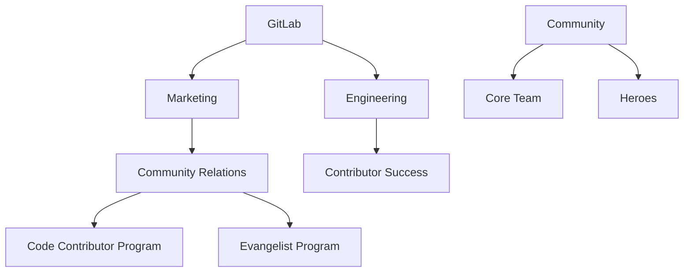

## On this page

{:.no_toc .hidden-md .hidden-lg}

- TOC
{:toc .toc-list-icons .hidden-md .hidden-lg}

{::options parse_block_html="true" /}

- - -

## Community at GitLab

There's several teams across various reporting structures that work on making the GitLab Community great.

## Structure

### Community teams

As part of the Contributor Success team charter, we are also going to setup teams of contributors into community teams. The aim is to have a collective group of contributors that consists of multiple domain expertise (Development, Quality, UX, etc.) and that can work together as a team.
