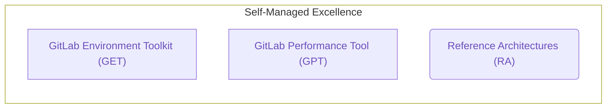

{:.no_toc .hidden-md .hidden-lg}

- TOC
{:toc .hidden-md .hidden-lg}

## Overview

This page provides more detail about Self-Managed Excellence initiatives.

Quality Engineering owns several tools which form a 3-prong trident for Self-Managed Excellence: the [GitLab Environment Toolkit (GET)](https://gitlab.com/gitlab-org/gitlab-environment-toolkit), the [GitLab Performance Tool (GPT)](https://gitlab.com/gitlab-org/quality/performance), and the [Reference Architectures (RA)](https://docs.gitlab.com/ee/administration/reference_architectures/). Together, these tools support our broader strategy of cementing customer confidence and contributing to their ongoing success by ensuring their instances are built to a rigorously tested standard that performs smoothly at scale.

- Expanding GitLab Environment Toolkit (GET), our established provisioning toolkit.
- Expanding GitLab Performance Tool (GPT), our performance testing tool for validation at scale.
- Maturing Reference Architectures (RA), our guidelines for ensuring performant environments.

## GitLab Environment Toolkit

Quality Engineering is currently building and maintaining the [GitLab Environment Toolkit](https://gitlab.com/gitlab-org/gitlab-environment-toolkit) (GET), which is a collection of tools to deploy and operate production GitLab instances based on our [Reference Architectures](https://docs.gitlab.com/ee/administration/reference_architectures/).

### FY23 Direction

In FY23 we're focusing on achieving Viable maturity status for GET in both functional and UX terms. In particular our goals include making the following additions:

- GCP
  - Google Cloud SQL support (including Read Replicas)
  - Google Cloud Load Balancer support
  - GKE Regional Cluster support
  - Dedicated Service Account support
- AWS
  - RDS Read Replica support
  - S3 Lifecycle Support
- OpenSearch support
- Proxy support
- Additional support for more advanced Geo setups such as cross VPC support
- Documentation of Cloud Provider permission requirements
