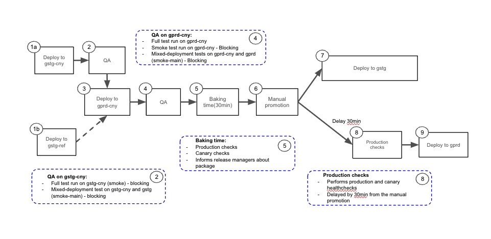
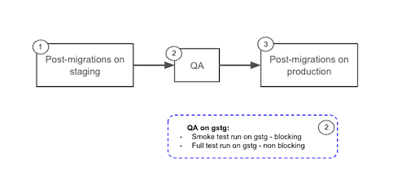

## On this page
{:.no_toc .hidden-md .hidden-lg}

- TOC
{:toc .hidden-md .hidden-lg}

## Resources

| Description        | Location            |
|--------------------|---------------------|
| Release orchestration | [Link](https://gitlab.com/gitlab-org/release-tools/) |
| Release documentation | [Link](https://gitlab.com/gitlab-org/release/docs) |
| Release related tasks issue tracker | [Link](https://gitlab.com/gitlab-org/release/tasks/) |
| Delivery team issue tracker | [Link](https://gitlab.com/gitlab-com/gl-infra/delivery/issues) |
| Release manager schedule | [Link](https://about.gitlab.com/community/release-managers/) | 
| Maintenance Policy | [Link](https://docs.gitlab.com/ee/policy/maintenance.html) |

## Overview and terminology

* **Monthly self-managed release**: GitLab version (XX.YY.0) [published every month on the 22nd][process-monthly-release]. From this monthly release, [patch][process-patch-release], [non-critical][process-security-release-non-critical], and [critical][process-security-release-critical] security releases are created as needed
* **GitLab.com releases**: [Auto-deploy releases][process-auto-deploy-release] that are deployed from [auto-deploy branches created from master][auto-deploy], on regular intervals

**The main priority** of both types of releases **[is GitLab availability & security](/handbook/engineering/development/principles/#prioritizing-technical-decisions)**
as an application running on both GitLab.com and for customers running GitLab
in their own infrastructure.

With these two types of releases, GitLab Inc. has to balance _at the same time_
the workflows normally found in SaaS companies with the ones found in companies
that publish packaged software.

## GitLab.com deployments

### GitLab.com deployments overview

We follow a Continuous Deployment approach with the goal of deploying as frequently as possible to keep batch sizes small. This means that GitLab.com **lives in the now** with changes tracked using commit SHAs rather than [semver] versioning as used by self-managed installations.

The `self-managed release` is a collection of many successfully deployed `auto-deploy`
releases on GitLab.com. Users on GitLab.com therefore receive features and bug fixes earlier than
users of self-managed installations.

### GitLab.com deployments process

GitLab.com receives updates multiple times a day with new deployment branches currently created at **00:00, 03:00, 06:00, 9:00, 12:00, 15:00 and 19:00 UTC** from Monday through Friday.

* [Source](https://docs.google.com/presentation/d/1YRjA1dYCXNXp06VltDYlik1MdFyzUvaeXKk69mMPcA4/edit?usp=sharing)

Once a new branch is created, only commits that pass the CI tests are eligible for deployments ("green build"). This means that if specs are failing in
[gitlab-org/gitlab], the deployments cannot progress further.

Automated tasks in the [release-tools] project are setup to drive the next steps:

- Twice every hour, a task runs to cherry-pick merge requests labeled with `~"Pick into auto-deploy"` (See [Labels of importance]).
- Twice every hour, a task searches for the latest "green build" in the auto-deploy branch.
  - If it finds a commit that has not been previously deployed, it will start the process of creating a new package.
  - If the commit has already been deployed, the task will not take any actions.

A package is deployed to GitLab.com in the following steps:
1. 1a. When a new package is built, it is automatically deployed to gstg-cny, [the canary stage of staging.gitlab.com](/handbook/engineering/infrastructure/environments/#staging-canary). 1b. In parallel, the same package is deployed to the [Staging-ref environment, gstg-ref](/handbook/engineering/infrastructure/environments/#staging-ref)
2. A set of automated QA end-to-end/integration tests are run. Note that two sets of blocking QA tests are executed, one targeting gstg-cny and the other targeting staging (gstg). This is designed to assist with exposing issues arising in mixed deployment environments, where multiple versions of GitLab components are deployed that share services such as the database
3. After passing, the package is automatically deployed to gprd-cny, [the canary stage of gitlab.com](/handbook/engineering/infrastructure/environments/#production-canary), where [canary testing](/handbook/engineering/#canary-testing) can take place. This means that specific projects (like `gitlab-org/gitlab`) as well as a small amount of end user traffic will be using the new package. 
4. Like with deployment to staging-canary above, two sets of automated QA end-to-end/integration tests are run. One targets the canary stage of production, the other targets the main stage (to ensure the new and old code are still functional).
5. After 30 minutes in the [canary stage of gitlab.com](/handbook/engineering/infrastructure/environments/#production-canary), and provided no new exceptions or alerts are reported, the package is considered to be ready for deployment to [gitlab.com](/handbook/engineering/infrastructure/environments/#production) and [staging.gitlab.com](/handbook/engineering/infrastructure/environments/#staging)
6. The promotion to [gitlab.com](/handbook/engineering/infrastructure/environments/#production) and [staging.gitlab.com](/handbook/engineering/infrastructure/environments/#staging) is triggered manually by the release
managers. Ongoing incidents or Change Requests with the `blocks deployments` label will prevent a deployment from continuing. 
7. Deployment to the staging envionment
8. Production checks are performed to asses the health of the environment. If considered to be healthy the pipeline will automatically continue
9. Deployment to the production environment runs delayed to staging
Each deployment will trigger a notification in the Slack channel [#announcements](https://gitlab.slack.com/archives/C8PKBH3M5).
As part of the deployments, a QA issue is created in [release/tasks] issue tracker to inform the people who are
involved in the process that their change is going through environments

### Post-deploy migration execution

To make GitLab.com packages rollbackable, the [post-deploy migrations] are independent from the GitLab.com deployment process. These migrations
are run in staging and production environments through the post-deploy migration pipeline that is triggered on a daily basis at the discretion of
the release managers.

* [Source](https://docs.google.com/presentation/d/1YRjA1dYCXNXp06VltDYlik1MdFyzUvaeXKk69mMPcA4/edit?usp=sharing)

When a release manager executes the post-deploy migration pipeline:

1. Post-deploy migration scripts run on staging
2. QA tests execute against staging
3. Following a successful QA verification, post-deploy migration scripts run on production.

Details of this pipeline can be found in the [post-deploy migration pipeline documentation].

## Self-managed releases

### Self-managed releases overview 
The `self-managed release` is a [semver] versioned package of features that
are already released on GitLab.com through `auto-deploys`.
This means that the official published version of GitLab is a **historical
snapshot** of items that are released to users on GitLab.com. As such,
the `self-managed release` is created from a _backport_ branch named by the
targeted semver version with a stable suffix, eg. `12-3-stable`.

Our [maintenance policy] describes in detail the cadence of our major, minor and patch releases for self-managed users. The major release yearly cadence was defined [after an all stakeholder discussion](https://gitlab.com/gitlab-com/Product/issues/50).

### Self-managed releases process

The `self-managed release` timelines are concentrated around the 22nd. One week
before the release date, the [release managers](https://about.gitlab.com/community/release-managers/) will start preparing for the release by ensuring that the GitLab.com releases are in a consistent state. This means
that a `self-managed release` will only contain code that is successfully running
on GitLab.com at the time the release manager decides to finalise the release.

In the days leading up to the 22nd, the release manager will post announcements in
[#releases], [#development](https://gitlab.slack.com/archives/C02PF508L),
[#backend](https://gitlab.slack.com/archives/C8HG8D9MY), and [#frontend](https://gitlab.slack.com/archives/C0GQHHPGW) update on candidate and guaranteed commits for the release.

Merge Requests that have been included in the monthly release will receive [a label indicating inclusion](https://about.gitlab.com/handbook/engineering/releases/#labels-indicating-inclusion-in-upcoming-self-managed-release).

## Security
The security of the software we ship must be everyone's responsibility as is the quality.  It can be a daunting task to deliver quality software securely.  GitLab has processes in place to help with application and code security reviews through the Security Departments' [Application Security (AppSec) team](/handbook/engineering/security/#application-security).  If you're unsure about the security implications of an addition to a code-base, the AppSec team can be included (`@gitlab-com/gl-security/appsec`) in the review to help.

## Timelines

The only guaranteed date throughout the release cycle is the 22nd. On this date,
the `self-managed release` will be published together with the release announcement.

**All other dates** are **a guideline only** and cannot be considered a deadline
when it comes to what will be included into any type of release. This includes the
[development month] and the dates defined there as well as any promises given to
customers. This is strictly because there are a lot of moving parts to be considered
when preparing a release which includes working on highest priority and severity
issues as well as security related issues.

If it is absolutely necessary to get a certain feature
ready for a specific version, merge the feature early in the development cycle.
Merges closer to the release date are absolutely not guaranteed to be included
in that specific monthly `self-managed release`.
For GitLab.com releases, timelines are different and described below.

### Deployment blockers

Anyone can **halt or block a deployment** by:
* Declaring a [incident](/handbook/engineering/infrastructure/incident-management/#reporting-an-incident)
* Applying the `blocks deployments` label. This prevent automated deployments from starting.
* Alerting the Release Managers in the [#releases] channel. 

In addition, automated deployments to **any production environment** (including [canary]), are
halted during the change lock period. Currently, the change lock period is between every **Friday 23:00 UTC and Monday 06:00 UTC** as well as during any [scheduled Production Change periods](/handbook/engineering/infrastructure/change-management/#production-change-lock-pcl).

During the change lock period, manual deployment can be triggered through GitLab ChatOps if the deployment fixes **a severity::1 availability or security issue**.

Deployments to production will be blocked by the following events:

1. An [active incident with the `blocks deployment` label](/handbook/engineering/infrastructure/incident-management/#labeling).
1. Ongoing [change issues with the `blocks deployment` label](/handbook/engineering/infrastructure/change-management/#change-criticalities).

Release Managers may decide, with input from the [EOC](/handbook/engineering/infrastructure/incident-management/#roles-and-responsibilities) to override a block and continue with the deployment. 

## Labels of importance

For both types of releases, there are a few labels of specific importance.

#### Delivery impact labels

Incidents may optionally have a `Delivery impact:*` label to indicate the impact the incident has when active. This label is intended to help with prioritizing between multiple incidents.  

| **Impact label** | **Definition** |
| ----- | ---------- |
| Delivery impact::1 | Deployments and/or scheduled releases are fully blocked by this incident. Action should be taken to resolve this immediately |
| Delivery impact::2 | Deployments and/or scheduled releases will soon become blocked. Resolve as soon as possible |
| Delivery impact::3 | Deployments and releases are not currently blocked but there is some impact on the delivery process |

### GitLab.com pick label

For code that needs to be deployed to GitLab.com with higher priority than the
regular cadence, we have `~"Pick into auto-deploy"` label. Note that branches are regularly created throughout the day, inclusion in a scheduled deployment does not require this label. 

The automated systems that create a new GitLab.com release will look for this label
specifically, and any merge request with this label and a severity::1/severity::2 severity label will be automatically cherry-picked
into the active auto-deploy branch. In case the merge request cannot be picked,
which can happen if there is a conflict in the files being picked, the message
will be posted in the merge request asking the author to create a new merge request
targeting the currently active release branch.

The label should be only used under the following circumstances, when the merge
request is especially urgent. For example: 

- Resolves or mitigates a severity::1/severity::2 incident
- Resolves a regression that can lead to a severity::1/severity::2 problem
- Urgent performance or availability fix that can improve the stability of
GitLab.com

If this label is added because a merge request is blocking further deploys,
consider leaving a note in [#releases] Slack channel to raise awareness of the status.

**For new features or non-urgent fixes**, the label **should not be used** because
the new release is only days or hours away.

Directions on how to know whether a MR is deployed to GitLab.com are in the [release/docs](https://gitlab.com/gitlab-org/release/docs/blob/master/general%2Fdeploy%2Fauto-deploy.md#auto-deploy-status).

### Self-managed releases

Similar to the above mentioned label, each `self-managed release` has a label
to highlight that a certain merge request should be backported to the targeted
release. For example, releases in the 12.3 series will have `~"Pick into 12.3"`
label which will signal that this merge request should be included in one of the
[next patch releases being created][creating patch release]. The patch releases are created as needed but only according to our [maintenance policy].

The label should be applied in the following situations:

- The backport (stable) branch has been created, the release on the 22nd is not created
and the merge request fixes a critical regression.
- The 22nd has passed and the merge request fixes a bug.

The label should not be applied to merge requests:

- Introducing new features
- Resolving a security vulnerability because process for [security releases](../security/index.html#security-releases) differs
from the regular release

#### Labels indicating inclusion in upcoming Self-managed release

As a merge request is included in monthly self-managed release candidates (RC), it will receive the
`released::candidate` label when the release candidate it is included in is deployed to
[pre.gitlab.com]. See ["What is a release candidate and when are they created?"](#what-is-a-release-candidate-and-when-are-they-created)
for more information on release candidates. This label indicates that the MR will most
likely be included in the upcoming Self-managed release.

A merge request will receive the `released::published` label (which replaces the `released::candidate` label)
when included in a packaged release, such as `13.6.0` or `13.5.2`, and deployed to
[release.gitlab.net] for both automated and manual testing. This label indicates that the
MR will be published with the Self-managed release.

## Frequently Asked Questions

### Who are the release managers for release X?

You can find this out by taking a look at the [GitLab Release
Managers](https://about.gitlab.com/community/release-managers/) schedule.

### What is a release candidate and when are they created?

A release candidate (RC) is a GitLab package that includes the changes that will
make it into the final self-managed release, except for the rare case where a
change may need to be reverted. RCs are only created for the monthly
self-managed release, not patch releases. The amount of RCs created per month
will vary per release.

There is no fixed point in time where a release manager creates a release
candidate. Instead, this is based entirely on how the release process has been
going, what the state is of GitLab.com, etc.

Release candidates are created whenever possible, and as such there are no
guarantees on creation timing. This will depend on factors such as:

* Any incidents on GitLab.com that are or have been going on in the run-up to
  the release.
* Any (critical) [security releases](../security/index.html#security-releases) that require the attention of release
  managers.
* Any issues with our auto-deployment pipelines.
* Other release related work that may delay or prevent the creation of a release
  candidate until said work is dealt with.

In other words, if you want to know when a release candidate is created your
best option is to join one of the following Slack channels:

* [#releases]
* [#f_upcoming_release]

Release candidates are deployed to [pre.gitlab.com] for both automated and
manual testing.

### Will release managers create a release candidate earlier if I ask them to?

It is up to a release manager to decide when to create a release candidate,
taking into account the state of deployments and GitLab.com.

Please do not message a release manager in private about release related
questions or requests. Instead, post your request/question in the [#releases]
channel.

### How can I determine if my merge request will make it into the monthly release?

When we create release candidates, and when we create a new release package,
the [Release Tools project][release-tools] will
[add a label to the merge requests included](#labels-indicating-inclusion-in-upcoming-self-managed-release).

For more information, refer to the [Auto-deploy
status](https://gitlab.com/gitlab-org/release/docs/-/blob/master/general/deploy/auto-deploy.md#auto-deploy-status)
command.

In the runup to the 22nd, release managers will also start announcing
what commit will at the very least make it into the release. Such notifications
are shared in Slack [#releases] channel and will look something like this (format is defined in the [release-tools monthly template](https://gitlab.com/gitlab-org/release-tools/-/blob/master/templates/monthly.md.erb)):

> This is the candidate commit to be released on the 22nd.
https://gitlab.com/gitlab-org/gitlab/commits/4033cb0ed66de77a4b5c1936e33de918edef558e

The last commit to make it into the release will have a message similar to this:

> :mega: Barring any show-stopping issues, this is the final commit to be released on the 22nd.
https://gitlab.com/gitlab-org/gitlab/-/commits/13-1-stable-ee

### When do I need to have my MR merged in order for it to be included into the monthly release?

The earlier in the monthly cycle your MR is merged, the higher the chances are for it to be included in that month's release.

There is no guaranteed "cut-off", "freeze" or any other date defined under which the MR will be included.

Availability, security and performance of GitLab.com is a pre-requisite for any monthly self-managed release.
If GitLab.com is not experiencing any issues, MR's merged as late as the 20th of the month were included in the release.
On the opposite side, when GitLab.com stability was lower, MR's merged as early as 15th of the month were not included.

In other words:

**The quality and stability of what is delivered by everyone defines the final MR that will be included in the monthly release.**

For more detailed answer, see [self-managed release timelines](/handbook/engineering/releases/#self-managed-releases-1).

### When will my merge request be deployed?

We currently create an auto-deployment branch at a [specific
timeline](/handbook/engineering/releases/#gitlabcom-deployments-process). The current Mean Time To Production time and target can be seen on the [Infrastructure performance indicators page](/handbook/engineering/infrastructure/performance-indicators/#mean-time-to-production-mttp).

For a merge request with [the pick label](/handbook/engineering/releases/#gitlabcom-pick-label), the
process is different.

### How can I determine what environment my merge request is currently in?

See [this](https://gitlab.com/gitlab-org/release/docs/-/blob/master/general/deploy/auto-deploy.md#status-of-a-merged-mr-or-a-commit)
guide for more information.

### I found a regression in the QA issue, what do I do next?

If you've found a regression with a potentially high [severity], immediately follow the steps in [Deployment blockers] to halt the deployment.

If a regression is found in a new feature, and only that feature is affected, follow the directions in the QA issue created in the [release/tasks] project for a regular regression.

For high severity bugs found in the lead up to the 22nd of the month please also alert the Release Managers in [#releases].

### What's the process for a release of type X?

The different processes are documented here:

- Self-managed releases:
  - [Monthly releases][process-monthly-release]
  - [Critical security releases][process-security-release-critical]
  - [Non-critical security releases][process-security-release-non-critical]
  - [Patch releases][process-patch-release]
- GitLab.com releases:
  - [Auto-deploy releases][process-auto-deploy-release]
  - [Hot patch]

### A security issue was assigned to me, where should I start?

See the [Security Release process as Developer] documentation for more information.

Also, make sure to see [Security Releases How to video] for a broad explanation about all the steps required as a Developer when working on a security fix.

### Why wasn't my security fix included in the Security Release?

Security issues created on [GitLab Security] need to be associated with the Security Release Tracking issue for them to be included on the Security
Release. Make sure to use the [security issue template] and follow the steps there.

### How many backports do I need when working on a security issue?

Besides the merge request targeting `master`, three backports will be needed targeting the last two monthly releases and the current release. 
For more information, see [security release backports].

### How can I get a high severity bug fix released?

Any high severity issue should start with an issue labelled with the appropriate bug and severity labels. 

Depending on the bug details, follow one of the following processes: 
- For [high severity security bugs][process-security-release-critical] 
- For [high severity bugs affecting self-managed users][process-patch-release]. If the bug has been found close to the 22nd of the month please also alert the Release Managers in [#releases]. 
- For [high severity bugs affecting GitLab.com](/handbook/engineering/releases/#gitlabcom-pick-label)

### How can I revert a security merge request?

Once a security merge request has been merged, it's not advisable to revert it for multiple reasons:

1. Reverting requires rolling back a security fix, compromising the integrity of GitLab.com and self-managed instances
1. Reverting without making another fix into the release risks disclosing the vulnerability to the public when we make the release.
   For high severity vulnerabilities, this is unacceptable
1. Security releases are performed in a restricted time constraint, reverting a security merge request requires another fix to be
   prepared in time to avoid impacting the security release timeframe 

If a security vulnerability introduced a bug, in most cases, the appropriate path forward is to fix the issue in the canonical repository (after the security release has been published).

If a security vulnerability introduced a high severity bug, engage with AppSec and release managers to coordinate next steps. 

### How can I determine if a post-deploy migration has been executed?

See [this](https://gitlab.com/gitlab-org/release/docs/-/blob/master/general/post_deploy_migration/readme.md#how-to-determine-if-a-post-deploy-migration-has-been-executed-on-gitlabcom)
guide for more information.

___________

If you need any additional help please ask the Release Managers in the [#releases] Slack channel.

[semver]: https://semver.org
[canary]: /handbook/engineering#canary-testing
[development month]: /handbook/engineering/workflow/#product-development-timeline
[auto deploy transition]: https://gitlab.com/gitlab-org/release/docs/blob/21cbd409dd5f157fe252f254f3e897f01908abe2/general/deploy/auto-deploy-transition.md#transition
[maintenance policy]: https://docs.gitlab.com/ee/policy/maintenance.html
[gitlab-org/gitlab]: https://gitlab.com/gitlab-org/gitlab
[release-tools]: https://gitlab.com/gitlab-org/release-tools
[release/tasks]: https://gitlab.com/gitlab-org/release/tasks/
[labels of importance]: #labels-of-importance
[creating patch release]: https://youtu.be/lHag9jARbIg
[auto-deploy]: https://www.youtube.com/watch?v=_G-EWRpCAz4
[severity]: /handbook/engineering/quality/issue-triage/#severity
[#releases]: https://gitlab.slack.com/archives/C0XM5UU6B
[#f_upcoming_release]: https://gitlab.slack.com/archives/C0139MAV672
[process-monthly-release]: https://gitlab.com/gitlab-org/release/docs/blob/master/general/monthly/process.md
[process-auto-deploy-release]: https://gitlab.com/gitlab-org/release/docs/blob/master/general/deploy/auto-deploy.md
[process-security-release-critical]: https://gitlab.com/gitlab-org/release/docs/blob/master/general/security/process.md#critical-security-releases
[process-security-release-non-critical]: https://gitlab.com/gitlab-org/release/docs/blob/master/general/security/process.md#non-critical-security-releases
[process-patch-release]: https://gitlab.com/gitlab-org/release/docs/blob/master/general/patch/process.md
[Security Release process as Developer]: https://gitlab.com/gitlab-org/release/docs/-/blob/master/general/security/developer.md
[Security Releases How to video]: https://www.youtube.com/watch?v=ixtUDxM3nWA
[GitLab Security]: https://gitlab.com/gitlab-org/security/
[security issue template]: https://gitlab.com/gitlab-org/security/gitlab/issues/new?issuable_template=Security+developer+workflow
[security release backports]: https://gitlab.com/gitlab-org/release/docs/-/blob/master/general/security/developer.md#backports
[Hot patch]: https://gitlab.com/gitlab-org/release/docs/blob/master/general/deploy/post-deployment-patches.md
[Deployment blockers]: /handbook/engineering/releases/#deployment-blockers
[pre.gitlab.com]: /handbook/engineering/infrastructure/environments/#pre
[release.gitlab.net]: /handbook/engineering/infrastructure/environments/#release
[How to fix a broken stable branch]: https://gitlab.com/gitlab-org/release/docs/-/blob/master/general/how-to-fix-broken-stable-branch.md
[post-deploy migrations]: https://docs.gitlab.com/ee/development/database/post_deployment_migrations.html
[post-deploy migration pipeline documentation]: https://gitlab.com/gitlab-org/release/docs/-/tree/master/general/post_deploy_migration
