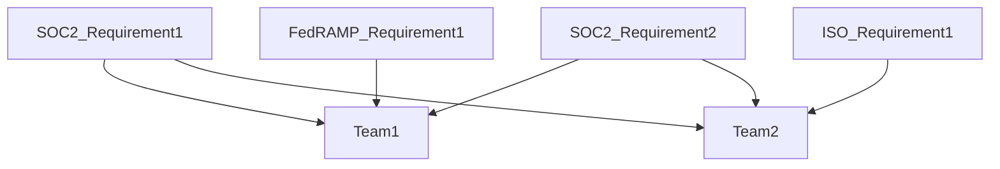
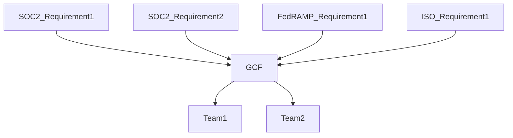

## On this page
{:.no_toc .hidden-md .hidden-lg}

- TOC
{:toc .hidden-md .hidden-lg}

# GitLab's Security Controls

Security controls are a way to state our company's position on a variety of security topics. It's not enough to simply say "We encrypt data" since our customers and teams will naturally want to know "what data do we encrypt?" and "how do we encrypt that data?". When all of our established security controls are operating effectively this creates a security program greater than the sum of its parts. It demonstrates to our stakeholders that GitLab has a mature and comprehensive security program that will provide assurance that data within GitLab is reasonably protected.

## GitLab Control Framework (GCF)

We have tried to take a comprehensive approach to our immediate and future security compliance needs. Older and larger companies tend to treat each security compliance requirement individually which results in independent security compliance teams going out to internal teams with multiple overlapping requests. For example, at such a company you might have one database engineer that is asked to provide evidence of how a particular database is encrypted based on SOC2 requirements, then again for ISO requirements, then again for FedRAMP requirements. This approach can be visualized as follows:

Given our [efficiency value](/handbook/values/#efficiency) here at GitLab we wanted to create a set of security controls that would address multiple underlying requirements with a single security control which would allow us to make fewer requests of our internal teams and efficiently collect all evidence we would need for a variety of audits at once. This approach can be visualized as follows:

As our security compliance goals and requirements have evolved so have our requirements and constraints related to our security control framework. The latest iteration of our GCF is based on the [Secure Control Framework by ComplianceForge](https://www.complianceforge.com/scf/) since the SCF comes with extensive and reliable compliance and regulatory framework mappings.

## Security Control Lifecycle

The lifecycle of our security controls can be found at [this handbook page](/handbook/engineering/security/security-assurance/security-compliance/security-control-lifecycle.html). As part of the security control lifecycle, all GCF security controls are reviewed and tested at a minimum on an annual basis or as required by regulation.

GCF security controls are assessed at the entity level or the system level depending upon the nature of the control. 

GCF security controls assessed at system level are based upon the system's [critical system tiering](https://about.gitlab.com/handbook/engineering/security/security-assurance/security-risk/storm-program/critical-systems.html). Dependent upon the system's tier, a subset of GCF controls are evaluated based upon overall risk and impact to the organization. This is broken out as follows:
 

|Tier |	GCF Control Scope |	ZenGRC Link|
|--|--|--|
|Tier 1 Product|	All Key Security Controls| [Link](https://gitlab.zengrc.com/sor/listing/controls?p=eyJzb3IiOnsicGFnZVNpemUiOjIwMCwiY29sdW1ucyI6WyJ0aXRsZSIsInNsdWciLCJvd25lcnNHcm91cCIsImtleUNvbnRyb2wiLCJjYV9fMTE2IiwiY3JlYXRlZEF0IiwiZGVzY3JpcHRpb24iLCJzdGF0dXMiLCJjYV9fMTEyIiwibWFwcGluZ3MucHJvZ3JhbXMiLCJhc3Nlc3NtZW50cyJdLCJjb2x1bW5TaXplcyI6W3sibmFtZSI6InRlc3RQbGFuIiwic2l6ZSI6Mzc0fSx7Im5hbWUiOiJtYXBwaW5ncy5wcm9ncmFtcyIsInNpemUiOjM4MX1dLCJmaWx0ZXJzIjp7IkFORCI6W3siZiI6InN0YXR1cyIsIm8iOiI9IiwidiI6IkZpbmFsIn0seyJmIjoiY2FfXzExNiIsIm8iOiI9IiwidiI6IlN5c3RlbSJ9LHsiZiI6ImtleUNvbnRyb2wiLCJvIjoiPSIsInYiOiJLZXkifV19fX0%3D&page=1)|	
|Tier 1 Business|	Highest Risk Security Controls | [Link](https://gitlab.zengrc.com/sor/info/Program/15/mapped/Control?listing.relevant_to=Program%3A15&listing.context=MAPPED&listing.fields=slug%2Ctitle%2Cdescription&listing.page_size=100)|	
|Tier 2 Core|	Highest Risk Security Controls| [Link](https://gitlab.zengrc.com/sor/info/Program/15/mapped/Control?listing.relevant_to=Program%3A15&listing.context=MAPPED&listing.fields=slug%2Ctitle%2Cdescription&listing.page_size=100)|	
|Tier 2 Support|	Highest Risk Security Controls| [Link](https://gitlab.zengrc.com/sor/info/Program/15/mapped/Control?listing.relevant_to=Program%3A15&listing.context=MAPPED&listing.fields=slug%2Ctitle%2Cdescription&listing.page_size=100)|
|Tier 3 / Non-critical|	Not Evaluated| N/A |	

## Control Ownership

Control Owner - Ensures that the design of the control and the control activities operate effectively and is responsible for remediation of any control activities that are required to bring that control into a state of audit-readiness.

Process Owner - Supports the operation of the control and carries out the process designed by the control owner. The process owner is most likely to be interviewed by an auditor to determine whether or not the process is operating as intended.

## Security Control Changes

The GitLab Security Compliance team is responsible for ensuring the consistency of the documentation of the security controls listed below. While normally we welcome any GitLab team-member to make edits to handbook pages, please be aware that even small changes to the wording of any of these controls impacts how they satisfy the requirements for the security frameworks they map to. Because of this, we ask any changes that need to be made to this page and the underlying guidance pages to start with a message in the [#sec-assurance](https://slack.com/app_redirect?channel=sec-assurance) slack channel. The compliance team will then engage with you and make any appropriate changes to these handbook pages.

## GitLab IT General Controls (ITGCs) 

ITGCs are a subset of the GCF controls. Please refer to [GitLab SOX ITGC Compliance](https://internal-handbook.gitlab.io/handbook/finance/sox-internal-controls/) (internal only) for details. 

# List of controls by family:
*We are continuing to update the controls with additional details*

<a href="https://about.gitlab.com/handbook/engineering/security/security-assurance/security-compliance/guidance/asset-management.html" target="_blank">Asset Management (AST) </a>

| Control | Title | Description |
|---------|-------------|---------------|
| AST-04 | Network Diagrams & Data Flow Diagrams (DFDs) | Maintain network architecture diagrams that:  - Contain sufficient detail to assess the security of the network's architecture;  - Reflect the current state of the network environment;   - Document all sensitive data flows. |
| AST-09 | Secure Disposal or Re-Use of Equipment | Securely dispose of, destroy or repurpose system components using organization-defined techniques and methods to prevent information being recovered from these components. |

<a href="https://about.gitlab.com/handbook/engineering/security/security-assurance/security-compliance/guidance/business-continuity-and-disaster-recovery.html" target="_blank">Business Continuity & Disaster Recovery (BCD) </a>

| Control | Title | Description |
|---------|-------------|---------------|
| BCD-01 | Business Continuity Management System (BCMS) | Facilitate contingency planning security controls to help ensure resilient assets and services. |
| BCD-02 | Identify Critical Assets | Identify, document and resume the critical systems, applications and services that support essential missions and business processes within Recovery Time Objectives (RTOs) with little or no loss of operational continuity of the defined time period of the contingency plan’s activation. |
| BCD-04 | Contingency Plan Testing & Exercises | Conduct tests and/or exercises to determine the contingency plan’s effectiveness and the organization’s readiness to execute the plan. |
| BCD-05 | Contingency Plan Root Cause Analysis (RCA) & Lessons Learned | Conduct Root Cause Analysis (RCA) and “lessons learned” activities every time the contingency plan is activated. |
| BCD-06 | Contingency Planning & Updates | Keep contingency plans current with business requirements and technology changes. |
| BCD-07 | Alternative Security Measures | Alternative or compensating controls to satisfy security requirements when the primary means of implementing the security requirements is unavailable or compromised. |
| BCD-11 | Data Backups | Create and routinely test recurring backups of data, software and system images verifying the reliability of the backup process to ensure the integrity and availability of the data. |
| BCD-12 | Information System Recovery & Reconstitution | Ensure the recovery and restoration of systems to a known state after a disruption, compromise or failure. |
| BCD-13 | Backup & Restoration Hardware Protection | Protect backup and restoration of hardware and software. |

<a href="https://about.gitlab.com/handbook/engineering/security/security-assurance/security-compliance/guidance/configuration-management.html" target="_blank">Configuration Management (CFG) </a>

| Control | Title | Description |
|---------|-------------|---------------|
| CFG-01 | Configuration Management Program | Facilitate the implementation of configuration management security controls. |
| CFG-02 | System Hardening Through Baseline Configurations | Develop, document, review, update and maintain secure baseline configurations at least annually as part of system component installations and upgrades for technology platforms that are consistent with industry-accepted system hardening standards and automating reports on baseline configurations of the systems. |

<a href="https://about.gitlab.com/handbook/engineering/security/security-assurance/security-compliance/guidance/change-management.html" target="_blank">Change Management (CHG) </a>

| Control | Title | Description |
|---------|-------------|---------------|
| CHG-01 | Change Management Program | Facilitate the implementation of change management security controls. |
| CHG-02 | Configuration Change Control | Govern the technical configuration change control processes by testing and documenting proposed changes in a non-production environment before changes are implemented in a production environment including a cybersecurity representative in the configuration change control review process. |
| CHG-04 | Access Restriction For Change | Enforce configuration restrictions in an effort to restrict the ability of users to conduct unauthorized changes. |
| CHG-06 | Security Functionality Verification | Verify the functionality of security controls when anomalies are discovered. |
| CHG-07 | Project Audit Events Review | Regular review of audit events to verify no inappropriate changes to key change management Segregation Of Duties (SOD) settings occured. |

<a href="https://about.gitlab.com/handbook/engineering/security/security-assurance/security-compliance/guidance/cloud-security.html" target="_blank">Cloud Security (CLD) </a>

| Control | Title | Description |
|---------|-------------|---------------|
| CLD-01 | Cloud Services | Facilitate the implementation of cloud management security controls to ensure cloud instances are secure and in-line with industry best practices. |

<a href="https://about.gitlab.com/handbook/engineering/security/security-assurance/security-compliance/guidance/compliance.html" target="_blank">Compliance (CPL) </a>

| Control | Title | Description |
|---------|-------------|---------------|
| CPL-01 | Statutory, Regulatory & Contractual Compliance | Facilitate the identification and implementation of relevant legislative statutory, regulatory and contractual security controls. |
| CPL-01.1 | Non-Compliance Oversight | GitLab Inc. has implemented mechanisms to document and review instances of non-compliance with statutory, regulatory and/or contractual obligations to develop appropriate risk mitigation actions.|
| CPL-02 | Security Controls Oversight | Responsible for security controls oversight. |
| CPL-03 | Security Assessments | Ensure team members regularly review controlled documents within their area of responsibility for accuracy and adherence to appropriate security policies, standards and other applicable requirements. |
| CPL-04 | Audit Activities | Plan and execute compliance audits that minimize the impact of audit activities on business operations. |

<a href="https://about.gitlab.com/handbook/engineering/security/security-assurance/security-compliance/guidance/cryptographic-protections.html" target="_blank">Cryptographic Protections (CRY) </a>

| Control | Title | Description |
|---------|-------------|---------------|
| CRY-01 | Use of Cryptographic Controls | Facilitate the implementation of cryptographic protections security controls using known public standards and trusted cryptographic technologies. |
| CRY-03 | Transmission Confidentiality | Cryptographic mechanisms to protect the confidentiality of data being transmitted. |
| CRY-05 | Encrypting Data At Rest | Cryptographic mechanisms to prevent unauthorized disclosure of information at rest. |
| CRY-09 | Cryptographic Key Management | Controls to protect the confidentiality, integrity and availability of keys by facilitating the production and management of symmetric cryptographic keys using Federal Information Processing Standards (FIPS)-compliant and asymmetric cryptographic keys using approved key management technology and processes that protect the user’s private key. |

<a href="https://about.gitlab.com/handbook/engineering/security/security-assurance/security-compliance/guidance/data-classification-and-handling.html" target="_blank">Data Classification & Handling (DCH) </a>

| Control | Title | Description |
|---------|-------------|---------------|
| DCH-01 | Data Protection | Facilitate logical and physical data protection controls and ensure data stewardship is assigned, documented and communicated and the quality of information remains complete and verifiable. |
| DCH-02 | Data & Asset Classification | Ensure a complete and accurate data and asset list are categorized and prioritized based on their classification, criticality and business value, in accordance with applicable statutory, regulatory and contractual requirements. |
| DCH-03 | Media Access | Mechanisms exist to control and restrict access to digital and non-digital media to authorized individuals only. |
| DCH-08 | Physical Media Disposal | Securely retain and dispose of physical media when it is no longer required, using formal procedures. |
| DCH-09 | Digital Media Sanitization | Sanitize media, both digital and non-digital, with the strength and integrity commensurate with the classification or sensitivity of the information prior to disposal, release out of organizational control or release for reuse. |
| DCH-10 | Media Use | Restrict the use of some types of digital media on systems or system components. |
| DCH-12 | Removable Media Security | Restrict removable media in accordance with data handling and acceptable usage parameters. |
| DCH-13 | Use of External Information Systems| Restrict the use of portable storage devices by external parties, systems and services used to securely store, process and transmit data. |
| DCH-14 | Information Sharing | Utilize a process assisting users in making information sharing decisions to ensure data is appropriately protected. |
| DCH-17 | Ad-Hoc Transfers | Secure ad-hoc exchanges of large digital files with internal or external parties. |
| DCH-21 | Information Disposal | Securely dispose of, destroy or erase information. |
| DCH-22 | Data Quality Operations | Check for the accuracy, relevance, timeliness, impact, completeness and de-identification of information across the information lifecycle. |

<a href="https://about.gitlab.com/handbook/engineering/security/security-assurance/security-compliance/guidance/endpoint-security.html" target="_blank">Endpoint Security (END) </a>

| Control | Title | Description |
|---------|-------------|---------------|
| END-04 | Malicious Code Protection (Anti-Malware) | Utilize anti-malware technologies to detect and eradicate malicious code. |
| END-06 | File Integrity Monitoring (FIM) | Utilize File Integrity Monitor (FIM) technology to detect and report unauthorized changes to system files and configurations. |
| END-07 | Host Intrusion Detection and Prevention Systems (HIDS / HIPS) | Utilize Host-based Intrusion Detection / Prevention Systems (HIDS / HIPS) on sensitive systems. |

<a href="https://about.gitlab.com/handbook/engineering/security/security-assurance/security-compliance/guidance/security-and-privacy-governance.html" target="_blank">Security & Privacy Governance (GOV) </a>

| Control | Title | Description |
|---------|-------------|---------------|
| GOV-01 | Security & Privacy Governance Program | Facilitate cybersecurity and privacy governance security controls. |
| GOV-01.1 | Steering Committee | GitLab Inc. has implemented mechanisms to coordinate cybersecurity, privacy and business alignment through a steering committee or advisory board, comprising of key cybersecurity, privacy and business executives, which meets formally and on a regular basis. |
| GOV-02 | Publishing Security & Privacy Documentation | Establish, maintain and disseminate cybersecurity and privacy policies, standards and procedures. |
| GOV-03 | Periodic Review & Update of Security & Privacy Program | Review the cybersecurity and privacy program, including policies, standards and procedures, at planned intervals or if significant changes occur to ensure their continuing suitability, adequacy and effectiveness. |
| GOV-04 | Assigned Security & Privacy Responsibilities | Assign a qualified individual with the mission and resources to centrally-manage, coordinate, develop, implement and maintain an enterprise-wide cybersecurity and privacy program. |
| GOV-05 | Measures of Performance | Implementing Key Performance Indicators (KPIs) assisting organizational management and Key Risk Indicators (KRIs) assisting senior management with developing, reporting and monitoring measures of performance and trend analysis of the cybersecurity and privacy program. |

<a href="https://about.gitlab.com/handbook/engineering/security/security-assurance/security-compliance/guidance/human-resources-security.html" target="_blank">Human Resources Security (HRS) </a>

| Control | Title | Description |
|---------|-------------|---------------|
| HRS-01 | Human Resources Security Management | Facilitate personnel security controls. |
| HRS-02 | Position Categorization | Manage personnel security risk by assigning a risk designation to all positions and establishing screening criteria for individuals filling those positions. |
| HRS-03 | Roles & Responsibilities | Define cybersecurity responsibilities for all personnel and ensure that all security-related positions are staffed by qualified individuals who have the necessary skill set. |
| HRS-04 | Personnel Screening | Manage personnel security risk and formally indoctrinate all the relevant types of information to which an individual would have access to by following organized-defined special protections of screening individuals prior to authorizing access to a system that stores, transmits or processes sensitive information. |
| HRS-05 | Terms of Employment | Requiring all employees and contractors to apply security and privacy principles in their daily work defined by acceptable and unacceptable rules of behavior for the use of technologies, including consequences for unacceptable behavior. |
| HRS-06 | Access Agreements | Require employees and third-party users to sign appropriate access agreements such as Non-Disclosure Agreements (NDAs) or similar confidentiality agreements that reflect the needs to protect data and operational details prior to being granted access. |
| HRS-07 | Personnel Sanctions | Sanction personnel failing to comply with established security policies, standards and procedures by conducting employee misconduct investigations when there is reasonable assurance that a policy has been violated. |
| HRS-08 | Personnel Transfer | Adjust logical and physical access authorizations to systems and facilities upon personnel reassignment or transfer, in a timely manner. |
| HRS-09 | Personnel Termination | Govern the termination of individual employment by:   -cretrieving organization-owned assets upon termination,   - expediting the process of removing "high risk" individual’s access to systems and applications upon termination, as determined by management; and   - governing third-party personnel by notifying terminated individuals of applicable, legally binding post-employment requirements for the protection of organizational information. |
| HRS-10 | Third-Party Personnel Security | Govern third-party personnel by reviewing and monitoring third-party cybersecurity and privacy roles and responsibilities. |
| HRS-11 | Separation of Duties | Maintain Separation of Duties (SoD) to prevent potential malevolent activity without collusion. |
| HRS-13 | Identify Critical Skills & Gaps | Evaluate the critical cybersecurity and privacy skills needed to support the organization’s mission and identify gaps that exist. |

<a href="https://about.gitlab.com/handbook/engineering/security/security-assurance/security-compliance/guidance/identification-and-authentication.html" target="_blank">Identification & Authentication (IAC) </a>

| Control | Title | Description |
|---------|-------------|---------------|
| IAC-01 | Identity & Access Management (IAM) | Facilitate the identification and access management security controls. |
| IAC-03 | Identification & Authentication for Non-Organizational Users | Uniquely identify and authenticate third-party users and processes that provide services to the organization. |
| IAC-06 | Multi-Factor Authentication (MFA) | Automatically enforce Multi-Factor Authentication (MFA) for:   - Remote network access; and/or   - Non-console access to critical systems or systems that store, transmit and/or process sensitive data. |
| IAC-07a | User Provisioning | Utilize a formal user provisioning process for team members that governs the assignment of access rights. |
| IAC-07b | User De-Provisioning | Utilize a formal user de-provisioning process for terminated team members that governs the assignment of access rights. |
| IAC-07c | Change of Roles & Duties | Revoke user access rights following changes in personnel roles and duties, if no longer necessary or permitted. |
| IAC-08 | Role-Based Access Control (RBAC) | Enforce a Role-Based Access Control (RBAC) policy over users and resources that applies need-to-know and fine-grained access control for sensitive data access. |
| IAC-09 | Identifier Management (User Names) | Govern naming standards for usernames and systems to ensure proper user identification management for non-consumer users and administrators. |
| IAC-10 | Authenticator Management (Passwords) | Securely manage passwords for users and devices ensuring vendor-supplied defaults are changed as part of the installation process. |
| IAC-15 | Account Management | Proactively govern account management of individual, group, system, application, guest and temporary accounts. |
| IAC-16 | Privileged Account Management (PAM) | Restrict and control privileged access rights for users and services. |
| IAC-17 | Periodic Review | Periodically review the privileges assigned to users to validate the need for such privileges; and reassign or remove privileges, if necessary, to correctly reflect organizational mission and business needs. |
| IAC-20 | Access Enforcement | Eenforce logical access permissions through the principle of "least privilege." |
| IAC-21 | Least Privilege | Utilize the concept of least privilege, allowing only authorized access to processes necessary to accomplish assigned tasks in accordance with organizational business functions. |
| IAC-22 | Account Lockout | Enforce a limit for consecutive invalid login attempts by a user during an organization-defined time period and automatically locks the account when the maximum number of unsuccessful attempts is exceeded. |
| Baseline-01 | Baseline and Role Based Entitlements | Annual review of Baseline and Role-based Entitlements to ensure alignment with job responsibilities. |

<a href="https://about.gitlab.com/handbook/engineering/security/security-assurance/security-compliance/guidance/information-assurance.html" target="_blank">Information Assurance (IAO) </a>

| Control | Title | Description |
|---------|-------------|---------------|
| IAO-01 | Information Assurance (IA) Operations | Facilitate the implementation of cybersecurity and privacy assessment and authorization security controls. |
| IAO-02 | Assessments | Formally assess and ensure assessors or assessment teams have the appropriate independence to conduct cybersecurity and privacy security control assessments in systems, applications and services through Information Assurance Program (IAP) activities to determine the extent to which the security controls are implemented correctly, operating as intended and producing the desired outcome with respect to meeting expected requirements for:   - Statutory, regulatory and contractual compliance obligations;   - Monitoring capabilities;   - Mobile devices;   - Databases;   - Application security;   - Embedded technologies (e.g., IoT, OT, etc.);   - Vulnerability management;   - Malicious code;   - Insider threats; and   - Performance/load testing. |
| IAO-04 | Threat Analysis & Flaw Remediation During Development | Require system developers and integrators to create and execute a Security Test and Evaluation (ST&E) plan to identify and remediate flaws during development. |
| IAO-05 | Plan of Action & Milestones (POA&M) | Generate a Plan of Action and Milestones (POA&M), or similar risk register, to document planned remedial actions to correct weaknesses or deficiencies noted during the assessment of the security controls and to reduce or eliminate known vulnerabilities. |
| IAO-06 | Technical Verification | Perform Information Assurance Program (IAP) activities to evaluate the design, implementation and effectiveness of technical security and privacy controls. |

<a href="https://about.gitlab.com/handbook/engineering/security/security-assurance/security-compliance/guidance/incident-response.html" target="_blank">Incident Response (IRO) </a>

| Control | Title | Description |
|---------|-------------|---------------|
| IRO-01 | Incident Response Operations | Implement and govern processes and documentation to facilitate an organization-wide response capability for security and privacy-related incidents. |
| IRO-02 | Incident Handling | Cover the preparation, automated detection or intake of incident reporting, analysis, containment, eradication and recovery. |
| IRO-04 | Incident Response Plan (IRP) | Maintain and make available a current and viable Incident Response Plan (IRP) to all stakeholders to address Personal Data (PD) incidents according to applicable laws, regulations and contractual obligations. |
| IRO-07 | Integrated Security Incident Response Team (ISIRT) | Establish an integrated team of cybersecurity, IT and business function representatives that are capable of addressing cybersecurity and privacy incident response operations. | 
| IRO-09 | Situational Awareness For Incidents | Document, monitor and report the status of cybersecurity and privacy incidents to internal stakeholders all the way through the resolution of the incident. |
| IRO-10 | Incident Stakeholder Reporting | Report sensitive data incidents and provide security and privacy incident information in a timely manner to applicable:   - Internal stakeholders;   - Affected clients & third-parties;   - Regulatory authorities; and   to the provider of the product or service and other organizations involved in the supply chain for systems or system components related to the incident. |
| IRO-14 | Regulatory & Law Enforcement Contacts | Maintain incident response contacts with applicable regulatory and law enforcement agencies. |

<a href="https://about.gitlab.com/handbook/engineering/security/security-assurance/security-compliance/guidance/mobile-device-management.html" target="_blank">Mobile Device Management (MDM) </a>

| Control | Title | Description |
|---------|-------------|---------------|
| MDM-01 | Centralized Management of Mobile Devices | Develop, govern & update procedures to facilitate the implementation of mobile device management controls. |
| MDM-03 | Full Device & Container-Based Encryption | Implement cryptographic mechanisms to protect the confidentiality and integrity of information on mobile devices through full-device or container encryption. |

<a href="https://about.gitlab.com/handbook/engineering/security/security-assurance/security-compliance/guidance/continuous-monitoring.html" target="_blank">Continuous Monitoring (MON) </a>

| Control | Title | Description |
|---------|-------------|---------------|
| MON-01 | Continuous Monitoring | Enterprise-wide monitoring controls such as Intrusion Detection / Prevention Systems (IDS / IPS) technologies on critical systems, key network segments and network choke points.   GitLab utilizes Host-based Intrusion Detection / Prevention Systems (HIDS/HIPS) to continuously monitor inbound and outbound communications traffic for unusual or unauthorized activities and actively responds to alerts from physical, cybersecurity, privacy and supply chain activities, blocking unwanted activities to achieve and maintain situational awareness.   GitLab utilizes Wireless Intrusion Detection / Protection Systems (WIDS / WIPS) to identify rogue wireless devices and detect attack attempts via wireless networks.   GitLab sends logs to a Security Incident Event Manager (SIEM) or similar automated tool to review event logs on an ongoing basis and escalate incidents in accordance with established timelines and procedures. |
| MON-02 | Centralized Collection of Security Event Logs | Utilize a Security Incident Event Manager (SIEM) or similar automated tool, to support the centralized collection of security-related event logs to maintain situational awareness. |
| MON-03 | Content of Audit Records | Configure systems to produce audit records that contain sufficient information to, at a minimum:   - Establish what type of event occurred;   - When (date and time) the event occurred;   - Where the event occurred;   - The source of the event;   - The outcome (success or failure) of the event; and   - The identity of any user/subject associated with the event. |  
| MON-10 | Audit Record Retention | Retain audit records for a time period consistent with records retention requirements to provide support for after-the-fact investigations of security incidents and to meet statutory, regulatory and contractual retention requirements. |
| MON-16 | Anomalous Behavior | Detect and respond to anomalous behavior that could indicate account compromise or other malicious activities. |

<a href="https://about.gitlab.com/handbook/engineering/security/security-assurance/security-compliance/guidance/network-security.html" target="_blank">Network Security (NET) </a>

| Control | Title | Description |
|---------|-------------|---------------|
| NET-01 | Network Security Management | Develop, govern & update procedures to facilitate the implementation of network security controls. |
| NET-03 | Boundary Protection | Limit network access points by monitoring and controlling communications at the external network boundary and at key internal boundaries within the network. |
| NET-04 | Data Flow Enforcement – Access Control Lists (ACLs) | Design, implement and review firewall and router configurations to restrict connections between untrusted networks and internal systems and deny network traffic by default and allow network traffic by exception (e.g., deny all, permit by exception). |
| NET-06 | Network Segmentation | Logically or physically segment information flows to accomplish network segmentation to other components of the system and implementing security management subnets to isolate security tools. |
| NET-08 | Network Intrusion Detection / Prevention Systems (NIDS / NIPS) | Employ Network Intrusion Detection / Prevention Systems (NIDS/NIPS) to detect and/or prevent intrusions into the network. |
| NET-12 | Safeguarding Data over Open Networks | Implement cryptographic mechanisms for strong cryptography and security protocols to safeguard sensitive data during transmission over open, public networks and to protect external and internal wireless links from signal parameter attacks through monitoring for unauthorized wireless connections, including scanning for unauthorized wireless access points and taking appropriate action, if an unauthorized connection is discovered. |
| NET-13 | Electronic Messaging | Protect information involved in electronic messaging communications. |
| NET-14 | Remote Access | Define, control and review remote access methods. |

<a href="https://about.gitlab.com/handbook/engineering/security/security-assurance/security-compliance/guidance/security-operations.html" target="_blank">Security Operations (OPS) </a>

| Control | Title | Description |
|---------|-------------|---------------|
| OPS-01 | Operations Security | Implement operational security controls to identify and document Standardized Operating Procedures (SOP), or similar documentation, to enable the proper execution of day-to-day / assigned tasks. |
| OPS-02 | Security Concept Of Operations (CONOPS) | Develop a security Concept of Operations (CONOPS), or a similarly-defined plan for achieving cybersecurity objectives, that documents management, operational and technical measures implemented to apply defense-in-depth techniques that is communicated to all appropriate stakeholders. |
| OPS-03 | Service Delivery (Business Process Support) | Define supporting business processes and implement appropriate governance and service management to ensure appropriate planning, delivery and support of the organization's technology capabilities supporting business functions, workforce, and/or customers based on industry-recognized standards to achieve the specific goals of the process area. |

<a href="https://about.gitlab.com/handbook/engineering/security/security-assurance/security-compliance/guidance/physical-and-environmental-security.html" target="_blank">Physical & Environmental Security (PES) </a>

| Control | Title | Description |
|---------|-------------|---------------|
| PES-01 | Physical & Environmental Protections | Facilitate the operation of physical and environmental protection controls. |
| PES-02 | Physical Access Authorizations | Implement physical access controls to maintain a current list of personnel with authorized access to organizational facilities based on the position or role of the individual, (except for those areas within the facility officially designated as publicly accessible). |
| PES-03 | Physical Access Control | Implement physical access controls to enforce physical access authorizations for all physical access points (including designated entry/exit points) to facilities (excluding those areas within the facility officially designated as publicly accessible). |

<a href="https://about.gitlab.com/handbook/engineering/security/security-assurance/security-compliance/guidance/privacy.html" target="_blank">Privacy (PRI) </a>

| Control | Title | Description |
|---------|-------------|---------------|
| PRI-05 | Use, Retention & Disposal |   - Retain Personal Data (PD), including metadata, for an organization-defined time period to fulfill the purpose(s) identified in the notice or as required by law;   - Dispose of, destroys, erases, and/or anonymizes the PI, regardless of the method of storage; and   - Use organization-defined techniques or methods to ensure secure deletion or destruction of PD (including originals, copies and archived records). |
| PRI-14 | Privacy Records & Reporting | Maintain privacy-related records and develop, disseminate and update reports to internal senior management, as well as external oversight bodies, as appropriate, to demonstrate accountability with specific statutory and regulatory privacy program mandates. |

<a href="https://about.gitlab.com/handbook/engineering/security/security-assurance/security-compliance/guidance/project-and-resource-management.html" target="_blank">Project & Resource Management (PRM) </a>

| Control | Title | Description |
|---------|-------------|---------------|
| PRM-01 | Security Portfolio Management | Security and privacy-related resource planning controls that define a viable plan for achieving cybersecurity & privacy objectives. |
| PRM-02 | Security & Privacy Resource Management | Address all capital planning and investment requests, including the resources needed to implement the security & privacy programs and documents all exceptions to this requirement. |
| PRM-03 | Allocation of Resources | Identify and allocate resources for management, operational, technical and privacy requirements within business process planning for projects / initiatives. |
| PRM-04 | Security & Privacy In Project Management | Assess security and privacy controls in system project development to determine the extent to which the controls are implemented correctly, operating as intended and producing the desired outcome with respect to meeting the requirements. |
| PRM-05 | Security & Privacy Requirements Definition | Identify critical system components and functions by performing a criticality analysis for critical systems, system components or services at pre-defined decision points in the Secure Development Life Cycle (SDLC). |
| PRM-06 | Business Process Definition | Define business processes with consideration for cybersecurity and privacy that determines:   - The resulting risk to organizational operations, assets, individuals and other organizations; and   - Information protection needs arising from the defined business processes and revises the processes as necessary, until an achievable set of protection needs is obtained. |
| PRM-07 | Secure Development Life Cycle (SDLC) Management | Ensure changes to systems within the Secure Development Life Cycle (SDLC) are controlled through formal change control procedures. |

<a href="https://about.gitlab.com/handbook/engineering/security/security-assurance/security-compliance/guidance/risk-management.html" target="_blank">Risk Management (RSK) </a>

| Control | Title | Description |
|---------|-------------|---------------|
| RSK-01 | Risk Management Program | Implement risk management controls. |
| RSK-02 | Risk-Based Security Categorization | Categorizes systems and data in accordance with applicable local, state and Federal laws that:   - Document the security categorization results (including supporting rationale) in the security plan for systems; and   - Ensure the security categorization decision is reviewed and approved by the asset owner. | 
| RSK-03 | Risk Identification | Identify and document risks, both internal and external. | 
| RSK-04 | Risk Assessment | Conduct an annual assessment of risk and maintain a risk register that monitors the reporting of risks including the likelihood and magnitude of harm, from unauthorized access, use, disclosure, disruption, modification or destruction of the organization's systems and data. | 
| RSK-05 | Risk Ranking | Identify and assign a risk ranking to newly discovered security vulnerabilities that is based on industry-recognized practices. | 
| RSK-06 | Risk Remediation | Remediate risks to an acceptable level and respond to findings from security and privacy assessments, incidents and audits to ensure proper remediation has been performed. |
| RSK-07 | Risk Assessment Update | Routinely update risk assessments and react accordingly upon identifying new security vulnerabilities, including using outside sources for security vulnerability information. |
| RSK-08 | Business Impact Analysis (BIA) | Conduct a Business Impact Analysis (BIA). | 
| RSK-09 | Supply Chain Risk Management Plan | Develop a plan for Supply Chain Risk Management (SCRM) and periodically assess supply chain risks associated with the development, acquisition, maintenance and disposal of systems, system components and services, including documenting selected mitigating actions and monitoring performance against those plans. | 
| RSK-10 | Data Protection Impact Assessment (DPIA) | Conduct a Data Protection Impact Assessment (DPIA) on systems, applications and services to evaluate privacy implications. |

<a href="https://about.gitlab.com/handbook/engineering/security/security-assurance/security-compliance/guidance/security-awareness-and-training.html" target="_blank">Security Awareness & Training (SAT) </a>

| Control | Title | Description |
|---------|-------------|---------------|
| SAT-01 | Security & Privacy-Minded Workforce | Security workforce development and awareness controls. |

<a href="https://about.gitlab.com/handbook/engineering/security/security-assurance/security-compliance/guidance/secure-engineering-and-architecture.html" target="_blank">Secure Engineering & Architecture (SEA) </a>

| Control | Title | Description |
|---------|-------------|---------------|
| SEA-01 | Secure Engineering Principles | Centrally-manage organization-wide management and implementation of industry-recognized cybersecurity and privacy practices and other related processes in the specification, design, development, implementation and modification of systems and services. |
| SEA-02 | Alignment With Enterprise Architecture | Develop an enterprise architecture, aligned with industry-recognized leading practices, with consideration for cybersecurity and privacy principles that addresses risk to organizational operations, assets, individuals, and other organizations. |

<a href="https://about.gitlab.com/handbook/engineering/security/security-assurance/security-compliance/guidance/technology-development-and-acquisition.html" target="_blank">Technology Development & Acquisition (TDA) </a>

| Control | Title | Description |
|---------|-------------|---------------|
| TDA-01 | Technology Development & Acquisition | Tailored development and acquisition strategies, contract tools and procurement methods to meet unique business needs. |
| TDA-02 | Security Requirements | Technical and functional specifications, explicitly or by reference, in system acquisitions based on an assessment of risk. |
| TDA-15 | Developer Threat Analysis & Flaw Remediation | Require system developers and integrators to create a Security Test and Evaluation (ST&E) plan and implement the plan under the witness of an independent party. |

<a href="https://about.gitlab.com/handbook/engineering/security/security-assurance/security-compliance/guidance/threat-management.html" target="_blank">Threat Management (THR) </a>

| Control | Title | Description |
|---------|-------------|---------------|
| THR-01 | Threat Intelligence Program | Includes a cross-organization information-sharing capability that can influence the development of the system and security architectures, selection of security solutions, monitoring, threat hunting, response and recovery activities. |
| THR-02 | Indicators of Exposure (IOE) | Develop Indicators of Exposure (IOE) to understand the potential attack vectors that could be used to attack the organization. |
| THR-04 | Insider Threat Program | Includes a cross-discipline insider threat incident handling team. |

<a href="https://about.gitlab.com/handbook/engineering/security/security-assurance/security-compliance/guidance/third-party-management.html" target="_blank">Third-Party Management (TPM) </a>

| Control | Title | Description |
|---------|-------------|---------------|
| TPM-01 | Third-Party Management | Management of third-party security controls. |
| TPM-02 | Third-Party Criticality Assessments | Identify, prioritize and assess suppliers and partners of critical systems, components and services using a supply chain risk assessment process relative to their importance in supporting the delivery of high-value services. |
| TPM-03 | Supply Chain Protection | Evaluating security risks and addressing identified weaknesses or deficiencies in the security associated with the services and product supply chain, limiting harm from potential adversaries who identify and target the organization’s supply chain by utilizing tailored acquisition strategies, contract tools and procurement methods for the purchase of unique systems, system components or services. |
| TPM-04 | Third-Party Services | Mitigate the risks associated with third-party access to the organization’s systems and data and ensure that the interests of third-party service providers are consistent with and reflect organizational interests. |
| TPM-05 | Third-Party Contract Requirements | Identify, regularly review and document third-party confidentiality, Non-Disclosure Agreements (NDAs) and other contracts that reflect the organization’s needs to protect systems and data. |
| TPM-06 | Third-Party Personnel Security | Control personnel security requirements including security roles and responsibilities for third-party providers. |
| TPM-07 | Monitoring for Third-Party Information Disclosure | Monitor for evidence of unauthorized exfiltration or disclosure of organizational information. |
| TPM-08 | Review of Third-Party Services | Monitor, regularly review and audit supplier service delivery for compliance with established contract agreements. |
| TPM-09 | Third-Party Deficiency Remediation | Address weaknesses or deficiencies in supply chain elements identified during independent or organizational assessments of such elements. |
| TPM-10 | Managing Changes To Third-Party Services | Control changes to services by suppliers, taking into account the criticality of business information, systems and processes that are in scope by the third-party. |
| TPM-11 | Third-Party Incident Response & Recovery Capabilities | Ensure response/recovery planning and testing are conducted with critical suppliers/providers. |

<a href="https://about.gitlab.com/handbook/engineering/security/security-assurance/security-compliance/guidance/vulnerability-and-patch-management.html" target="_blank">Vulnerability & Patch Management (VPM) </a>

| Control | Title | Description |
|---------|-------------|---------------|
| VPM-02 | Vulnerability Remediation Process | Ensure that vulnerabilities are properly identified, tracked and remediated. |
| VPM-04 | Continuous Vulnerability Remediation Activities | Address new threats and vulnerabilities on an ongoing basis and ensure assets are protected against known attacks. |
| VPM-05 | Software Patching | Conduct software patching for all deployed operating systems, applications and firmware. |
| VPM-06 | Vulnerability Scanning | Detect vulnerabilities and configuration errors by recurring vulnerability scanning of systems and web applications. |
| VPM-07 | Penetration Testing | Conduct penetration testing on systems and web applications. |

## References

    <a href="https://about.gitlab.com/handbook/engineering/security/security-assurance/security-compliance/" class="btn btn-purple-inv" style="width:100%;height:100%;margin:1px;display:flex;justify-content:center;align-items:center;">Return to the Security Compliance Team Homepage</a>

 
