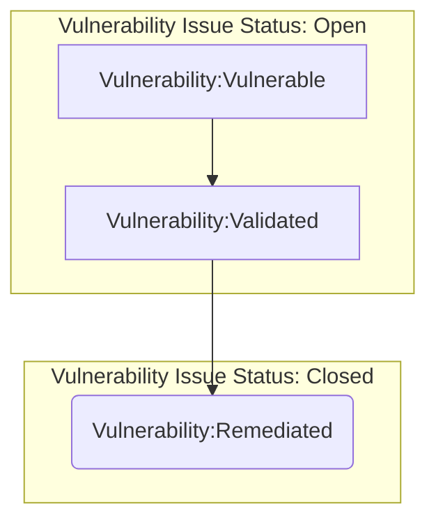
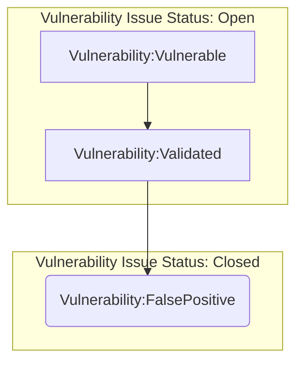
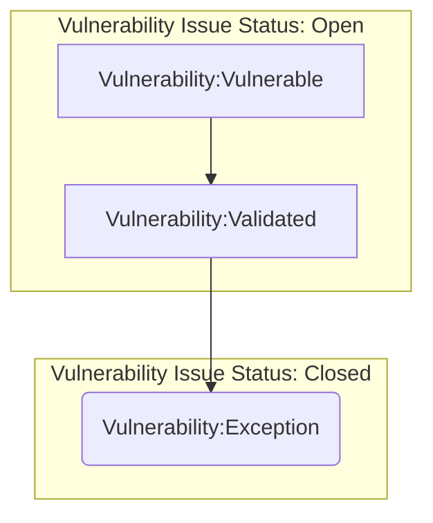
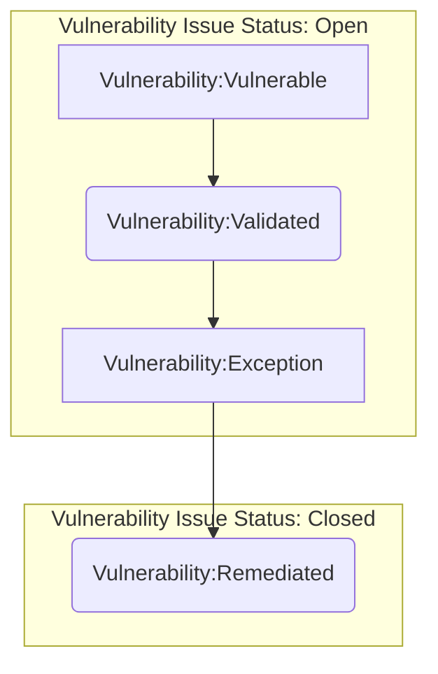
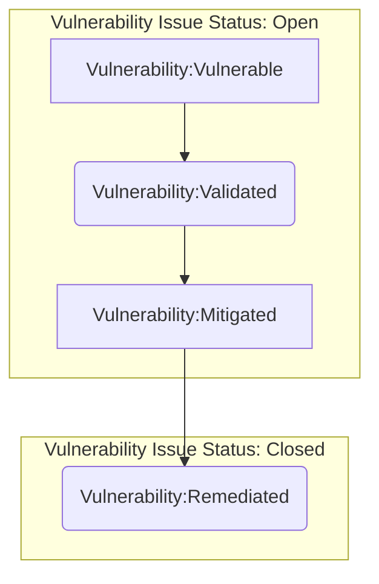

## On this page
{:.no_toc .hidden-md .hidden-lg}

- TOC
{:toc .hidden-md .hidden-lg}

{::options parse_block_html="true" /}

**This is a Controlled Document**
{: .panel-heading}

Inline with GitLab's regulatory obligations, changes to [controlled documents](https://about.gitlab.com/handbook/engineering/security/controlled-document-procedure.html) must be approved or merged by a code owner. All contributions are welcome and encouraged.

## Vulnerability Management Overview

Vulnerability Management is the recurring process of identifying, classifying, prioritizing, mitigating, and remediating vulnerabilities. This overview will focus on infrastructure vulnerabilities and the operational vulnerability management process. This process is designed to provide insight into our environments, leverage GitLab for vulnerability workflows, promote healthy patch management among other preventative best-practices, and remediate risk; all with the end goal to better secure our environments.

To achieve these goals, we’ve partnered with Tenable and have deployed their software-as-a-service (SaaS) solution, [Tenable.io](https://www.tenable.com/products/tenable-io/faq), as our vulnerability scanner. Tenable.io allows us to focus on what is important; scanning for vulnerabilities, analyzing, and ingesting vulnerability data into GitLab as the starting point for our vulnerability management process.

## Purpose

This Vulnerability Management Standard defines a consistent process to identify, document, categorize, manage, and remediate all vulnerabilities that impact in-scope GitLab systems in order to reduce the risk relating to security vulnerabilities that could impact the achievement of GitLab goals.

## Scope

This information security standard applies to all systems that store, process or transmit GitLab or GitLab customer data. The below requirements for each system is based on the GitLab [critical system tiering methodology](https://about.gitlab.com/handbook/engineering/security/security-assurance/security-risk/storm-program/critical-systems.html).

## Roles & Responsibilities

| Role | Responsibility |
| -----| -------------|
| Security Compliance Team | Responsible for implementing and maintaining this Vulnerability Management Standard and oversight of supporting procedures as part of ongoing continuous control monitoring |
| Control Owners | Responsible for defining and implementing procedures to support Security policies and standards |
| Security Leadership | Responsible for approving changes to this standard |

## Procedure

### The Vulnerability Management process

Arguably the most important step for a successful vulnerability management process is defining the scope that the process will cover. Security and Infrastructure partnered to come up with a scope that would make sure all of our critical environments and systems were covered during deployment. The following environments are currently `in-scope` for GitLab.com production:

| Environment  | Project/Account        | Production  | Deployed |
| :---         | :----                  | :---        | :---     |
| GCP          | gitlab-production      | yes         | yes      |
| GCP          | gitlab-ops             | yes         | yes      |
| GCP          | gs-production          | yes         | yes      |
| GCP          | env-zero               | yes         | yes      |
| GCP          | gemnasium-production   | yes         | yes      |
| GCP          | service-prod           | yes         | yes      |
| GCP          | gitlab-ci              | limited     | yes      |
| AWS          | gitlab-com             | yes         | yes      |
| Azure        | GitLab                 | yes         | no       |

>Note: If you believe a system you are responsible for should be included in the vulnerability management process, please [contact](/handbook/engineering/security/threat-management/vulnerability-management/#contact) the Security Vulnerability Management Team.

With these environments scoped out and Tenable scanners deployed, we can begin the vulnerability management process. Keep in mind that vulnerability management is a feedback loop - vulnerability scanners provide the vulnerability data which is analyzed and ingested to mitigate and remediate found vulnerabilities. Feedback from this process feeds into preventative initiatives that further secure our environments.

Currently, we break down vulnerability management into the following steps:

#### 1. Vulnerability Scanning

This step is where we scan resources in our environments to identify vulnerabilities. Once setup, scans run on regular cadences that meet or exceed our [compliance framework requirements](/handbook/engineering/security/security-assurance/security-compliance/guidance/vulnerability-and-patch-management.html).

#### 2. Reporting/Analysis

Vulnerability scan data is exported and analyzed to provide consolidated vulnerability data we can ingest into GitLab.com for vulnerability remediation tracking. This is currently a manual process where we export vulnerability data into a spreadsheet and pull out pertinent information.

Tenable also provides reporting functionality that is used by our Compliance team to run reports for audits.

Currently, we export vulnerabilities as CSV files. These exports are filtered to be specific to the project/account (for example, gitlab-production in GCP gets its own report). Once exported, we analyze
and consolidate the data into different `views`, including: unique vulnerabilities, vulnerability count, vulnerability count by asset, and vulnerability by severity. Once completed, we open a [vulnerability remediation issue](https://gitlab.com/gitlab-com/gl-security/security-operations/sirt/infrastructure-vulnerability-management/-/blob/master/.gitlab/issue_templates/remediation.md)
in the [Vulnerability Management issue tracker](https://gitlab.com/gitlab-com/gl-security/security-operations/sirt/infrastructure-vulnerability-management/-/issues). These issues are where all discussion and documentation for the vulnerability will occur. We also open a linked issue in [Infrastructure issue tracker](https://gitlab.com/gitlab-com/gl-infra/infrastructure/issues)
which is where additional remediation issues for the vulnerabilities get opened and scheduled for review and remediation.

#### 3. Ingestion

Once the data is prepared in a format that we can pull out the most important information, we can ingest into GitLab.com. Issues are opened in the [Vulnerability Management tracker](https://gitlab.com/gitlab-com/gl-security/security-operations/sirt/infrastructure-vulnerability-management/-/issues) to track the remediation process of the vulnerability. Another issue is opened in the [Infrastructure issue tracker](https://gitlab.com/gitlab-com/gl-infra/infrastructure/issues)linking to the vulnerability management tracker issue; these are so that the work can properly get prioritized and scheduled according to the Infrastructure team’s workflow.

Currently, we group vulnerabilities into a single remediation issue on a monthly basis as to consolidate the work required to remediate. From here, the SIRT team can work with Infra to prioritize and open additional remediation issues which are linked to the monthly remediation issue.

Vulnerability remediation issues should be tagged with the `vulnerability` type label. These leverage GitLab's [scoped label capability](https://docs.gitlab.com/ee/user/project/labels.html#scoped-labels). The following labels exist to track the vulnerability remediation workflow:

* `~vulnerability::vulnerable`: This label identifies that the vulnerability has been opened, but not validated and is considered impactful to our environments per the assigned priority label. With this label a vulnerability issue should not be closed.

* `~vulnerability::validated`: This label identifies that the vulnerability has been validated as legitimate and is scheduled for mitigation or remediation. With this label a vulnerability issue should not be closed.

* `~vulnerability::falsepositive`: This label identifies that the vulnerability has been validated as a false positive and is no longer impactful to our environments. With this label a vulnerability issue can be closed.

* `~vulnerability::exception`: This label identifies that the vulnerability has been validated as legitimate and has an approved exception issue to account for a business need. In extreme circumstances, a vulnerability issue can be closed with an exception.

* `~vulnerability::mitigated`: This label identifies that the vulnerability has been validated and triaged. The impact has been reduced through compensating controls, but not remediated (it is still actively identified on vulnerability scans). With this label a vulnerability issue should not be closed.

* `~vulnerability::remediated`: This label identifies that the vulnerability has been remediated and the remediation has been validated. With this label a vulnerability issue can be closed.

We also add the `VM` label to all Vulnerability issues to scope the issues in the [Vulnerability Management issue board](https://gitlab.com/gitlab-com/gl-security/security-operations/sirt/infrastructure-vulnerability-management/-/boards/1573615).

#### 4. Validation

Validation is an important part of vulnerability management. This is where we investigate to ensure that the vulnerability being reported has properly been identified.

Vulnerabilities can sometimes be identified during a scan, but are not actually on the system. This can happen for a number of reasons, but most commonly is the result of misflagged ports or services. These are classified as false positives and would go through the [process to be closed as a false positive](/handbook/engineering/security/threat-management/vulnerability-management/#closed-as-false-positive).

#### 5. Remediation

Remediation is the part of the process in which a validated vulnerability is fixed. The remediation process would be tracked in the corresponding vulnerability issue in the [Vulnerability Management issue tracker](https://gitlab.com/gitlab-com/gl-security/security-operations/sirt/infrastructure-vulnerability-management/-/issues). SLAs are in place to help prioritize vulnerability based on severity. Once a vulnerability is remediated, we will run followup scans on the impacted systems to validate that the vulnerability is indeed remediated.

We've implementing an escalation path for remediation issues in the [Infrastructure issue tracker](https://gitlab.com/gitlab-com/gl-infra/infrastructure/issues) that automatically tags the VM DRI and backup when remediation issues are approaching/past [SLAs](/handbook/engineering/security/threat-management/vulnerability-management/#remediation-slas).

For improved tracking of remediation issues, we are using GitLab Epics. The [remediation epic](https://gitlab.com/groups/gitlab-com/gl-security/security-operations/sirt/-/epics/1) includes monthly subepics that track remediation progress for that month. If remediation SLAs do not require a vulnerability to be remediated in a month, it will be rolled over into the following subepic until remediated or its due date passes.

#### Vulnerability Issue Workflows

There are several ways a vulnerability issue can be closed - below are some common vulnerability workflows using the `vulnerability` labels as reference:

##### Closed as Remediated

The most common workflow is to close a vulnerability issue as `Remediated`. This means that a vulnerability has been validated and remediation has taken place. Below is the workflow:

##### Closed as False Positive

A vulnerability must always be validated - but sometimes the validation can prove that a vulnerability is a false positive. Below is the workflow:

##### Closed as Exception

Sometimes issues arise that would otherwise prevent a vulnerability from being remediated or mitigated. While commonly, these would result in an open `Exception` vulnerability issue status, there are unique cases where an issue can be closed as an exception. Below is the workflow:

##### Open as Exception

Closed issue via the `Exception` process are very rare. Generally, an exception is a non-permanent way to assume risk on a vulnerability due to extenuating circumstances in which remediation can not take place within the required SLAs. Below is the described the workflow:

##### Open as Mitigated

Another common workflow is when a vulnerability is validated and a fix is scheduled for some time in the future (within the SLA). If we're able to, we will put mitigation in place in the interim to reduce the risk from the vulnerability. Below is the described workflow:

#### 6. Feedback

The last step is for the Security Incident Response Team and Infrastructure to determine what we can learn from each vulnerability remediated. This may be an improvement on the vulnerability management process itself or establishing preventive mechanisms for a repetitive vulnerability type. This feedback will be documented in the vulnerability issue and could result in additional issues being opened.

As stated above, this process is a cyclical loop. Vulnerability scans are recurring, providing new vulnerability data that feed new vulnerability remediation and exception issues which then help update/escalate open issues/processes.

### Remediation SLAs

Security and Infrastructure have come up with remediated SLAs based on a multitude of factors, such as severity, scope, impact, etc. All of these factors will be considered when mapping the priority to [GitLab’s priority labels](https://docs.gitlab.com/ee/development/contributing/issue_workflow.html#priority-labels). The SLAs are as follows:

| CVSS Score | Severity  | Priority  | Time to mitigate    |Time to remediate (TTR) | TTR with disabled feature flag |
|------------|-----------|-----------|---------------------|------------------------|--------------------------------|
| 9.0-10.0 (Critical) | `~severity::1` | `~priority::1`     | Within 24 hours     | On or before the [next security release](/releases/categories/releases/)   | Within 30 days or before the feature flag is enabled, whichever comes first |
| 7.0-8.9 (High) | `~severity::2` | `~priority::2`     | N/A                 | Within 60 days        | Within 90 days or before the feature flag is enabled, whichever comes first |
| 4.0-6.9 (Medium) | `~severity::3` | `~priority::3`     | N/A                 | Within 90 days        | Before the feature flag is enabled |
| 0.1-3.9 (Low) | `~severity::4` | `~priority::4`     | N/A                 | Best effort unless risk accepted | Best effort unless risk accepted |

For more information around vulnerability SLAs, please see [this handbook section](/handbook/engineering/security/#severity-and-priority-labels-on-security-issues).

#### Environments (Dev/Staging/QA/Production)

These [SLAs](/handbook/engineering/security/threat-management/vulnerability-management/#remediation-slas) apply to mitigation and remediation of vulnerabilities, regardless of the usage of the GitLab owned environment in which they are present. They are not only applicable to production systems. Whilst great care has been taken to isolate non-production environments, and prevent the storage of PII - the usage distinctions between environments (dev/test/qa/production) do not represent a significant enough security boundary to allow non-production environments to be mitigated and remediated on a more relaxed timeframe.

### Exception process

We understand that it is not always technologically feasible to keep all packages up-to-date due to application conflicts, or that a business decision may be made to not remediate a vulnerability because remediation would impact performance too greatly.
Low risk vulnerabilities that may not get prioritized within the remediation SLAs should have an exception approved for them, documenting the low likelihood of exploit due to layered security, other compensating controls, mean of exploitation, etc.

With this in mind we have a vulnerability exception process; If you've identified a vulnerability that is a candidate for an exception, please open a [vulnerability exception issue](https://gitlab.com/gitlab-com/gl-security/security-operations/sirt/infrastructure-vulnerability-management/-/blob/master/.gitlab/issue_templates/exception.md) in the [vulnerability management issue tracker](https://gitlab.com/gitlab-com/gl-security/security-operations/sirt/infrastructure-vulnerability-management/-/issues).

Please fill all out the pertinent information requested in the template. For reference, the information required is as follows:

* Vulnerability title
* Tenable plugin-ID
* Priority/Severity of Vulnerability
* Original remediation issue due date
* Length of requested exception
* List of applicable hosts

You will also need to describe the business need for the exception, document any existing/implemented compensating controls, and link any ongoing remediation efforts.

##### Exception length restrictions

We currently allow exception lengths based on priority/severity as follows:

| P/S  | 30-days | 60-days | 90-days | 365-days |
|------|---------|---------|---------|----------|
| priority::1/severity::1| `Yes`   | `No`    | `No`    | `No`     |
| priority::2/severity::2| `Yes`   | `Yes`   | `Yes`   | `No`     |
| priority::3/severity::3| `Yes`   | `Yes`   | `Yes`   | `Yes`    |
| priority::4/severity::4| `Yes`   | `Yes`   | `Yes`   | `Yes`    |

##### Exception approval matrix

After the issue is open, the requestor should assign the due date to match that of the associated remediation issue and assign to the proper approver. The severity and priority of the vulnerability will dictate the approval process. This is documented below:

| P/S  | Approver                        |
|------|---------------------------------|
| priority::1/severity::1| VP of Security or Infrastructure      |
| priority::2/severity::2| Director of Security Operations      |
| priority::3/severity::3| Security Manager, Security Incident Response Team  |
| priority::4/severity::4| Security Engineer, Security Incident Response Team  |

### Host Validation

To ensure we are scanning all possilbe hosts in the scoped environments, we leverage [Tenable connectors](https://docs.tenable.com/cloud/Content/Settings/Connectors.htm). These connectors run as a service account in our environment projects/accounts and pull metadata regarding all compute assets, thus populating an up-to-date view of all the assets in our environment. These imports run on a 24-hour schedule, meaning we always have a daily view of our assets across the environments.

We setup our traditional scans using subnets that encompass all of our assets. When new subnets are setup in our environments (for example, VPC networks in GCP or AWS), part of the process of setting up that network is making sure that (if in scope) authenticated vulnerability scans are setup. If a connector import ever finds an asset outside of the subnets we are currently scanning, an investigation is launched to determine the validity of that host. These hosts would show up as validated, but unassessed. If it is a legitmate host we will add that new subnet the asset is in to our scanning schedule. While we prefer to setup the scans prior to new networks being setup, this feedback loop ensures we never miss assets when scanning.

### Vulnerability Scanning Schedule

Vulnerability scans occur on a weekly basis in our [scoped environments](/handbook/engineering/security/threat-management/vulnerability-management/#the-vulnerability-management-process). The schedule can be seen below:

The start times are always consistent - however, scan durations may fluctuate based on a multitude of factors. Generally, the production scans complete in under 2-hours. We’ve segmented the `gitlab-production` scans to reduce impact to the environment. We’ve also enabled load throttling, so if increased load is detected on the systems/networks being scanned, Tenable will reduce its footprint to further reduce impact.

The target groups used in these scans are setup using GCP VPC network ranges to ensure any newly provisioned resources are scanned without manually inputting the resources IP into the scan. We will leverage similar functionality during our AWS and Azure deployments.

>Note: for more information, please visit the `#tenable-notifications` channel on Slack where there are links to documentation breaking down what hosts are in what scan group.

### Contact

If you have any questions or concerns related to vulnerability management please contact the Vulnerability Management Team in `#security-department` channel on slack, or you can [open an issue](https://gitlab.com/gitlab-com/gl-security/security-operations/infrastructure-security/projects/infrastructure-vulnerability-management/-/issues/new) in the [Infrastructure Vulnerability Management issue tracker](https://gitlab.com/gitlab-com/gl-security/security-operations/infrastructure-security/projects/infrastructure-vulnerability-management/-/issues). All work being done to improve this process is also tracked in the issue tracker.

Any questions regarding ownership around vulnerability management can be answered in [GitLab’s tech stack documentation](/handbook/business-ops/tech-stack-applications/).

## Exceptions
Exceptions to this procedure will be tracked as per the [Information Security Policy Exception Management Process](/handbook/engineering/security/#information-security-policy-exception-management-process).

## References
* Parent Policy: [Information Security Policy](/handbook/engineering/security/)
