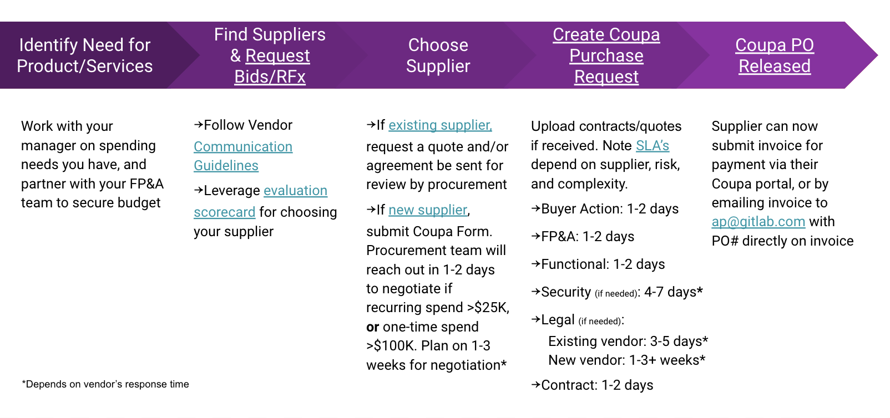

{::options parse_block_html="true" /}

<link rel="stylesheet" type="text/css" href="/stylesheets/biztech.css" />

## On this page
{:.no_toc}

- TOC
{:toc}

## <i class="fas fa-stream" id="biz-tech-icons"></i>  What is Procurement?
Procurement is the process of selecting vendors, strategic vetting, selection, negotiation of contracts, and the actual purchasing of goods. Procurement acquires all the goods, services, and work that is vital to GitLab.

## <i class="fas fa-stream" id="biz-tech-icons"></i>  What is the Procurement Process at GitLab?
Anytime a purchase is being made on behalf of GitLab that does not qualify as a personal expense, or meet the list of exceptions, a Coupa Purchase Request must be approved BEFORE a purchase and/or work can begin.

[Exceptions to the PO policy](https://about.gitlab.com/handbook/finance/procurement/#-what-are-the-exceptions-to-the-po-policy) include, but are not limited to, purchases under $5,000 USD.

#### Shared Goals
Procurement is a cross-functional team that supports GitLab as a public company. We have four key objectives monitored in the following ways:
1. Risk Management and Compliance
    - Reported and monitored via internal and external audit which gets reported to our shareholders. 
1. Digital Automation and Efficiency
    - Reported via annual cost avoidance and year over year savings
1. Strategic Partnership and Department Spend Reviews
    - Reported through the twice annual NPS survey
1. Responsible Sourcing and Diversity
    - Monitored via Coupa Supplier Onboarding

## <i class="fas fa-stream" id="biz-tech-icons"></i> When do I start the Procurement Process?
- Before agreeing to any business, legal and/or pricing terms with a supplier, whether in conversation or email
- Immediately when you receive a contract and/or quote for new and/or recurring business 
    - If you have received a contract from a supplier, tell them you will send to your procurement team for review
- When you have narrowed down your RFP to the final 1-2 suppliers

## <i class="fas fa-stream" id="biz-tech-icons"></i> How do I start the Procurement Process?
- [Create a Purchase Request in Coupa](https://about.gitlab.com/handbook/finance/procurement/#-how-do-i-create-a-purchase-request-in-coupa)
- If unsure where to begin, tag the @procurement_team in the #procurement slack channel

## <i class="fas fa-stream" id="biz-tech-icons"></i> What are other Services Procurement Supports?
Includes RFP Templates, scorecards and Vendor Guidelines for doing business with GitLab:

     <a href="/handbook/finance/procurement/office-equipment-supplies/" class="btn btn-purple" style="white-space: initial;min-width: 0;width: auto;margin:5px;display:grid;align-items:center;height:100%;">Home Office and Supplies</a>
  <a href="/handbook/finance/procurement/personal-use-software/" class="btn btn-purple" style="white-space: initial;min-width: 0;width: auto;margin:5px;display:grid;align-items:center;height:100%;">Individual Use Software</a>
   <a href="/handbook/finance/procurement/vendor-selection-process/" class="btn btn-purple" style="white-space: initial;min-width: 0;width: auto;margin:5px;display:grid;align-items:center;height:100%;">Vendor Selection Process</a>  
   <a href="/handbook/finance/procurement/vendor-guidelines/" class="btn btn-purple" style="white-space: initial;min-width: 0;width: auto;margin:5px;display:grid;align-items:center;height:100%;">Vendor Guidelines</a>
   <a href="/handbook/legal/NDA/#" class="btn btn-purple" style="white-space: initial;min-width: 0;width: auto;margin:5px;display:grid;align-items:center;height:100%;">Non-Disclosure Agreement (NDA)</a>
   <a href="/handbook/finance/procurement/charitable-contributions/" class="btn btn-purple" style="white-space: initial;min-width: 0;width: auto;margin:5px;display:grid;align-items:center;height:100%;">Charitable Contributions</a>
   <a href="/handbook/finance/procurement/trial-agreement/" class="btn btn-purple" style="white-space: initial;min-width: 0;width: auto;margin:5px;display:grid;align-items:center;height:100%;">Demo/Trial Agreements</a>

## <i class="fas fa-stream" id="biz-tech-icons"></i>  When does procurement negotiate my contract and how long does that take?
- The procurement team negotiates SaaS contracts >$25K, and one-time contracts > $100K. 
- Plan on the negotiation, review and approval cycle to take 3-4 weeks. Large and/or complex contracts can take longer to negotiate and finalize.

## <i class="fas fa-stream" id="biz-tech-icons"></i> How do I create a Purchase Request in Coupa?
If purchasing Home Office Equipment and/or Software for your individual work use <$5K USD, see [Other Services Process](https://about.gitlab.com/handbook/finance/procurement/#-what-are-other-services-procurement-supports) since a Coupa Purchase Request is not required in these instances.

### Step 1: Obtain Coupa Access
1. Login to Coupa via your [Okta home page](https://gitlab.okta.com/app/UserHome#).
1. If you need Coupa access, see [How to access Coupa](https://about.gitlab.com/handbook/business-technology/enterprise-applications/guides/coupa-guide/#how-to-access-coupa).
1. Review Coupa training materials:
    - [How to Use Coupa for Purchasing](https://about.gitlab.com/handbook/business-technology/enterprise-applications/guides/coupa-guide/#how-to-use-coupa-for-purchasing)
    - [Coupa Training Videos](https://about.gitlab.com/handbook/business-technology/enterprise-applications/guides/coupa-guide/#coupa-training-videos)

### Step 2: Confirm Supplier is Setup in Coupa
#### If New Supplier:
1. [Review Vendor Selection Process](https://about.gitlab.com/handbook/finance/procurement/vendor-selection-process/) and ping the #procurement slack channel if you would like support choosing a new vendor and/or executing an RFP. 
1. Submit a [New Supplier Request Form](https://about.gitlab.com/handbook/business-technology/enterprise-applications/guides/coupa-guide/#how-to-request-a-new-supplier).
1. After you’ve submitted your request for a new supplier, the procurement and AP teams will review and approve within 1-2 business days. 
    - If you need this escalated:
        - Tag the procurement team in the #procurement slack channel 
        - Include link to the new supplier request and reason for escalation
        - Once the procurement team approves, the supplier will receive an onboarding email from Coupa requesting them to complete the onboarding process. This includes providing tax and banking information that only the supplier can provide.

**New Supplier Tip**
{: .panel-heading}

Once you've submitted your New Supplier Form, contact your supplier letting them know they will be receiving an onboarding request from Coupa. Let them know GitLab is unable to review or sign their contract until they complete this process so their prompt response is needed.
 
Please note, it takes several hours for Coupa to activate the supplier and be able to submit a request.

#### If Existing Supplier:
- Proceed to Step 3.

#### If Unsure:
- You can [search Coupa](https://about.gitlab.com/handbook/business-technology/enterprise-applications/guides/coupa-guide/#how-to-search-for-a-supplier) for a list of existing suppliers.

### Step 3: Create Coupa Requisition
1. Is this request for a **software renewal/add-on**? Or for **professional services**? 
    - If yes, begin by selecting the appropriate request “Form”, found in the Forms dropdown in the upper right of Coupa.
    - Software renewals and [professional service](https://about.gitlab.com/handbook/business-technology/enterprise-applications/guides/coupa-guide/#how-to-complete-the-professional-services-request-form?) requests that do NOT have this form completed will be rejected, causing delays to your timeline.
    - Once your form is completed, proceed to Cart and complete a request with necessary information.
1. Do you need a Virtual Card payment method for your supplier?
    - This applies to instances where the supplier only accepts online credit card payments. More info on allowed uses here (link to new Virtual Card page)
    - If yes, see instructions to [request a Virtual Card here](https://about.gitlab.com/handbook/business-technology/enterprise-applications/guides/coupa-virtual-cards/#what-is-virtual-card) 
    - Once your Virtual Card form is completed, proceed to Cart and complete a request with necessary information.
1. Create a Coupa Requisition, [instructions here](https://about.gitlab.com/handbook/business-technology/enterprise-applications/guides/coupa-guide/#how-to-create-a-requisition).

**TIPS to streamline approval process**
{: .panel-heading}

To help expedite the review and approval of your purchase request, be prepared to provide the following information in your Coupa Requisition. If you don't know all of this information yet or are wanting support to negotiate that's ok!
- Whether or not the supplier will have access to red and/or orange data
    - If yes, a [Vendor Security Review](https://about.gitlab.com/handbook/engineering/security/security-assurance/security-risk/third-party-risk-management.html) will be completed. The vendor will receive an email communication from ZenGRC requesting information regarding their security protocols.
    - If yes, the Vendor will need to sign our [DPA](https://drive.google.com/file/d/12HC2BEuXwxRFiUGAki7-CjmHclHRGwHK/view) and [SCC’s](https://drive.google.com/file/d/1oOgETU0YZrp_JhM88oI57DsLEh1qpvFV/view) as directed by federal and global requirements.
- **TIP:** To increase speed of approval send your supplier contact the [DPA](https://drive.google.com/file/d/12HC2BEuXwxRFiUGAki7-CjmHclHRGwHK/view) and [SCC’s](https://drive.google.com/file/d/1oOgETU0YZrp_JhM88oI57DsLEh1qpvFV/view) for signature right away. Also alert them the request from ZenGRC for security completion. Let them know review and approval can't begin without these pieces.
- All data and systems the vendor will have access to
    - Be as specific as you can about the type of data the vendor and/or system will have access to, and specifics about how they will receive that data.
    - Failure to complete this field will delay the review and approval of your request.
- Vendor’s Security Contact Email 
    - Oftentimes this is different from the main contact. Providing the head of security contact info from the vendor’s company will expedite the security review and avoid delays
    - This is the person who will receive an email from ZenGRC requesting details on their security program
- Upload any contracts and/or quotes you've received.
    - Draft contracts are ok. Make note of any terms and/or pricing still being finalized. 
- Click "Submit for Approval"
- Note any progress, status, or considerations for the procurement team to negotiate your contract. i.e. “I asked for a discount from supplier and they gave me 10%, please feel free to negotiate further”.

### Step 4: Monitor Progress in Coupa
You can check the status of your requisition at any time by scrolling to the “Approvers” section.

Common Status Questions:
1. Why is my supplier still onboarding?
- If the supplier still has not completed their onboarding, you will see the text “(onboarding)” in red next to the supplier's name in the “cart”
- Your request cannot begin the review and approval process until the supplier completes their onboarding 
- **TIP:** Procurement will contact the supplier requesting they complete the onboarding process. However, when the business sponsor also requests the suppliers action to complete the onboarding email from Coupa, it expedites response. Remind your supplier that their contract can NOT be reviewed and invoice can’t be paid  until they complete the onboarding process in Coupa
1. What does "Pending Buyer Action" status means?
- If your request is “Pending Buyer Action” and the supplier is NOT still onboarding, your req is being reviewed by the procurement team and will respond one of two ways within 1-2 business days:
        - Requesting additional questions/information about the purchase to you the business requestor, or to the supplier directly.
        - Approve the Coupa Request, which will automatically advance it to the FP&A team for their review and approval.
1. How are Contracts Signed?
- Once the Coupa Req is at the “Contract Approval” stage, the procurement team will route the contract to the appropriate signatory according to GitLab’s [authorization matrix](https://about.gitlab.com/handbook/finance/authorization-matrix/#authorization-matrix) via Docusign.  
- Once signed, the procurement team will route the contract to the supplier for countersignature.
- Once the contract is fully executed by both parties, the procurement team will approve the Coupa Request fully approving the Purchase Request and simultaneously releasing the Coupa Purchase Order (PO) to facilitate supplier payment.

### Step 5: Congratulations on your Coupa Purchase Order (PO)!
1. Once the PO is generated, GitLab has officially placed an order for your purchase!! You may now begin work and/or obtaining the products/services.
1. The supplier will receive a copy of the PO order and number at the email address they supplied for Accounts Payable.
1. The supplier will receive communication from Coupa indicating how to make payment one of two ways:
- Directly in their Coupa portal
- Send invoice to ap@gitlab.com with PO number included on the invoice
    - Failure to follow these instructions will delay payment
    - Invoices uploaded to Coupa by a GitLab team member are not routed for payment.
1. If your request was new software, [update the tech stack](https://about.gitlab.com/handbook/business-technology/tech-stack-applications/#add-new-system-to-the-tech-stack) after the Coupa PO is approved and the contract signed.

Congratulations and thank you for following this process to support GitLab as a public company!

## <i class="far fa-paper-plane" id="biz-tech-icons"></i> How long does it take to approve my Coupa Purchase Request?
As a general rule, plan on **5 Business Days** to approve your Purchase Request for an **existing supplier with standard terms, conditions, and low risk.**

If your request [requires negotiation](https://about.gitlab.com/handbook/finance/procurement/#-when-does-procurement-negotiate-my-contract-and-how-long-does-that-take), a [vendor security review](https://about.gitlab.com/handbook/engineering/security/security-assurance/security-risk/third-party-risk-management.html), and/or legal revisions, this will take longer as noted below. 

Please plan accordingly and open your Coupa Purchase Request allowing the cross-functional teams enough time to complete the review

If your request meets any of the below criteria, add the additional time noted for the activity to the 5 day baseline above:

### New Supplier Onboarding: 2-3+ Days
- This is entirely dependent upon the suppliers response time. 
- Once your New Supplier Request form is approved, the supplier receives an email from Coupa requesting banking and tax information to facilitate payment. 
- The procurement team can not complete this on the suppliers behalf since we do not know this information. If we did it would be a violation of SOX Compliance guidelines.
- If your supplier isn’t onboarded after 2 days, contact your supplier directly requesting they do so ASAP since their contract cannot be reviewed or approved until this is completed. Carbon copy procurement@gitlab.com

**In the event two or more of the below activities are required, they will happen in parallel to one another:**

### Negotiation: 1-3 Weeks
- Required for: SaaS contracts >$25K, and one-time contracts >$100K.  
- Turn time is based on the level of negotiation required and the suppliers willingness to meet budget and benchmark indicators.

### Vendor Security Review (VSR): 4-14 Days 
- This activity cannot begin until **after** the supplier completes the security/privacy questionnaire and supplies their security documentation. Oftentimes, it can take a week for the supplier to respond and complete the requested materials. The SLA begins once that is completed.
- Time before this activity can begin, is entirely dependent upon the suppliers response time and maturity of security protocols.
- A [VSR](https://about.gitlab.com/handbook/engineering/security/security-assurance/security-risk/third-party-risk-management.html) is required for: All SaaS purchases, and other purchase types where the supplier will have access to orange and/or red data (excluding field marketing events).
- **TIP:** To increase speed of approval, upload any security compliance documentation (such as the SOC-2 report) to the Coupa Request and notify your supplier contact they will be receiving a request from  ZenGRC for completion ASAP.

### Legal Review: 3 Days - 3+ Weeks  
 _Note: The amount of time for review, and to reach execution, is based on the details below. Use these SLA's as guidelines, noting that each contract review process is unique and if additional terms, requirements, and/or risks are identified the timeline for completion may be extended_

- **Existing Vendors: 3-5 Days**
    - If new terms, and/or risks are introduced or required, this may take longer.
    - Any delays from the supplier, will delay final approvals.
- **New Vendors: 1-3+ weeks**
    - If vendor doesn't readily accept the GitLab standard terms, additional rounds of red-lines and negotiations may be required, extending this SLA.
    - Whenever possible, the legal team hopes to achieve red-lines--to be provided back to the vendor--no later than five (5) business days after being assigned.

**Types of Vendors**
- Net New:
    - These require the most amount of time as GitLab will be establishing (for the first time) terms and conditions which will govern the use of the products and/or services being procured.     
    - Negotiations can vary from 1 week to multiple months based on the level of detail and modifications required to reach executable terms. 

- Renew / Upsell: 
   - These generally require much less time as existing terms are in place which will underline the products and/or services being offered. 
   - That being said, in the event GitLab where to add a new product and/or service (from an existing Vendor) additional cycles may be required in order to create amendment(s) to the existing agreement. 

- One-time Transaction: 
   - These generally require much less time as existing terms are in place which will underline the products and/or services being offered. 

**Types of Agreements (generally broken into three (3) categories)**
- Software (SaaS & On-Prem): Requires the most rigorous review to ensure the rights and obligations placed upon GitLab are, (i) reasonable given the Software being provided, and (ii) align with GitLab contracting and industry standards. 

- Professional Services / Training: Requires detailed review to ensure intellectual property ownership aligns with our intentions, as well as, reasonable obligations being placed upon GitLab. 

- Marketing / Events: Generally, requires the least amount of time to review as the obligations are standardized given the event in question and program provided. Details regarding events may include negotiations with regards to Force Majeure, cancellation (including penalty), and ensuring the terms of the Agreement align with those of the requesting GitLab Team Members.  

**Additional Details**
- As discussed above, the turnaround time for the review of an Agreement is contingent on many factors. The goal of the legal team is to review and provide red-lines as thoroughly and promptly as possible. 

- The ability for GitLab to process and work efficiently through an agreement negotiation relies on the vendor, and vendor counsel, to respond promptly to GitLab red-lines and comments. 

## <i class="far fa-paper-plane" id="biz-tech-icons"></i> What if I have an Urgent Request?
If you are unable to plan and have a legitimate reason to escalate a purchase request, follow the process below.

- Post in #procurement slack channel request for escalation with:
    - Link to your Coupa Request
    - Date needed
    - Specific and quantifiable impact to the business if date is missed.
        - "Supplier wants it signed today" does not qualify as a reason for escalation and these requests will be denied.
        - "Price will increase $45K if not signed by Friday" or "Material negative brand impact if not signed by Friday due to missed PR deadlines" are specific, tangible, business impacts that will be reviewed.
- Truly urgent and business critical requests will be evaluated, please note these are disruptive to our workflow and our ability to meet SLA's for requests opened on time.
- We may or may not be able to accommodate your urgent request based on the risk and bandwidth available.
- When you know you have a critical request with a deadline, enter the request into Coupa 1-2 weeks prior to needing approval to avoid needing escalation. Do this even if the contract isn’t final yet to help expedite the process.

## <i class="far fa-paper-plane" id="biz-tech-icons"></i> How do I increase the dollar amount for an existing Coupa PO?
- If you have a PO with an existing supplier and the cost has increased, you can [update the existing PO](https://about.gitlab.com/handbook/business-technology/enterprise-applications/guides/coupa-guide/#how-to-do-a-purchase-order-change-request) for the new dollar amount. 
- Attach supporting documentation from the supplier for the change in amount. This could be a SOW, Change Request, and/or Order Form based on the purchase type.

## <i class="fas fa-book" id="biz-tech-icons"></i> What are the exceptions to the PO Policy?

Exceptions to the PO Policy are:
1. Purchases under $5K
1. Charitable Contributions (Donations)
1. Computer/Hardware Advances (if unable to be paid through Payroll Dept)
1. Interview Candidate Reimbursement
1. Legal Fees
1. Audit, Tax, and Insurance Fees
1. Benefits, PEO Providers and Payroll
1. AR/Customer Refunds
1. Board of Director Payments
1. Financing, Banking and Investing (incl interest, debt, FX, fees)
1. Corporate Credit Card
1. Urgent Payments not included on list above (approval required from VP, Corporate Controller and/or PAO)

## <i class="fas fa-book" id="biz-tech-icons"></i> Helpful Documents and Templates

#### Contract Templates

- [GitLab Vendor Terms and Conditions](https://about.gitlab.com/handbook/finance/procurement/vendor-guidelines/)
- [Logo Authorization Template](https://drive.google.com/file/d/1Vtq3UHc8lMfIbVFJ3Mc-PZZjb6_CKAvm/view?usp=sharing)
- [Data Processing Addendum (pre-signed)](https://drive.google.com/file/d/12HC2BEuXwxRFiUGAki7-CjmHclHRGwHK/view?usp=sharing)
- [EU Standard Contractual Clauses](https://drive.google.com/file/d/1oOgETU0YZrp_JhM88oI57DsLEh1qpvFV/view?usp=sharing)
- [US Contractor Agreement](https://docs.google.com/document/d/1A8mnzoJ_lJ3MP-ZUTm29n1Xev4H6EQyG/edit?usp=sharing&ouid=101595031187349560306&rtpof=true&sd=true)
- [SOW Template](https://docs.google.com/document/d/1IUgGGxmNSPZ3gJK-qt2LZ1vsKJZG1oWs/edit?usp=sharing&ouid=101595031187349560306&rtpof=true&sd=true)
- [Change Request Template](https://docs.google.com/document/d/1AHagOA8g_RSt9cpVHrlxiRHKOutcxvJ6/edit?usp=sharing&ouid=101595031187349560306&rtpof=true&sd=true)

#### Documentation

* [Non-Disclosure Agreement (NDA) Process](https://about.gitlab.com/handbook/legal/NDA/)
* [Uploading Third Party Contracts to ContractWorks](/handbook/legal/vendor-contract-filing-process/)
* [Company Information](https://gitlab.com/gitlab-com/Finance-Division/finance/-/wikis/company-information) - general information about each legal entity of the company
* [Trademark](/handbook/marketing/corporate-marketing/brand-activation/brand-standards/#trademark) - information regarding the usage of GitLab's trademark
* [Authorization Matrix](/handbook/finance/authorization-matrix/) - the authority matrix for spending and binding the company and the process for signing legal documents

{::options parse_block_html="false" /}
