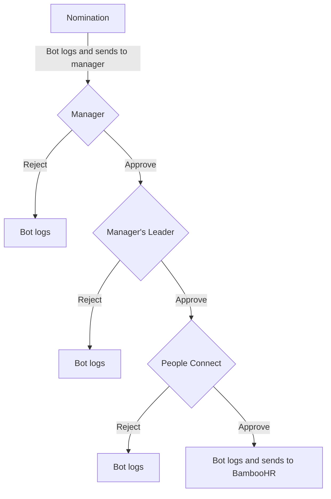

Can't find what you're looking for? Try the main [People Operations page](/handbook/people-group/).

## On this page
{:.no_toc .hidden-md .hidden-lg}

- TOC
{:toc .hidden-md .hidden-lg}

The following incentives are available for GitLab team members. Also see our separate page on [benefits](/handbook/total-rewards/benefits/) available to GitLab team members.

### Discretionary Bonuses

#### Discretionary Bonuses per Team Member

The number of discretionary bonuses given divided by the total number of team members, in a given period as defined. The discretionary bonuses per team member target is > 0.1. This analysis can be found on the [People Group Dashboard](https://app.periscopedata.com/app/gitlab/482006/People-Group-KPIs).

Discretionary bonuses are measured in BambooHR, as are the number of team members, in a given period as defined.

1. Calculate the number of the discretionary bonuses per month
  * Pull the "Bonus" Report from BambooHR.
  * Add the report to the metrics spreadsheet. Remove all data for bonuses other than discretionary bonuses and those not within the last rolling 12 months.
  * Populate the Last Rolling 12 Months Expense Table
1. Determine the percentage of bonuses granted for the Company
  * Using a pivot table, add in the count per month as well as headcount as of the last day of the month.
  * The formula will convert this to a percentage.
1. Determine the spread of bonuses granted by Division
  * Using the report filtered in the first section, generate a pivot table around the number of bonuses granted by division for the metrics month currently under review. For example, on July 1st you would be looking at the June metrics.
  * Pull the headcount report to add in the number of people in each division for that month.
  * The formulas will determine the percent per division on bonuses granted
  * Review the delta of the percent of headcount granted a bonus and add it to the Prior Change Column.
1. Outline any large deltas and note any takeaways for review at the next monthly metric meeting for People Ops.

<iframe class="dashboard-embed" src="https://app.periscopedata.com/shared/fe963ce6-510e-44ac-88f0-052002b6dc30?embed=true" height="2400"> </iframe>

#### Discretionary Bonuses for Individuals

1. Every now and then, individual GitLab team members really shine as they live our values.  We especially like to celebrate the special moments that exemplify the behavior we want to see in all GitLab team members.
1. We recognize this through the #thanks channel, and sometimes also through a discretionary bonus.
1. [Any GitLab team member can recommend a discretionary bonus for another GitLab team member to the GitLab team member's manager using the Nominator Bot](/handbook/incentives/#process-for-recommending-a-team-member-for-a-discretionary-bonus) for a $1,000 at [the exchange rate](/handbook/total-rewards/compensation/#exchange-rates). The exception is that direct reports cannot nominate their manager or anyone in their management chain for a discretionary bonus.
1. Only [GitLab team members](/handbook/people-group/employment-solutions/#team-member-types-at-gitlab) are eligible to receive a discretionary bonus / working group bonus or nominate other GitLab team members. Hence, `Temporary Contractors` (Not included in GitLab Team Member Types) are not eligible to receive or nominate discretionary bonus / working group bonus. Any such nominations for the temporary contractors will not be approved by the People Connect team.
1. We are fixing this amount at $1,000 thoughtfully and purposefully. We want the focus to be on the value and the behavior, not on the perceived monetary impact to GitLab. This is about recognition.
1. A general guideline is that 1 in 10 team members might receive a discretionary bonus each month. This can vary greatly as we don't give out bonuses just to hit a quota, nor would we hold one back because a certain number had already been awarded.
1. There is no limit to the frequency with which someone can receive a bonus. If someone deserves a bonus a day after being nominated for one we should do a second one.
  - _Note: If you received the same nomination twice (for the same person and the same reason), you must reject one. See more details in section for [multiple discretionary bonuses](/handbook/incentives/#multiple-discretionary-bonuses)_
1. As with other bonuses, only active GitLab team members can be nominated and can nominate other GitLab team members to receive discretionary bonuses.
   Should a nominated team member leave GitLab, they will not receive a discretionary bonus.
   It's at the discretion of the manager if they still want to publicly recognize the team member's behavior for the nomination.
1. Only individuals in good standing with the company are eligible for discretionary bonuses (I.E. not currently undergoing [underperformance remediation](/handbook/leadership/underperformance/)). If a team member receives a discretionary bonus nomination during a period of underperformance remediation, managers should wait until the underperformance remediation period concludes successfully before determining whether to admit the discretionary bonus request.

#### Valid and Invalid criteria for discretionary bonuses

Discretionary bonuses are to celebrate team members that live by our values. To make sure we are recognizing the right behaviors, below are some criteria to help you decide if a bonus meets the requirements for approval. Also in the nomination you are asked to elaborate on how this nomination is meeting the criteria.

*Valid bonus criteria*

*  Going above and beyond what is expected in regard to the team member's role description.
*  Truly exceptional work.  Good and great is already expected in a team member's work and performance.
*  Providing additional coverage or project load for other team members.
*  Team member's work results in higher productivity or improved processes that create efficiencies and results. This may also result in identifying cost saving initiatives.

*Invalid bonus criteria*

* Supplement to income.
* For being nice and friendly.
* For being helpful.
* Doing a project or task that is core to their role.
* For help onboarding a new GitLab team member.
* Hitting sales target or quota
* Providing customer insight
* Partnering or collaborating with other groups within GitLab
* Working long hours or on weekends

*Examples of a valid discretionary bonus*
 - The reason for the bonus is that this person (X, a Technical Writer) has single-handedly stepped in to act as a part-time documentation engineer in the absence of a full-time engineer.
The person's history of contributions is plain to see here: (Nominator included links to boards, issues or merge requests)
In particular, X's implementation of a Global Navigation and GitLab iconography for documentation are real highlights of X's impact for end-users. For developers, they have modernized the codebase and continues to work toward making `gitlab-docs` just like any other GitLab project for developers. X's dedication to the Technical Writing team over a long period of time motivates me to do more than just thank X in #thanks channel. X has specifically: Been active to see the Technical Writing team to succeed: /handbook/values/#see-others-succeed. X delivers for the team in lots of MVCs: /handbook/values/#minimal-viable-change-mvc, so we can get early value. For example, making iconography available using Markdown first, and planning to deliver other implementations later. X solutions are boring: /handbook/values/#boring-solutions, in that X aims to reuse as much GitLab code as possible, and raising instances where that isn’t the case as technical debt. For example, docs icons are the same library as icons in the product.

* I’d like to nominate X for a discretionary bonus for exhibiting the values for results, efficiency, and collaboration. While the whole backend engineers in the X team were OOO, despite it wasn’t his team, X stepped in and handled a problem (link) that was blocking a deploy. X was able to debug the problem, not an easy one by the way, communicate it to the different counterparts, and also fix it. X also spotted that it could affect other features and provide a way to fix them as well.

* I am nominating X for the values efficiency and results for the Nominator Bot. This bot assists us to nominate a team member for Discretionary Bonus without logging into BambooHR. This new bot speeds up the process probably by half the time it took to get approvals (for both me that administers the process and managers for approval) and directly now impacts our PI to increase discretionary bonuses. X is managing all the debugging and going above and beyond to solve any problems, without anyone asking X or having to follow up and this is out of scope of "just building a nominator" bot.
You can read more about the process in [our handbook](/handbook/incentives/#nominator-bot-process)

*Examples of invalid discretionary bonus*

* "X has been an integral part to my onboarding experience, working tirelessly to help me get access and answer to questions.  X truly embodies GitLab's value of efficiency, collaboration and results"
* "X has continually met or exceeding their sales quota for 3 months"
* "X is always willing to jump in even at the last moments to help out a team member"
* "X has helped to update handbook pages, keeping the handbook alive"
* "I find the team member is doing very inspiring work and easy to collaborate with"

*What does 'going above and beyond' mean?*

> to do more or better than would usually be expected of you

What do we normally expect of a GitLab team member? Read their job family responsibilities to determine if their work is part of the normal job expectations. As an example, a senior Frontend developer is expected to [solve technical problems of high scope and complexity.](/job-families/engineering/development/frontend/#senior-frontend-engineer). Going above and beyond involves taking on work that is outside the scope of their job responsibility listing, and executing it to a high level.

Some tips for knowing if someone is going above and beyond:

- Look at other successfully approved bonuses in that person's stage. Is this work similar?
- Look at the level above the person's current job responsibilities. Do their actions exceed their current role?
- Look at the impact of the person's work across the wider organization. Is the work done has a large-scale impact outside of their team or stage?
Any bonus submitted that does not include clear and valid reasons for submittal may be denied and the nominator / manager will be asked to provide further content and details.

#### Multiple Discretionary Bonuses

If you received the same nomination twice (for the same person and the same reason), you may reject one. When you do this, please reach out to the team member who submitted the nomination to explain, and include the other nominator's name in the #team-member-updates announcement.

**For example:**
- Person A submits a valid nomination for Project X on 2021-01-01
- Manager approves and it progresses in the approval process
- Person B submits a valid nomination for Project X (same project) on 2021-01-02
- Manager copies the nomination (because Nominator Bot may not save the message), reaches out to let Person B know, and rejects Person B's nomination.
- Person A's nomination is fully approved
- Manager shares in #team-member-updates, mentioning nomination by both Person A and Person B and with the descriptions from both

#### Process for Recommending a Team Member for a Discretionary Bonus

**Note:** Kindly use Nominator Bot for discretionary bonus requests instead of BambooHR.

##### Nominator Bot Process

**Any GitLab team member**
1. Go to Slack and type `/nominate`
1. Slack will open a dialog and ask you for some details about the nomination. Use the motivation text field, to write a few sentences describing how the GitLab team member has demonstrated a specific GitLab value in their work.  Please make sure you have viewed the valid and invalid criteria listed above. Don't forget that the nomination request should tie to our values and be detailed enough to ensure that the nomination meets the criteria. You can select the values it applies to.
1. If applicable, please be sure to include any relevant issues or merge requests that support the nomination.
1. Once submitted, the bot will send this over to the manager to kick-off the approval flow.
1. If at any point in the approval flow the manager or the manager's manager has a question about approving the bonus they can reach out to the manager and/or nominator for more context. If they have remaining questions related to the process and logistics (e.g., where is the bonus in the approval chain?) they can reach out to [people connect](/handbook/people-group/people-connect/). For remaining questions regarding guidance on whether to approve a nomination, they can reach out to their aligned [People Business Partner](/handbook/people-group/#people-business-partner-alignment-to-division).
1. Once everyone has approved the bot will report back to you with the good news. If it's rejected we ask the person who rejects, to reach out to you. That is not done by the bot.

**Manager Process**
1. The Nominator bot will send you a Slack DM asking to approve or reject the nomination.
1. When you decide to approve, all you need to do is click the approve button. The bot will take care of the next steps (sending it to the second level manager and the People Connect team).
1. When you decide to reject, click the reject button. The nomination will be updated as `rejected_by_manager`. The bot will ask you to reach out to the nominator as to make sure they understand why the nomination was not approved.
1. When everyone else has approved, the bot will reach out to you so you can share this with the team member, in the [#team-member-updates](https://gitlab.slack.com/archives/CL55Q4U0K) Slack channel, and optionally cross-post to the team member's group channel.

**Approval flow**

#### Working Group Bonus
1. Sometimes a [working group](/company/team/structure/#working-groups) strongly displays GitLab Values over a period, project or situation. For this case, we have group Working Group Bonus.
1. As with individuals, we recognize those who make up that group through the #thanks channel and sometimes through a Working Group Bonus.
1. [Anybody can recommend a Working Group Bonus through the managers of the individuals involved](/handbook/incentives/#process-for-recommending-a-team-member-for-a-bonus-in-workday) for $100 per person at [the exchange rate](/handbook/total-rewards/compensation/#exchange-rates).

#### Process for Recommending Working Group Bonus in Workday

**Any GitLab team-member**

1. Write a description of how the working group has demonstrated a specific GitLab value in their work.
1. Email that sentence to the managers of the individuals, suggesting a Working Group Bonus, and set-up a 15 minute Zoom meeting with all the managers to discuss your proposal. _Note: The alignment with managers can also be done asynchronously in a private Slack channel._
1. Remember that the manager(s) may or may not agree and they have full discretion (with approval of their manager) on whether their reports get a bonus.  Don't forget that you can also use the #thanks channel to recognize people, as well.

**Sales Development Focus Bonus (Sales Development specific working bonus)**

1. Sometimes a working group strongly displays GitLab Values over a period, project or situation. For this case, we have a  Working Group Bonus. The requirements for the sales development teams can vary from month to month and therefore may require a special focus from one or a group of individuals to complete  specific tasks.  Examples include: Adoption of a new process, driving new behaviors or special focus on a specific prospecting task from the sales team. This bonus is not an  income supplement or an incentive for the team to do their current job, but to reward extra effort.

1. The Focus Working Group Bonus can only be recommended by Sales Development Managers for individuals or a group of individuals within their teams. The budget for the focus bonus cannot exceed $500 monthly for any Sales Dev Team and will typically be divided amongst team members. 

**Manager Process**

1. Please submit as a [One Time Payment](https://docs.google.com/document/d/15_cqMAIoqkxNhoCTL42X3XUpr0E9fNZXFmY3Yitk2LQ/edit) in Workday

**Approval Process:**

1. The next level Manager receives an alert from Workday and can approve or deny.
1. Once approved by the next level manager, the request is sent to People Connect for review and final approval. 
1. Once fully approved, Payroll is notified of the bonus and can begin processing.
1. After this, the manager is able to notify the team member of the bonus and will announce it on the GitLab Slack channel [#team-member-updates](https://gitlab.slack.com/archives/CL55Q4U0K). The announcement should include the “who” and “why” of the bonus.

#### Communicating Discretionary Bonuses

As a general rule, the nominated team member's direct manager should be the only person who communicates discretionary bonuses. The manager will receive final notification via BambooHR or the nominator bot (depending on where the nomination process was initiated) and will know when the nomination has gone through all levels of approval.

The exception to this rule could be for working group bonuses if a single person nominated a group. If the nominator would like to announce on behalf of the group, they should:
* **Confirm that all bonuses have gone through all layers of approval**
* Confirm with each nominees direct manager that it is ok for them to announce on behalf of the group

#### Discretionary bonus reporting

On a quarterly basis there's a review of the discretionary bonuses data. This includes: # approved per manager, # rejected per manager and any trends on the reason for rejection. This way we can act on any trends and ensure an efficient and consistent process across the whole organization.

#### GitLab Anniversaries

At 10:00 UTC on Thursday of every week, `PeopleOps Bot` slack bot will send a shout out on the `#team-member-updates` channel congratulating all team members who celebrates a hire date anniversary that week.
Visit our [GitLab Anniversary Gift](/handbook/people-group/celebrations/#anniversary-gifts) section for more information about the gifts.

### Real Examples of Real Team Members Who Received Bonuses for Doing Great Things

* This document presents the case for awarding a UX team member an incentive. The UX team member is reliable, fair and respectful, consistently acting in the best interest of the company as well as the team.
  * Collaboration: The UX team member took on the extra duties of UX Lead and handled the interim duties seamlessly. She responded kindly to the community feedback on sidebar issue in 9.0 well. She personally helped the VP of Engineering finish the merit review process for the UX team.
  * The UX team member has greatly helped the UX Lead transition to her new role by assisting with meetings, transferring knowledge openly, and being available for questions whenever necessary.
  * Results and Efficiency: The UX team member quickly delivered screenshots for a partnership in a day or two. She did a great job with the UX team updates, providing clear and visual screenshots of what the team was working on. She helped the team deliver the UX improvements shown in those updates.

* A Support team member received a bonus for:
  * Results & boring solutions: He managed to swap the database from PG9.2 to PG9.6 without significant downtime. It was even boring. ­
  * Sharing: His issues, guidelines, monitoring, you­name­it are exemplary. He keeps raising the bar and leaving a written trace to follow when he is not around. ­
  * Efficiency: He always hits the nail and does the right thing, has a great sense of priorities and can jump into production to solve a _right now_ pain in a heartbeat. ­
  * Quirkiness: What to say? Do you want someone washing grapes or painting a wall in a call, just invite him.

* A Marketing team member received a bonus for:
  * Transparency: The marketing team member always works in the open. In our 1:1s she is very clear on her focus and aligns priorities with team priorities. Every thing she is working on links to an issue.
  * Efficiency: The marketing team member is an excellent example of someone who can get multiple things done in a short amount of time. She can efficiently manage many high quality projects without getting bogged down in the details.
  * Collaboration: The marketing team member worked with the VP of Scaling to update the general handbook to make it prettier. This shows she collaborates well outside of her team. The marketing team member has also been helping a colleague with content management.
  * Directness: The marketing team member gives excellent review feedback on blog posts. She is very direct and not afraid of perfection.

* A Product team member received a bonus for:
  * Collaboration:  Works together well with everyone and actively recruits opinions across the organization.
  * Results: Shipping consistent and meaningful improvements in issues, board, etc.
  * Efficiency: Actively avoids meetings and encourages async work.
  * Iteration: Reduces everything to its very minimal iteration, not paying with quality or usability, yet moving forward with each release.

### GitLab Awards Program
Each fiscal year the GitLab Awards program recognizes team members who made great impact as a result of displaying our [Values](/handbook/values/#credit). The GitLab Awards Program consists of two different types of awards: The DZ Award and Values Awards. Generally we open the window for nominations in the fourth quarter of the fiscal year. Winners will be announced before the end of the fiscal year.

#### The DZ Award
In honor of our valued co-founder, [Dmitriy Zaporozhets “DZ”](https://gitlab.edcast.com/insights/dz), his contributions and him dedicating 10 years to GitLab, GitLab recognizes a team member each fiscal year who made a great impact solving a hard problem by using a [boring solution](/handbook/values/#boring-solutions).

The DZ award details:
- The recipient of The DZ award will receive a one time cash bonus equivalent to $10,000 USD at using the local exchange rate. This is designed to honor DZ's 10 years of contributions to GitLab and the recipient's role in continuing DZ's legacy.
- Special designed GitLab Award and Headphone Stand 

#### Criteria for The DZ Award
Potential nominees should be any team members who solved a challenging problem by creating and implementing a [boring solution](/handbook/values/#boring-solutions) that resulted in a positive and profound impact.

**Criteria used to calibrate:**
- OKR results and outcomes
- Significant business result/impact from the boring solution in this Fiscal Year.
- Contributions outside the general scope of the role (e.g. this award would not be granted for business as usual boring solutions)

**Criteria not used to calibrate:**
- The team member holding a technical role or creating a solution to a technical problem is not a requirement to be nominated for this award.
- Grade within the business - this award is not intended to be granted to only leaders, but instead available to all team members.
- [Talent Assessment](/handbook/people-group/talent-assessment) - while we want to ensure we continue our pay for performance compensation philosophy, team members can be eligible for this award regardless of the output of the last review cycle.
- The only criteria is that the team member would need to be in good standing (e.g. not on a PIP/recently received a Written warning).

#### The Values Awards
The Values Awards honor those who embody and employ the GitLab values which are fostering an environment where everyone can thrive. These awards specifically recognize team members who are inclusive with all team members in their diversity of thought and perspectives. Team members eligible for these awards demonstrate: no ego in the workplace, use a single source of truth, saying why not just what, and embracing uncomfortable ideas and conversations. The contributions or displays of the GitLab Value should be visible beyond the team member’s direct team, customers, users or investors.

The Values Awards details:
- There are six awards, one for: Collaboration, Results, Efficiency, Diversity, Inclusion and Belonging, Iteration and Transparency.
- The recipient of each value award will receive a one time cash bonus equivalent to $5,000 USD at the exchange rate.
- Special designed GitLab Awards medal. 

#### Values Award Descriptions
#### [Collaboration](/handbook/values/#collaboration) Award
To achieve results, team members must work together effectively. The value award for [Collaboration](/handbook/values/#collaboration) should be awarded to a team member that made helping others a priority and went above and beyond in ways that led to tangible results. This can come in the form of for example: giving feedback effectively, sharing, reaching across company departments or short toes.

#### [Results](/handbook/values/#results) Award
We do what we promised to each other, customers, users, and investors. The value award for [Results](/handbook/values/#results) should be awarded to a team member that went above and beyond to get to significant results for a company wide impact. This can come in different forms through for example: ownership, perseverance, dogfooding or disagree, commit, and disagree.

#### [Efficiency](/handbook/values/#efficiency) Award
Working efficiently on the most important business initiatives enables us to make fast progress, which makes our work more fulfilling. The value award for Efficiency should be awarded to a team member that helped make fast progress through for example championing writing things down, embracing change or being a manager of one.

#### [Diversity, Inclusion & Belonging](/handbook/values/#diversity-inclusion) Award
We aim to make a significant impact in our efforts to foster an environment where everyone can thrive. The value award for Diversity, Inclusion and Belonging should be awarded to a team member that contributed to creating an environment where people from every background and circumstance feel like they belong and can contribute through for example: their bias towards asynchronous communication, seeking diverse perspectives or embracing neurodiversity.

#### [Iteration](/handbook/values/#iteration) Award
We do the smallest thing possible and get it out as quickly as possible. The value award for Iteration should be awarded to a team member that contributed or displayed iteration that led to faster results through for example: setting a due date, minimal viable change (MVC) or low level of shame.

#### [Transparency](/handbook/values/#transparency) Award
By making information public, we can reduce the threshold to contribution and make collaboration easier. The value award for transparency should be awarded to a team member that contributed or displayed transparency through for example: determining what is not public, use of single source of truth and saying why not what.

#### Criteria for value awards:
- Significant contribution or display of GitLab Value in this Fiscal year.
- The contribution or display of GitLab Value led to tangible results.
- The contribution or display was visible to team members outside of their direct team, customers, users or investors.
- Contribution or display was outside the general scope of their role/Job Family responsibilities
- ​​Truly exceptional work. Good and great is already expected in a team member's work and performance
- Team member is in good standing with the company (e.g. not on a PIP/recently received a Written warning).

#### Nomination process for awards
All team members can make nominations for both The DZ Award and Values Awards. When you want to nominate a peer it’s crucial to loop in your manager and your Department Head. Ultimately each Department Head can bring forward 1 nomination for the DZ Award and 1 nomination per value. The Department Head should loop in their People Business Partner with the final nominations in the correct format. The People Business Partners will coordinate the nominations for both awards and ultimately nominations will be calibrated at the E-Group level.

##### Overview of the nomination process:
- When the nomination window opens managers and the Department Heads can gather nominations.
- The Department Head has to ensure the nominations come in the correct format as described below and the People Business Partners will work with the leaders to finalise the list of nominees:
  - For The DZ Award there’s [this nomination template](https://docs.google.com/document/d/1I1zpTCmoC1_1uU56xBmLXMwZYvODsmyVU0CEAPBekYg/edit#heading=h.5ahg1o4v53q7) which should be filled out to bring forward a nomination.
  - For The Values awards we’ll gather nominations via [this form](https://forms.gle/Pt8iPA3wg1iiG3nHA) and fill out [this template](https://docs.google.com/document/d/1M8GMh7JtcBDHw6A5wNlkq08YvCSwUjrkjqNK_5hEVlE/edit#) only for final nominees on a Division level.
- When the nomination window closes People Business Partners will ensure all nomination documents are completed before calibration.
- People Business Partners will then calibrate between department nominations with the E-group leader to select one team member nomination for The DZ Award and up to one team member per Value for the Values Awards.
  - Engineering and Sales will be able to nominate two team members for The DZ Award.
- The nominations are finalized and E-group will discuss the nominees from each group and select the award winners.
- The award winners will be announced.

### Referral Bonuses

Chances are that if you work at GitLab, you have great friends and peers who would be fantastic additions to our [Team](/company/team/) and who may be interested in joining our team. To help us grow with exceptional people, we have [Referral Bonuses](/handbook/hiring/referral-process/) that work as follows:

We encourage and support [diversity](/handbook/values/) and [frugality](/handbook/values/) on our team and in our hiring practices, so we will offer the following referral bonuses once the new team member has been with the company for 3 months. We will award the highest cumulative dollar amount as outlined below:
* [$1,500](/handbook/total-rewards/compensation/#exchange-rates) base referral bonus for a new hire.
* [$1,500](/handbook/total-rewards/compensation/#exchange-rates) add-on referral bonus for a hire from a ["select underrepresented group"](/culture/inclusion/#examples-of-select-underrepresented-groups).

The following is an *example* of a cumulative Referral Bonus:
* Hire a referred Sales Development Representative: $1,500
* Who self-identifies as a member of a ["select underrepresented group"](/culture/inclusion/#examples-of-select-underrepresented-groups): + $1,500
* Cumulative referral bonus to the referring team member: **$3,000**

#### How to make a referral

For information regarding the program details and team member eligibility and understanding, please visit our [guide in the Hiring section of GitLab's handbook](/handbook/hiring/referral-process/).

If a team member has been referred, the People Connect team will review team members' self-identification data in BambooHR including Gender, Ethnicity and Veteran status to determine if the team member qualifies as belonging to a select underrepresented group. The People Connect team will edit the referrer's referral bonus as applicable. People Connect will confirm the bonus amount when it is entered into BambooHR and will process the bonus.

* Exceptions
   * no bonus for hiring people who report to you directly or are in your direct reporting chain,
   * no bonus for a current executive team member (VP and above) who's referral is hired,
   * no bonus if you refer current team members,
   * no bonus for referring a [Boomerang Team Member](https://www.bamboohr.com/hr-glossary/boomerang-employee/),
   * no bonus for a referring team member will be applicable if the team members employment is terminated prior to the referral bonus payout date. You need to be an active team member.

* In the event that more than one GitLab employee refers the same team member for the same role the People Ops team will ask the new team member to confirm who they were referred by (who should get the credit). If they mention two or more people then the bonus will be split between them.

* In the event that someone wants to refer another candidate to GitLab before they have started the referring party must have a sign contract at the time of the new candidate's application.

* In the event that a GitLab sourcer adds a candidate to GreenHouse and the recruiter screens the candidate a referring party cannot be added to their profile after. The candidate source would be Prospecting by the GitLab sourcer.

#### Referral Bonus Processing

1. The People Connect team processes referral bonuses weekly out of the GitLab Referral Bonus Audit Workday report
1. One Time Payments are added to Workday after reviewing the report and ensuring all qualifications have been met
1. Payroll is notified of the completed bonus and can begin processing

#### Temporary Add-on Campaign additional tracking for payout

1. Talent Acquisition Manager will track all referrals set to hired in time period of Add-on campaign.
2. Talent Acquisition Manager will notify People Connect by Slack or email, the first of the month that aligns with the referral new hire's 3 month employment at GitLab.
3. People Connect will follow [steps outlined above](/handbook/incentives/#document-a-future-bonus-in-bamboohr)

### Get Together Grant

Start your quarter off by getting to know someone new at GitLab, or meeting someone in person for the first time! During the first month of every quarter in Feb, May, Aug, and Nov, we invite team members to use a Get Together Grant to meet up with a team member either in person or virtually. To take part in the grant, check out the following details:

1. Each team member can expense up to $50 USD each quarter on a meal, activity, or ground transportation to spend time with a GitLab team member in-person. Or, up to $25 USD each quarter for a virtual Get Together on a remote activity, remote coffees or remote meals (yes, this means you can have a real coffee for your remote coffee chat).
1. To use the grant, get together with a team member and expense up to $50 USD for in-person meet-ups or $25 USD for virtual meet-ups in Expensify by selecting the Get Together Grant category in the dropdown the first month of every quarter (Feb, May, Aug, and Nov) and writing whether your get together was live or virtual in the line items. The expense report must be submitted within 1 month of the Get Together.
_Please note, Get Together expenses that are submitted outside of these months will not be approved and any amount over the allotted $50 USD per person for in-person and $25 USD per person for remote get togethers will not be approved. Limit one Get Together Grant per person the first month of each quarter._
1. Team members can plan, pay for, and expense a Get Together in an eligible month (Feb, May, Aug, and Nov) for an activity or expense that allows them to get together with another team member later in that quarter.
1. Once you participate in a Get Together with another team member, share your experience and few pictures for a chance to be featured in social by submitting [this form](https://forms.gle/Z3CLPFAQGcAbwzN26).

#### Group Get Togethers

Please review the latest [Covid-19 guidance for in-person GitLab events that include more than 5 attendees](/handbook/travel/#for-in-person-gitlab-events) before planning a Group Get Together.

In areas where many GitLab team members live, stay tuned in Slack and on this page for planned events where we'll invite all GitLab team members in that area to join together in person. For team members who participate in Group Get Togethers, individual Get Togethers in person or remote will not be available in the month the Group Get Together takes place.

Planning a group get together is easy! Simply head to our [GitLab Team Member Socials](https://gitlab.com/gitlab-com/gitlab-team-member-socials) project and [create an issue](https://gitlab.com/gitlab-com/gitlab-team-member-socials/-/issues/new) to start planning your group get together ([example](https://gitlab.com/gitlab-com/gitlab-team-member-socials/-/issues/2)).

For more questions about Get Together Grants, please review the [FAQ](https://docs.google.com/document/d/1gt67EQKBoumA3ihTLecwjI4Haen9UImbFMumqKKegL4/edit).

### Visiting Grant

In FY21-Q1, GitLab suspended the Visiting Grant program until further notice. Due to the cancellation of [Contribute](/events/gitlab-contribute/) in FY23, we have introduced a special Visiting Grant Program for FY23-Q3 (2022-08-01 to 2022-10-31). Program details differ.

#### FY23-Q3 Visiting Grant Program

We canceled Contribute FY23-Q3 due to the COVID risk to team members in having a large, global event in an indoor facility in the middle of summer. Contribute’s purpose was to “get [team members](/company/team/) together to interact with one another and cultivate our community.” Introducing FY23-Q3 Visiting Grants is a way to capture the spirit of this by providing team members with another opportunity to spend time together within FY23-Q3 (2022-08-01 to 2022-10-31).

While the FY23-Q3 Visiting Grant Program shares a lot in common with the previous Visiting Grants Program, it varies in a few key ways:

##### Local Area

For the purposes of the [FY23-Q3 Visiting Grant Program](#fy23-q3-visiting-grant-program), a team members `local area` is being defined as within 50 miles/80 km from the team members home OR requiring less than 1.5 hours travel time one-way.

If team members have opportunities for participation in their local area, they should consider these. Contribute was canceled to reduce travel time to minimize COVID risk.

##### Timing

The event must happen within FY23-Q3 and and expenses filed within 7 days of the event ending

##### Team member inclusion

Efforts should be made to welcome all team members and [teams](/company/team/structure/#organizational-structure) when there are opportunities to do so within a geography. We encourage team members to plan events that are inclusive of cross-functional team members, but team members can choose to use these funds for team events. 

If you are planning a team event, you should still look for opportunities to include team members from other functions who live in the local area. For example, a team meeting in London, England could open up their dinner or happy hour to all team members within the location. This would be advertised in the [shared event planner](https://docs.google.com/spreadsheets/d/1cCuzXhBIpMInn30-ZD1XCcNnv21CwsmsA9TorW03d7Q/edit?usp=sharing) and posted in the local Slack group. 

All events should include at least *4 people.* Please ensure the activity is one where all team members attending would feel included. Exceptions to the number of people is okay if team members live in a location with few team members. In this case, team members can have local events that are inclusive of everyone who is within travel distance of the event. This may mean fewer than 4 people.

##### Planning transparency

Please list any events or activities in our [shared event planner](https://docs.google.com/spreadsheets/d/1cCuzXhBIpMInn30-ZD1XCcNnv21CwsmsA9TorW03d7Q/edit?usp=sharing), so all team members have the chance to opt in. Local or event/activity specific Slack channels can be used for organization.

When traveling and attending the event, please:
- Use "Conference" PTO in PTO by Roots to mark your plans timeframe.
- Change your GitLab status to reflect that you are not available for work. 
- Make sure your manager and your team is aware of your plans.

Everyone is encouraged to plan their Visiting Grant activities according to our [Flexible PTO](https://about.gitlab.com/handbook/paid-time-off/#a-gitlab-team-members-guide-to-time-off) policies.

##### Spending caps

Team members are expected to manage their individual expenses and adhere to expense caps. If events are centrally organized, coordinators should be clear with team members on how much of their FY23-Q3 allocation is going to the event. Team members are responsible for [spending company money like its their own](/handbook/spending-company-money/#guidelines) and not exceeding their individual budgets.

1. Team members should plan to have gatherings with a group of at least 4 people. 
1. Team members can spend up to $500 to participate in events within their [local area](#local-area). If team members are attending events within their [local area](#local-area), they can expense transport but not accomodations. 
1. Team members can expense up to $1000 each if they are traveling beyond their [local area](#local-area) to attend events. This option is open to team members who have local options, but choose to travel. These team members can put their budget toward accommodations in addition to travel expenses.
1. Each team member can choose to participate in as many events as they like as long as they can do this within budget. If the team member is attending both local and long-distance events, the $500 local events budget is supplemented by an additional $500 for a grand total of the $1000 travel budget.
1. For some team members, $1,000 is insufficient for participation in at least one event. To qualify for an exception, you would not have any available options within the $1,000 expense cap. This means that the team member is in a relatively remote area and does not have viable options for meeting with other team members within budget. If the team member lives in an area with at least four team members, they should explore meeting with this group before requesting any exception. For example, if there were not an event planned in DC, a team member should first explore opportunities to meet with the over 70 team members in the DC metro area before requesting additional funds. If you believe that you fall into the exception bucket, please fill out the [exception form](https://gitlab.com/gitlab-com/chief-of-staff-team/cos-team/-/issues/new) by choosing the Fy23Q3VisitingGrantExceptions template that can be found in the "description" dropdown. Your situation can be considered by your manager and then a member of the CoST to the CEO Team who will evaluate based on the criteria captured above. 

##### What can be expensed

In addition to transportation, team members can expense hotels when traveling outside of their [local area](#local-area), meals with other team members, passport, visas, COVID testing, and activities with other team members. As long as 4 team members are present on a given day, accommodations and related travel expenses will be covered. Team members may expense accomodations for the night prior to the event only if best efforts have been exhausted to arrive the day of the event. 

##### Additional spending guidelines

All individual plane travel must be booked through [TripActions](/handbook/travel/#booking-travel-and-lodging) when possible. You may also choose to book lodging and other travel through TripActions. In TripActions, you should put "FY23-Q3 Visiting Grant" in the *Purpose* field when booking. For flights booked outside of TripActions, team members should expense tickets up to the maximum amount through Expensify. Be aware that by not using TripActions, team members will be responsible for potential fees associated with any transport issues (ie. cancellations). 

If team members have layovers related to travel to and from the event, please expense the airfare as one trip. If something happens in transit that cannot be supported through TripActions, you will be responsible for the fees. If you decide to stay over during the layover, you will be responsible for any related expenses to the extended stay. 

Preference using your budget toward booking air travel through TripActions before you spend any of your allocation on other expenses. Unless you receive an exception, **if you spend over $1,000 on airfare, you will need to reimburse GitLab for the overage. When your expense cap is exceeded, do not expense additional expenses, for example, hotel, events, and food, associated with your travels.** If you choose to spend above your budget on air travel, you should still book through TripActions, but you will be responsible for your overages. You will also be responsible for any overages in Expensify.

To reimburse GitLab, please fill out the [Travel Grant Reimbursements template](https://gitlab.com/gitlab-com/chief-of-staff-team/cos-team/-/issues/new#) by choosing the "Fy23Q3VistingGrantReimbursements" description to alert your manager and allow us to track repayments. Direct deposit instructions will be sent to you and tailored to your location. All reimbursement deposits **must be received by GitLab by 2022-10-31**.

If more than 10 people are traveling to a central location and booking a hotel, or if you are booking catering for the event, we require these purchases to have a purchase order to ensure the best rates. All purchases must be made following the [procument process](/handbook/finance/procurement/#--what-is-the-procurement-process-at-gitlab).

You may pool your budgets across a group to make budgeting easier and increase purchasing power. E.g. a group of eight can have a collective budget of $8000. The decision to do this will be up to the [DRI](#organization) for the event.

Expensify can be used to reimburse other expenses within budget. In Expensify, the team member should code any related expense to the Category  "Company Functions" and to the Classification "FY23-Q3 Visiting Grant". 

##### Organization

We recommend that each event or activity has a [DRI](/handbook/people-group/directly-responsible-individuals/). This can be anyone who plans to attend that event or activity, and encourage team members to take a [Bias for action](/handbook/values/#bias-for-action) to self nominate, or nominate someone they know will be attending who would like to be the `DRI`. Please ensure the `DRI` is entered in the [FY23-Q3 Visiting Grant Events](https://docs.google.com/spreadsheets/d/1cCuzXhBIpMInn30-ZD1XCcNnv21CwsmsA9TorW03d7Q) sheet, and if you're nominating someone else, please check with them first before adding them to the sheet.
 
##### Safety and compliance for FY23-Q3 Visiting Grant Program

Team members should be aware of key GitLab policies and asks. 

1. Activities should be consistent with GitLab's [values](/handbook/values/).
1. Any travel should be in line with our [travel policy](/handbook/travel/) and associated activities should comply with company [COVID policy around testing, masking, vaccination, etc...](/handbook/travel/#travel-guidance-covid-19).
1. Team members should review [GitLab's Business Travel Accident Policy](https://about.gitlab.com/handbook/total-rewards/benefits/general-and-entity-benefits/#business-travel-accident-policy) and familiarize themselves with the company's [travel insurance](https://drive.google.com/file/d/0B4eFM43gu7VPVl9rYW4tXzIyeUlMR0hidWIzNk1sZjJyLUhB/view?resourcekey=0-CDrQbA3YfmHHDM69Zuzxlg). GitLab will not be responsible for activities that fall outside of the policy. 
1. Team members should adhere to the [GitLab Code of Conduct](/company/culture/ecoc/).
1. Team members should refer to our [contracts and vendor policies](/legal/procurement-guide-collaborating-with-gitlab-legal/#signing-contracts) and refrain from signing contracts on behalf of GitLab. 
1. Associated activities should comply with local laws.
1. Events should be outdoors as much as possible to reduce COVID risk.
1. Team member safety should be considered in event planning. Funds should not be used toward risky activities. 
1. Events should not involve activities that would not be covered under insurance. Please reach out to total-rewards@gitlab.com for any questions related to what activities are covered.
1. Team members should consult travel advisories, for example the one provided by the [U.S. Department of State](https://travel.state.gov/content/travel/en/traveladvisories/traveladvisories.html/) and avoid international travels to places against travel advice or with known unrest. 
1. Team members should not use this program to subsidize existing travel plans. This grant exists to get team members together. Expenses should reflect this intent. 

This Program has a limited timeframe, but we’ll look to the success of this program and other alternatives that support team member interactions and cultivation as we determine how best to support team member relationship building in the future. If you have questions, please post them in the [#fy23-q3-visiting-grants](https://app.slack.com/client/T02592416/C03P3D9PYLW) Slack Channel. 

##### FY23-Q3 Visiting Grant Program FAQ 

We'll attempt to document answers to frequently asked questions in the handbook, please also refer to [this document](https://docs.google.com/document/d/1ID9iYSgxfecwc48QBUrnmEOK2dwLaggtZ_AEzgr1BpE/edit#).

1. Can I spend out of pocket without reimbursement if I want to participate beyond what is allowable given my budget?
   1. You can use your own money beyond your personal event budget if it is possible to split out your personal monetary spend. For example, if a DRI is planning an event with 30 people and there is no way for you to pay your share fully with your event allowance, you can use personal money out of pocket towards this difference. If this is something that you are interested in doing, please sync with the DRI(s) in advance of an event to confirm that you can pay for all/part of your participation with your own money.
1. Am I eligible to participate in the Q3 Visiting Grant if I'm on an approved Leave of Absence?  
   1. While utilizing the Visiting Grant is completely optional and voluntary, and since it's intent is to allow Team Members to get together in person, yes, you are eligible to participate in the Q3 Visiting Grant program as this is not considered a business related expense. Other business expenses related to completing work during a leave of absence are not allowed, as per our [Expense Policy](https://about.gitlab.com/handbook/finance/expenses/#-expense-policy-summary).
1. My significant other will be traveling with me, should I use the TripActions portal to book and then pay back to GitLab for the significant other booking fees? 
   1. TripActions Business Travel is paid by GitLab's corporate card, so you need to use your personal card (personal booking or outside TripActions) for that portion that is +1, not yours. To book both tickets together, you should pay for the flights on your personal card and expense your own ticket with the rest of your trip/event related fees. See [personal bookings](https://about.gitlab.com/handbook/travel/#booking-travel-through-tripactions-) for more guidance. 

#### Sharing your Visiting Grant stories

If you're a GitLab team member who has traveled and utilized GitLab's Visiting Grant or are planning to do so soon, consider sharing your story!

If you've previously made use of the [Significant Life Event Grant](/handbook/incentives/#significant-life-event-grants) (temporarily suspended), please check with the team member who invited you to their event if they are comfortable with you sharing their story first.

These stories are useful in showing the world how we stay connected as a [geographically diverse team](/culture/inclusion/#fully-distributed-and-completely-connected). This is important as we [recruit the world's best talent to join us](/jobs/), as well as encouraging colleagues to take a leap, explore a new culture, and visit a team member in a new locale. They may be shared on GitLab's social media platforms, on hiring portals such as Glassdoor, or on the [GitLab blog](/blog/). You can also post pictures in the [#fy23-q3-visiting-grants](https://app.slack.com/client/T02592416/C03P3D9PYLW) Slack Channel. 

#### The Original Visiting Grant Program

Please note in FY21-Q1, GitLab suspended the Original Visiting Grant program until further notice. GitLab is an [all-remote company](/company/culture/all-remote/) with GitLab team-members all over the world. If you want to visit other team members to get to know them, GitLab will assist with travel expenses (flights, trains, and ground transportation to and from the airport) for a total of up to $150 for every team member that you visit and work with. Please note lodging is excluded. To be clearer, if you meet 2 [GitLab team members](/handbook/communication/top-misused-terms/) during your visit, the maximum limit of your visiting grant could be $150x2. You don't need to work on the same project or team, either, so long as you discuss work for at least part of the time you're meeting. Before booking any travel using the travel grant budget please discuss your proposed travel with your manager. We encourage team members to utilize the travel grant, however in some cases - for example, a team member has performance issues related to their role - the visiting grant would not be applicable.

Note that meals and local travel while visiting are not typically covered for anyone as that wouldn't really be fair to those being visited. It may be acceptable to cover a meal, however, if the meeting is pre-announced to other people in the region to encourage as many of them to attend as possible and there are four or more GitLab team-members attending.

There are many regular meet-ups of GitLab team-members in many cities. We have a [shared calendar][meetup-calendar] to view the schedule. Subscribe to it, make use of the visiting grant, and join meet-ups near you (or far away!).

To claim the grant, include a line item on your expense report or invoice along with the receipt of your flights, trains, and/or transportation to and from the airport with a list of the team members you visited. The expense report may be submitted during the first month of travel or up to 3 months after your trip has concluded. That said, if it's more [frugal](/handbook/values/#efficiency) to book and expense your travel further in advance, please do so.

[meetup-calendar]: https://calendar.google.com/calendar?cid=Z2l0bGFiLmNvbV85cWZnajRuMm9nZHMydmlhMDFrb3ZoaGpub0Bncm91cC5jYWxlbmRhci5nb29nbGUuY29t

#### Significant Life Event Grants

As we continue to prioritize the health and safety of our team members, GitLab is temporarily suspending the Significant Life Event Grant program until further notice.  We continue to monitor the situation and will update this information and the [travel policy](/handbook/travel/#travel-guidance-covid-19) accordingly.

Recognizing that [GitLab Team Members](/handbook/communication/top-misused-terms/) may wish to share significant events in each other's lives, such as weddings or civil partnerships, GitLab will assist with travel expenses to attend these events. This grant works the same way as the [Visiting Grant](#visiting-grant), except the reimbursement limit is $300 per team member you visit at an event.

### GitLab Ultimate

Every GitLab team member can request the [Ultimate](/pricing/#gitlab-com) tier for GitLab.com.
In case a team member has separate private and work accounts on GitLab.com, they can request it for both. This incentive **does not** apply to groups owned by GitLab team members (Group-level Ultimate features such as epics will not be available for Ultimate GitLab team-member personal accounts, for instance).

In order to request this benefit please [submit this form](https://docs.google.com/forms/d/e/1FAIpQLSddexI8VZTCiyxme1_7QtbQZ6WoIJRlHdaI2Gi6PD8Eti-DLQ/viewform). Your account(s) will be upgraded to the Ultimate tier within 2 hours of submission. If you have questions about this process or don't see this upgrade after 2 hours please reach out in the [#it_help GitLab slack channel](https://gitlab.slack.com/archives/CK4EQH50E).
