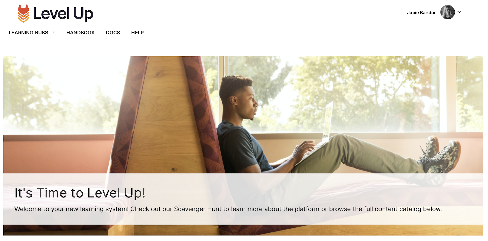
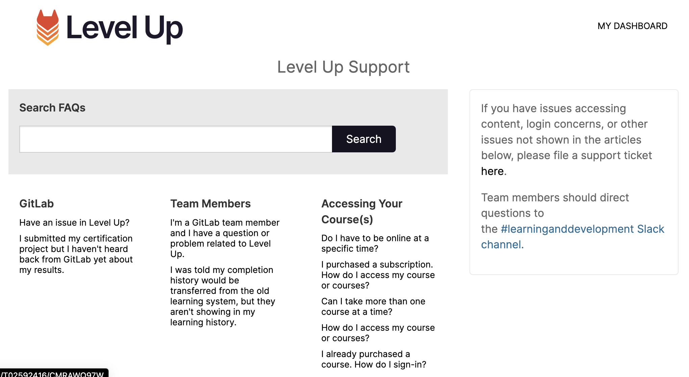
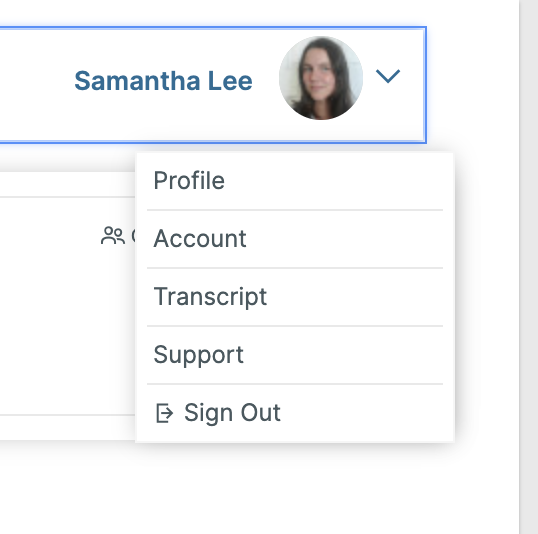
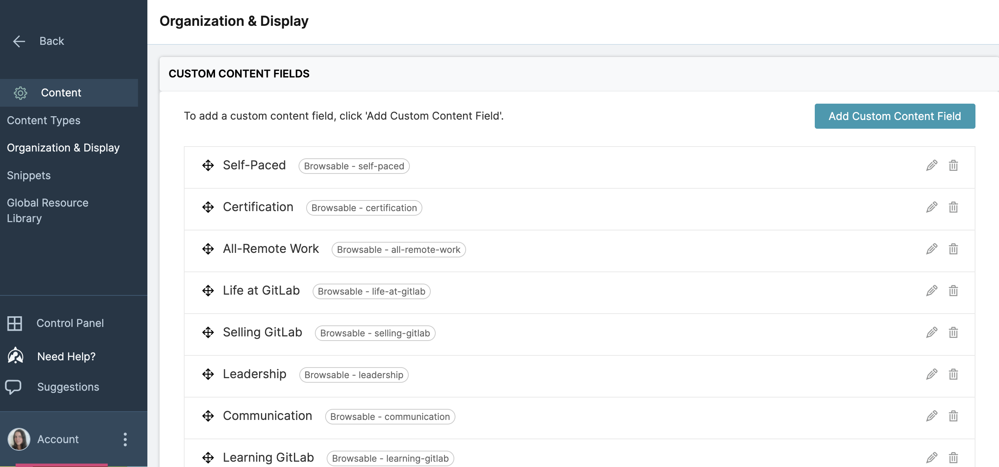
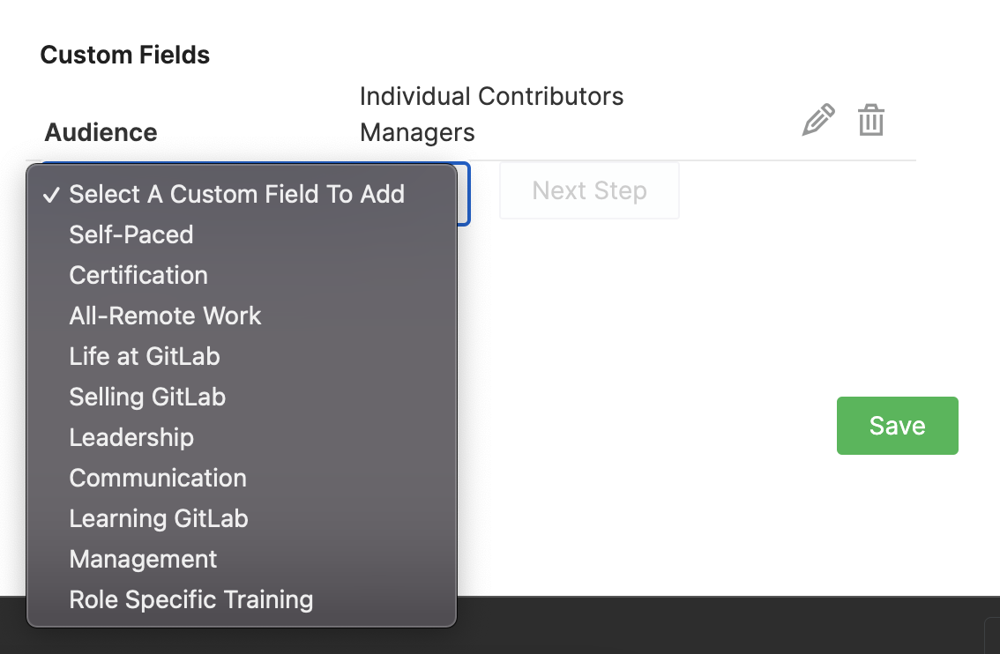

## On this page
{:.no_toc .hidden-md .hidden-lg}

- TOC
{:toc .hidden-md .hidden-lg}

# Welcome to Level Up!
<!-- blank line -->
This handbook page is meant to support both learners and administrators in Level Up. Thought Industries is the provider of the Level Up platform and is mentioned often in this documentation.

{: .medium.center}

# Contribute to Level Up
<!-- blank line -->
At GitLab, [everyone can contribute](/company/mission/#mission). Read below about how to contribute to Level Up.

### Why contribute?

Contributing to Level Up democratizes learning and enables our team members, customers, and community members to contribute to the growth of learning opportunities at GitLab. Some benefits for contributors include:

1. Share the work you've created to teach others how to use GitLab
1. Curate existing information that has helped you or others learn to use GitLab
1. Share information you've created about working remotely
1. Establish yourself as a subject matter expert within our learning community
1. Share learning pathways and other instructional design materials you've created
1. Enable organizations to learn about GitLab using innovative learning methods

To contribute to Level Up, please open an issue in the [lxp-contributions project](https://gitlab.com/gitlab-com/people-group/learning-development/lxp-contributions) using the `lxp_contribution` issue template. 

**Stay Tuned:** Future iterations of contributions to Level Up will include elevated permissions for Learning evangelists to add new material directly to Level Up!

# Support

For questions not answered below, reach out in the #learninganddevelopment Slack channel or [open an issue](https://gitlab.com/gitlab-com/people-group/learning-development/lxp-contributions).
<!-- blank line -->
**I'm a GitLab team member and I have a question or problem related to Level Up.**
     - Please reach out to the #learninganddevelopment Slack channel for support. 

**I was told my completion history would be transferred from the old learning system, but they aren't showing in my learning history.**
     - Don’t worry, we’re working on transferring learning completion but it will take a couple of weeks for the transfer to be fully completed. You can follow updates in the #learninganddevelopment Slack channel.

**I have a question about how to use the Level Up platform.**
     - When you're logged into Level Up, click the drop down menu next to your profile photo and select `Support`. Here, you'll see both general and Gitlab-specific help resources related to using Level Up. See screenshots below.

     {: .medium.center}

     {: .medium.center}

# Administrator Resources

## Training
<!-- blank line -->
1. The Thought Industries [Academy](https://academy.thoughtindustries.com/) includes self-paced training and support articles. Access the academy by clicking the `Need Help` button on the left side bar when logged into Thought Industries and scroll down to `Learn More in the Academy`
1. Admin in Level Up can use the `Help Center` to report technical problems with platform directly to Thought Industries.
1. [Platform Settings PDF Guide](https://drive.google.com/file/d/1MXf8NTGRHWloO4WWZYwcRcDzrVucOfcW/view?usp=sharing)

## Administrator Home Page
<!-- blank line -->
The admin home page is a place for platform administrators to access:
<!-- blank line -->
1. Thought Industries announcements and feature highlights
1. Updates on new platform features, shared the last Tuesday of every month
1. `Suggestions` tab to submit platform feature enhancements
1. Opt-in subscriptions for system updates, outages, and scheduled maintence (suggested for all admin)
1. The `Control Panel` that lists all features enabled in the Level Up instance

## Platform Settings

### Notifications
<!-- blank line -->
1. **Emails:** [Refer to this list of default emails sent to users](https://support.thoughtindustries.com/hc/en-us/articles/4404293128215-Default-Platform-Emails-to-Learners)]. Emails are branded for Level Up

## Content settings
<!-- blank line -->
1. **Content Types:** Access by navigating to `settings` -> `content` -> `content types`. Here you can create new content types, like a `module` or `course video` that isn't already included in the standard Thought Industries content types. You cannot edit a content type once it's been used.
1. **Ribbons:** Use ribbons when authoring a course to communicate to the learning with types like `free`, `featured`, `popular` or `new`. Create a new ribbon by navigating to `settings` -> `content` -> `organization and dispaly`.
1. **Global Resource Library:** These resources can be toggled on and accessed in any course. You can upload or author PDFs, pages, videos, etc. The same resource library is shared for all courses.
1. **Snippets:** Frequently used HTML text that can be used across all content when authoring.
1. **Add to Queue:** Navigate to `settings` -> `content` -> toggle on `add to queue` to allow user to save content for later.

## Certification and Gamification Settings

### Certificates
<!-- blank line -->
1. Awarded upon completion of learning content
1. Establish fields for all certifications by navigating to `settings` -> `certification`
1. `Level Up` is provisioned so users can share certificates on LinkedIn
1. A `.jpg` or .`jpeg` blank certificate must be uploaded when authoring a course
1. When building a course, drag and drop criteria to be auto-filled into the blank certificate file

### Gamification (these are gained as people earn points in the system)
<!-- blank line -->
1. Navigate to `settings` -> `gamification` to edit.

#### Points (Awards)
<!-- blank line -->
1. Awards in Level Up are called Points 
1. Users earn points for completing certain actions. **These must be configured, and are completely custom, by the GitLab team.*

#### Badges
<!-- blank line -->
1. Users earn badges based on their collected points
1. Badges must be configured by GitLab team. There is an optoin to upload custom badges. An example could be earning the `high achiever` badge after earning 50,000 points.

## Authoring

Level Up uses a [handbook first](/handbook/handbook-usage/#why-handbook-first) approach for all learning content, using the handbook as our single source of truth for learning content. 
This approach ensures:

- all voices and contributions are heard
- barriers to contributions are removed or reduced
- the organization maintains a single source of truth

### Adding captions to videos

It's important to add captions to videos whenever possible. The steps below outline different ways this can be done based on your video format.

1. YouTube: Use a YouTube embed code to allow users to turn on captions directly on the video
2. PowToon: Use a PowToon embed code, then write the trasncript of the video in a discussion thread in the relevant lesson. 
3. Native Video Upload: 
     1. Upload your video and either write out or obtain a text caption doc. 
     2. Scroll through the video to a time marker where you want to put a caption
     3. Click the caption button at lower right of the video
     4. Paste in a short amount of text.
     5. Watch it back. You can easily edit the captions (they are listed all together below the video window) so it’s not hard to adjust and make them fit.
     
### Custom Content Fields
<!-- blank line -->
The Custom Content Field requirements for internal courses can be found [here](https://docs.google.com/spreadsheets/d/1zPJu3PSr40Xa5dUEe6Wj1Sm8gUkQpJG-NwUybxJOMfE/edit#gid=587118744) for GitLab team members. To add a new field, navigate to `Settings` -> `Content` -> `Organization and Display`. 

{: .medium.center}

Add custom content fields directly to each course in the `Design` tab.

{: .medium.center}

Please review the **application rules** and **best practices** below:

**Application Rules:**
<!-- blank line -->
1. All content should be tagged with `Audience` custom content field + appropriate sub field
2. Most content should be tagged with `Topic` custom field + appropriate sub field
3. Some content should be tagged with `Role` customfield + appropriate sub field
4. To create a new custom content field, it must be documented in this Google sheet and communicated to the entire TI implementation team

**Best Practices:**
<!-- blank line -->
1. All custom content fields and sub fields are case sensitive - avoid mistakes like `Communication`, `Communications`, `Communicating`
1. Wherever possible, use existing custom content fields and sub fields as opposed to creating new ones
1. Review [TI support docs](https://support.thoughtindustries.com/hc/en-us/articles/360046307213-Using-Custom-Fields-vs-Curated-Categories) when questions arise

### Share a course link externally

1. Add `https://levelup.gitlab.com/access/saml/login/internal-team-members?returnTo=` immediately before a course link to direct users to the course page after signing in via SSO.

## Roles

Some users may need to have elevated permissions in the platform to perform specific functions like reporting or creating content. Here's some information about how to assign new roles, and create dual roles for users.

### Assigning Reporting access for the Internal Team Members panorama to users

1. First, please ask the user to create an access request for Level Up reporting access.
1. In the admin menu, navigate to `Users`, then `Learners`. Search for the relevant user.
1. Click into their profile, then under the `Role` section, click the `Select a New Role` dropdown, and select `Reporting Access`.
1. Click `Save` at the bottom of the profile page.
1. In the sidebar, click `Managers` and search for the user again.
1. Click into their profile, and then click the `Access` tab.
1. In the `Select a Group` dropdown, choose `Main` and click Save.
1. The user should now have reporting access within the Internal Team Members panorama.

Remember to set the user up with a dual role so they can continue use the system as a Learner, see detail below.

### Dual Roles

Users can either be `Managers` in the platform or `Learners`. Managers have access to the backend admin options, Learners to the frontend learning experience. Therefore, if you are elevating a users permissions so they have access to admin options, it's important you remember to assign them a `Dual Role`. This grants access to both the admin and learner sides of the platform.

### Creating a dual role

To create a dual role, you first need to navigate to the user profile in the admin panel. 

1. From the admin view, click `Users` then `Managers`. 
1. Click the name of the user who needs to be assigned a dual role to enter their profile.
1. In the `Details` tab, scroll down to the `Role` section.
1. Under Dual Role, click `Create Learner Profile`. This creates the Learner profile, meaning the user can now access the platform both for their admin needs, and as a learner.
1. Scroll to the bottom of the page and click `Save`.

## Content

### Content Types

Several different content types are available to use as templates in Level Up choosing the right content type is important for formatting your content, but also for reporting. Choosing the right content type for building out your learning material is important both for providing the right template & format for your content, but also for reporting and for letting learners know what type of content they can expect when choosing a learning item, e.g. a LinkedIn Learning Course, a Video, or a SCORM course.

Existing content types in the platform are as follows:

 - Course
 - SCORM
 - Blog
 - VILT
 - Micro Course
 - Video
 - Certification Exam
 - LinkedIn Learning Course
 - Self-paced
 - ILT
 - Certified Training Partner Kit
 - Education Services Customer ILT Event
 - External Training

To create a new content type:

1. Access the Level Up Admin view.
1. In the side bar, click `Settings`, then `Content`, then `Content Types`.
1. In the top right hand corner, click, `Add Content Type`.
1. Fill in the details for your new content type, and choose a template based off one of the existing content types in the platform. When you've added all relevant information, click `Save`.
1. Now, when you go to add a new item of content, you will be able to select your new content type as an option from which to start building.

