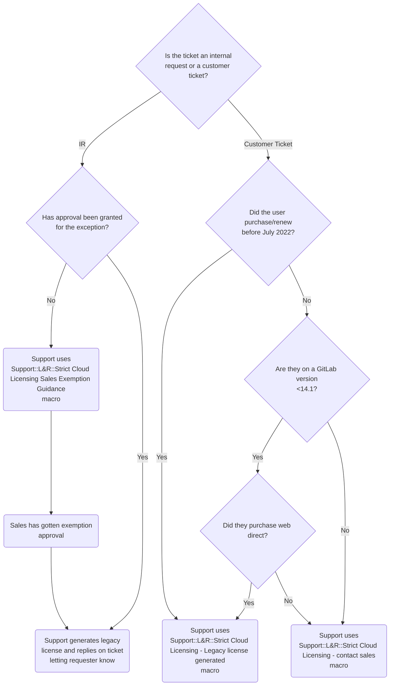

{:.no_toc}

----

## Cloud Licensing Overview

[Cloud Licensing](https://about.gitlab.com/pricing/licensing-faq/cloud-licensing/) allows GitLab customers to activate paid subscription features on self-managed instances using an activation code, rather than managing license files and manually uploading them into their instance. By activating through Cloud Licensing, a customer’s GitLab instance will periodically synchronize [Subscription Data](https://docs.gitlab.com/ee/subscriptions/self_managed/#subscription-data-that-gitlab-receives) with GitLab.

In order to further encourage Cloud Licensing, the Strict Cloud Licensing project will include several iterations to encourage customers to use Cloud License activation codes rather than a Legacy License file to activate their self-managed instances. The following [GitLab internal licensing terms page](https://internal-handbook.gitlab.io/handbook/product/fulfillment/definitions/#licensing-terms) provides a technical definition of the current three types of licenses (Cloud Licensing, Offline and Legacy) associated with Cloud Licensing.

## Strict Cloud Licensing

**Effective July 7, 2022:** Cloud Licensing will be enabled by default for all new and renewal customers, as detailed in the [Strict Cloud Licensing roll out plan](https://gitlab.com/gitlab-org/gitlab/-/issues/351682) (except OSS, EDU or Start-Up products). Customers will no longer have the ability to download a license file from the Customers Portal. In addition, Offline licenses will now be available to allow customers with air-gapped or offline instances to receive the benefits of Cloud Licensing. In order to receive a Legacy License or Offline License, customers will need to follow the below outlined process.

### Strict Cloud Licensing Process

NOTE: This only applies to standard and resold customers.

## Cloud Licensing Exemptions

### Pre-Sale Exemption (Sales)

Customers who cannot activate with Cloud Licensing will need to obtain either an Offline Cloud License or a Legacy License. If this process is handled correctly at time of sale, no Support involvement is required. 

By default, the `TurnOnCloudLicensing__c` flag in SFDC will be set to `Yes` on every quote during the sales cycle. If the Sales Rep wants to opt the customer out, they should update the quote field `[Cloud Lic] Add Cloud Licensing Opt Out` to either `Legacy License File` or `Offline License`. This in turn updates the value of `TurnOnCloudLicensing` to `No` or `Offline` respectively. Once the quote is submitted, Sales VP approval is required via the standard SFDC approval process. Once approved, the quote is synced to Zuora, which in turn creates and activates the subscription. In this scenario, the customer will receive their activation email with their license file attached and will also have the ability to download the license file from the [GitLab Customers portal](https://customers.gitlab.com/customers/sign_in).

### Post-Sale Exemptions (Support)

The above defined sales-initiated exemption process is intended to be the only means of opt out and should be used for all customers. However, there may be occurrences where a sales rep missed opting a customer out during the sale, and the customer has now incorrectly received a Cloud License activation code they cannot use. 

In the situation where a customer needs a Legacy License or Offline License  post-sale, they must reach out to sales for them to [open an Internal Request with Support](https://about.gitlab.com/handbook/support/internal-support/#internal-requests). Support will engage the sales account manager to obtain VP approval to provide the customer with the requested license. If an emergency situation occurs where the customer requires access during the approval process, a support engineer should provide the customer with a trial license until approval is received. Once approved, the correct license type can be issued to the customer.

If approved, the support engineer will need to first update the `Cloud Licensing` flag within [CustomersDot's Admin](https://customers.gitlab.com/admin).
Under "admin/customer/CUSTOMER_ID/zuora_subscriptions", the flag needs to be set to either "Offline" or "No", as shown in the screenshot below.

The matrix below defines the impact of setting the `Cloud Licensing` flag value to `Yes`, `Offline` or `No` on the eligibility of three license types.

| Cloud Licensing Flag value | Cloud License | Offline Cloud | Legacy License |
| ------ | ------ | ------ | ------  |
| Yes | Eligible | Not Eligible | Eligible |
| Offline | Eligible | Eligible | Not Eligible | 
| No  | Eligible | Eligible | Eligible |

Once updated, the support engineer should then generate the license manually by impersonating the customer and selecting `Download license file` from the "Manage Purchases" view. Using this method will ensure all license details are auto-populated correctly. Note that the download license option will only be visible _after_ the `Cloud Licensing` flag has been updated.

Once these steps are completed, please be sure to flag the ZenDesk ticket using the above macro to ensure these missed approvals are being tracked appropriately.

## Support FAQ
#### 1. Which license type should I provide for an approved opt out?
Knowing whether to provide an Offline or Legacy License will depend on the customer's specific scenario and what they request, but the following may be helpful:
* Offline licenses are preferred by GitLab over Legacy Licenses as they allow the customer to more easily provide usage data. These work best for customers who cannot use a Cloud License because their instance is air-gapped or not connected to the internet. However, in order to use an Offline Cloud License, the customer must be on 15.0 or higher.
* Legacy licenses can be sent when a customer is unwilling or unable to upgrade to Gitlab version 14.1 or higher, or is concerned about sharing Subscription Data.

#### 2. Are reseller purchases considered the same as sales-assisted? If a customer purchased after 2022-07-07 and needs a Legacy License, should we send them to their Account Manager to go through the exemption process, or do we treat them the same as web-direct and give them a Legacy License file, no questions asked?
Reseller customers should be directed to sales as well using the same process. 

## Additional Resources
For more information on Cloud Licensing, please refer to the following resources:
1. [Cloud Licensing Internal Handbook Page](https://internal-handbook.gitlab.io/handbook/product/fulfillment/cloudlicensing/cloud-licensing/)
1. [Offline Cloud Licensing Internal Handbook Page](https://internal-handbook.gitlab.io/handbook/product/fulfillment/cloudlicensing/offline-cloud-licensing/)
1. [Cloud Licensing Field Team FAQ](https://docs.google.com/document/d/1C8kQlxvK2LFBsb3N6cvS8wXkqOw5cnAvuqy_4miUbYQ/edit)

Have a question that hasn't been answered in the documentation? Add it to our [Cloud Licensing AMA doc](https://docs.google.com/document/d/1f3RzLobMn2OaHNztXVU4Sr1qwsd2IQ-a6oKVctprggY/edit#) (internal only)!
