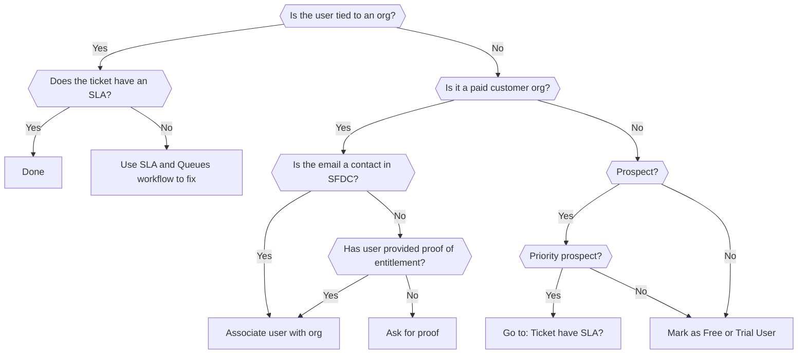

## On this page

{:.no_toc .hidden-md .hidden-lg}

- TOC
{:toc .hidden-md .hidden-lg}

## Use case

Tickets often come in without an associated organization, which means that no SLA is applied.

Potential reasons this might occur:

1. It's the first time user has submitted a ticket.
1. The user is writing from a domain name that doesn't match what we have in ZD
  (for example, using a personal email address for a work-related issue).
1. The user or organization has no subscription or a trial subscription.

### Determining if this workflow applies

This workflow applies if ZD displays `No organization` for a ticket.

## Overall Flow

You can watch a [short walkthrough video](https://drive.google.com/file/d/1asRtFbqeNJha3d6hIq9PAw_1-95WMaoj/view?usp=sharing) (internal) which covers straightforward cases.

See also the

- [triage page](ticket_triage.html) on assigning the correct form, and
- [SLA and Zendesk views page](sla_and_views.html) for after an org is associated.

## Identifying customers and users

Tickets can be created by different types of users.
Check whether a requester matches a type in the following order:

1. **[Customer](#identifying-customers)** - Has a paid current subscription for GitLab SaaS and/or self managed.
  - Customers receive SLA on their tickets as described in the [Standard and Priority Support](/support/#standard-support) section.
1. **[Prospect](#identifying-and-marking-prospects)** - Organization trialing GitLab that is sales assisted, also often referred to as a POC (proof of concept).
  - Prospects do not receive SLA unless sales has [manually marked them as a priority prospect](/handbook/support/internal-support/#trials-and-prospect-support).
1. **[Trial](#identifying-and-marking-trials)** - User or organization that has taken out a trial, typically using the free trial form.
  - Often, users identify themselves as `Ultimate` based on their trial plan, but **Trial** users do not get support as mentioned on the [Free trial page](/free-trial/).
1. **[Free User](#identifying-free-users)** - User of GitLab (SaaS or self managed) who has not purchased any type of paid subscription plan, and is not a Prospect.

### Identifying customers

If a requester has identified themselves as a paid customer, you can associate
the customer with the ZenDesk organization if either:

1. The customer's email is listed in Salesforce (SFDC) as a contact for that
   organization. You can use the
   [customer account look up workflow](looking_up_customer_account_details.html)
   to help you to find this information.

   OR
1. The customer provides [proof of entitlement](/support/#proving-your-support-entitlement).
    - For self-managed, you can use this macro, `Support::Self-Managed::Locating GitLab subscription`,
to request it.
    - For SaaS, user should be a member of the paid group or an [enterprise user](gitlab-com_overview.html#enterprise-users).

If the customer meets the criteria, follow the process described in [Associating
an organization](#associating-an-organization). Otherwise:

- If the customer has a subscription, but *not* for the product they're inquiring about,
let the customer know and consider them [a prospect](#identifying-and-marking-prospects).
- If you review the evidence and they do not appear to be a customer, check the
following sections on identifying and marking trials, prospects, and free users.

### Identifying and marking prospects

The user is a prospect:

- if SFDC Account Type is "Prospect".
- typically self-identified in ZD as "Sales Assisted Trial".

#### Priority prospect with SLA

When [sales has marked a prospect organization](/handbook/support/internal-support/#trials-and-prospect-support)
with `Manual Support Upgrade`:

- [Associate the org](#adding-a-customer-to-an-organization) synced from SFDC.
- SLA will be automatically applied based on the `priority_prospect` tag.

#### Other prospects

For all other prospects:

- add the `prospect` tag.

**Note:** It will be moved to the `Free user tickets` view without SLA,
so you should also respond with the appropriate `Free User` macro.

#### Organization incorrectly marked as a Prospect in SFDC

In SFDC, you may notice an organization has the Type set to `Prospect` but associated with a non Expired support level,
and the account in the CustomersDot shows that the org has a valid self-managed license or a GitLab.com subscription.
In this case, you may need to update the org in SFDC:

- Check if `Subscriptions` section in SFDC contains information about a valid subscription.
- Check if account in the CustomersDot contains information about the purchased subscription.
- Double click `Prospect` type, change it to `Customer` and click `Save`.
- After that, notify `@Sales-Support` by following the steps similar to the ones in [this section](sla_and_views.html#handling-customers-with-expired-licenses-and-updating-info-on-sfdc-side) to tag them.
- **IMPORTANT**: if you are not sure about the changes, ask `Sales-Support` to do it.
- As soon as the org has a valid `Customer` type, it will propagate to Zendesk.

### Identifying and marking trials

If you cannot find an account (organization) in SFDC, when searching by email, you should find:

- a *Lead*, where `Initial Source` mentions `Trial`,
- date is within the last 30 days.

Alternate ways to check:

- GitLab.com: [CustomersDot](https://customers.gitlab.com/admin) > `GitLab Groups` Tab >
an expiration date under the **Trials** column.
If needed, also check the
[internal-requests project](https://gitlab.com/gitlab-com/support/internal-requests/issues)
for manual plan changes.
- Self-managed: [CustomerDot](http://customers.gitlab.com/admin/license) portal as per [customer info license lookup](looking_up_customer_account_details.html#within-licenses-in-customersgitlabcom).

If you identify a ticket as from a trial user,

- select `Self-provisioned trial` in the `SaaS Subscription` or `Self-Managed Subscription`field

**Note:**  A Zendesk trigger will automatically add a `trial` tag to the ticket and it will be moved to the `Free user tickets` view without SLA,
so you should also respond with the appropriate `Free User` macro.

For 2FA Free tickets, there is no need to respond with the [`Support::SaaS::Free 2FA Support Deprecated`](https://gitlab.zendesk.com/agent/admin/macros/360049871240) macro because there is already a [trigger](https://gitlab.com/gitlab-com/support/support-ops/zendesk-global/triggers/-/blob/master/triggers/active/Automation%20Stage/Autoreply%20to%20Free%20and%20consumption%202FA%20tickets.yaml) that automatically sends the 2FA Free messaging to customers as long as the ticket meets the specified trigger conditions. You would only need to send that macro if something has told Zendesk to skip sending it when it did need to be sent.

### Identifying free users

If you cannot identify a user as a customer, prospect, or trial, [mark them as a free user](#marking-free-users).

## Associating an organization

### Finding the appropriate organization name

While often they match, the organization name a customer provides will not always match what's in ZD.

Since [the ZD organization information is synced from the SFDC Account](/handbook/support/support-ops/responsibilities.html#account---organization-sync-from-salesforce),
if you're unsure, [look up the account in Salesforce](looking_up_customer_account_details.html#within-salesforce) for the org name.

You can search for organizations using the ZD search (see screenshot below).

**If you find the correct organization in Salesforce, and it does not exist in
ZD, please do not create the organization directly in ZD.** See the
[Zendesk Global Organizations](../support-ops/documentation/zendesk_global_organizations.html)
page to learn how we create organizations in ZD. Please reach out to our
Support Ops Team for help with this situation.

### Adding a customer to an organization

#### Prerequisites

Before you can associate a user with an organization, please ensure that you have:

1. [identified the user as a customer](#identifying-customers)
1. verified their proof of entitlement

If these conditions are not fulfilled, ping their AM/TAM in the `#account-management` _before_ adding the user.

#### Add the user to the organization

When the prerequisites above are complete, 

1. Verify that the customer exists in SFDC, and remember that if you don't have access
   to SFDC, there are other ways to [look up customer account details](https://about.gitlab.com/handbook/support/workflows/looking_up_customer_account_details.html#looking-up-customer-account-details).
   If they do not exist in SFDC, use the SFDC app in Zendesk to add the user to SFDC
1. Click on the user's name in ZD ticket.
1. In the "Org" field type the organization name.
1. Select the appropriate organization.

**Note**: If a customer raises a ticket to add some users in their organization, here are some things to take note of:

- If the user exists in both SFDC and Zendesk, you can associate the user to the org.
- If the user exists in SFDC but not in Zendesk, you can create the user in Zendesk if you desire or just inform the user that when they first submit a ticket in the Support Portal the Zapier process we have in place should auto-associate the user in the org.
- If the user exists in Zendesk but not in SFDC, associate the user to the organization in
  Zendesk, refresh the Zendesk Apps (click the refresh arrow in the top right)
  and then use the
  [SFDC Tool app](../support-ops/documentation/zendesk_global_apps.html#sfdc-tool)
  to add the user as a contact under the organization in SFDC. Refresh the apps once
  more to confirm they were added properly. If this does not work, please
  contact Support Ops via the #support_operations slack channel.

**Note**: The original method for handling cases where the user is absent
in both SFDC and Zendesk is as follows:

- If the user does not exist in both SFDC and Zendesk,  you can ping their TAM/AM in the `#account-management`
  Slack channel to ask them to add the user in SFDC. Once the user is in SFDC, the Zapier process we have in place will also auto-associate the user to their org when they register or submit a ticket via the Support portal.

### Removing a user from an organization

If you erroneously assigned a user to an incorrect organization, follow these steps to un-assign a user:

1. Click on the user's name in ZD ticket.
1. Click the "Org" field and type `-` instead of the org name.
1. Make sure that the user changes were saved - you will see a message like `<User Name> was successfully updated.`
1. Please remove the form related tags in case if form of the ticket needs to be changed from the ticket as well. For example, Subscription type or problem type tags would be different for SAAS or Self Managed form.

**Note**: If the organization gets automatically reassigned after you un-assign it, it
likely means the org is using domain matching or the user is a contact in SFDC
(and is being auto-synced). In those cases, please reach out to Support Ops via
the #support_operations Slack channel for assistance.

## Marking free users

After [identifying a free user ticket](#identifying-free-users):

- Self-managed:
  1. Change the ticket to use the `Community` form if applicable.
  1. Change the `Self-Managed Subscription` to `Free customer`
  1. Reply using the `Free user` macro to explain they do not receive support.
- GitLab.com:
  1. Ensure the correct form (accounts or general).
  1. Change the `SaaS Subscription` to `Free user`.
  1. Select the appropriate `Problem Type`.
    - If you cannot choose an appropriate problem type, then check [if the user qualifies](/support/statement-of-support/#support-for-free-plan-users).
  1. If the user does not qualify for support, use the appropriate `Free user` macro.

The ticket will be moved to the `Free user tickets` view.

For example:

- a user `username@domain.tld` submits a ticket to GitLab Support.
- you search by the requester's e-mail i.e. `username@domain.tld`, the e-mail
  specified in the field `Email associated with your subscription`, or using the
  customer's domain and you cannot find any related accounts in SFDC.
- you search for the same data in the CustomersDot and cannot find any accounts there.
- you view any groups the user is a member of and confirm that no subscriptions exist in the CustomersDot
- you view `GitLab User Lookup` app in the Zendesk sidebar and none of the groups are on a paid plan
- if an account exists in the CustomersDot, no subscriptions are shown and you see
  `Choose a plan that suits your needs` when using `Impersonate` functionality.

## Customer is using personal email

Sometimes the customer raise tickets with the personal email instead of
business email or the business email is not synced in Zendesk. After providing
[proof of entitlement](/support/#proving-your-support-entitlement), please use
the following cases for your ease:

- Customer, who is the subscription holder, used Subscription Email field in form to show associated email but used personal email for raising ticket:
  1. If `Subscription Email` helps in identifying the organization and the personal email is not listed in SFDC, use [this process to add them.](https://about.gitlab.com/handbook/support/workflows/associating_needs_org_tickets_with_orgs.html#adding-a-customer-to-an-organization)
  1. Once added in SFDC, merge the personal email with the associated email found in SFDC.
- Customer does not have generic email and business email listed in SFDC: 
  - Request for the customer to create a new ticket with business email. Alternatively, follow the steps below: 
     1. Request for TAM/AM in Slack channel #account-management to add the business email in SFDC.
     1. Once added in SFDC, use [this process to associate the personal email to organization](https://about.gitlab.com/handbook/support/workflows/associating_needs_org_tickets_with_orgs.html#adding-a-customer-to-an-organization).
     1. Merge the personal email with business email. (Contact Support Ops if you are unable to add secondary email).
- Customer have both generic email and business email listed in SFDC but only one email is present in Zendesk:
  1. Merge the personal email with business email. (Contact Support Ops if you are unable to add secondary email).
  1. Inform the customer that you have added the personal email as secondary email.
- Customer raised ticket with business email but in middle of ticket responding with personal email:
  1. Merge the personal email with business email. (Contact Support Ops if you are unable to add secondary email).
  1. Inform the customer that you have added the personal email as secondary email.
- Customer raised a ticket with business email listed in SFDC but not in Zendesk:
  1. Our Zapier sync will link the customer with the correct organization if it is already listed in SFDC.

Note: Proof of entitlement strictly includes primary email address associated for SAAS and company provided email address for SM.

## AWS Marketplace purchases

For customers who have purchased through the AWS marketplace, their license is a 5 user Premium License under the company name of "AWS Marketplace AMI".  This exists as an org in Zendesk, so customers proving entitlement with this license can be associated with the Zendesk organization "AWS AMI Purchasers". This will apply the appropriate support entitlement tags.
