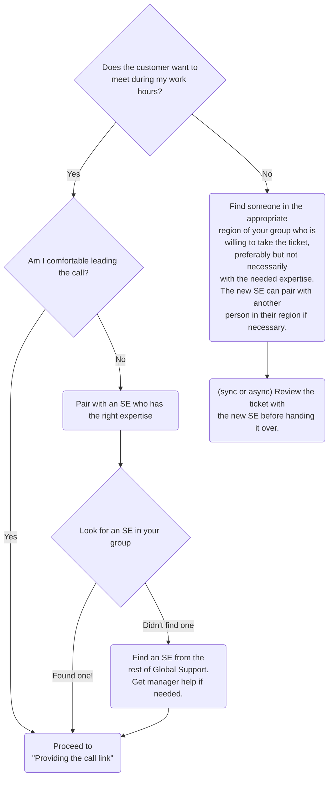

## On this page
{:.no_toc .hidden-md .hidden-lg}

- TOC
{:toc .hidden-md .hidden-lg}

## Introduction

This page presents the workflows to be used in Support Engineering to schedule,
prepare for, manage and follow-up on customer calls

## Scheduled calls

### Scheduling the call

When you know a ticket is ready for a call, start by determining who will lead
the call:



### Providing the call link

Start by using the
[`General::Invite customer call`](https://gitlab.com/search?utf8=%E2%9C%93&group_id=2573624&project_id=17008590&scope=&search_code=true&snippets=false&repository_ref=master&nav_source=navbar&search=id%3A+360013199280)
macro in Zendesk. Be sure to change `PERSONAL_CALENDLY_LINK` to be your own personal
Calendly link.

When sending a customer a call link:

* Always use [single-use Calendly link](/handbook/support/workflows/calendly.html#generating-a-single-use-calendly-link)
  to invite customers to a call so that we can avoid ghost calls.
* Ensure the [event title](https://calendly.com/event_types)
  [includes the word `Support`](/handbook/support/workflows/calendly.html#support-calls-in-the-team-calendar)
  (case insensitive). This is necessary for the event to appear in the
  `GitLab Support` Calendar.
* Make sure your calendly event includes a required Invitee Question asking
  for the Zendesk ticket number.
* If you know your availability is limited, or you need additional backup,
  check with another SE to see if they might also be available to take the call.

### Customer No Shows

There are many reasons that a customer may not be able to join a call. If a customer doesn't join the call and you've waited for over *10 minutes*, end the call, update the ticket and resend your Calendly link to schedule a new call. Your response on the ticket should just state that you're sorry you didn't get a chance to meet and would they please use the link to schedule a new call.

### Pre-call email

Please consider sending a pre-call email. This helps set expectations to the call regarding goals, duration, and
the people required to be on the call for effective troubleshooting. You can use the [`Support::Self-Managed::Pre customer call`](https://gitlab.com/search?utf8=%E2%9C%93&group_id=2573624&project_id=17008590&scope=&search_code=true&snippets=false&repository_ref=master&nav_source=navbar&search=id%3A+360086318253) macro in Zendesk
for that, please modify it as you see fit.

### Tips to keep calls within the scheduled time:

* Set expectations (again) at the start of the call:
   1. Call duration will be X
   1. 5-15 minutes before the end time, call wrap up will happen (below)
   1. Will need access to applicable systems
* At wrap-up time: 
   1. Start to wind down the call
* Stop the call and review progress and status (solved, not solved more info needed)
   1. Solvable in the next few minutes
   1. Need to research/schedule additional call
* Review
   1. Summary of what was learned
   1. Next steps for GitLab Support Engineer
   1. Next steps for user
   1. Next call recommendations (timing/goals/expectations)

## Notes on intake, upgrade and installation support calls

For Premium Support customers, and customers who have purchased Implementation Support, we offer intake and installation support. Premium Support customers also receive upgrade assistance. The different levels of service that are offered are described on the [support page](/support), and Implementation Support is described in more detail in the [statement of support](/support/statement-of-support/).

Call/screen sharing sessions involve guiding a customer through the GitLab upgrade process or taking control of the customer's server to perform the upgrade.
You should make sure that the customer has finished creating a backup **before** you start the call, as they can take a lot of time to complete and you don't want to do them while in the call.

**Important information to collect**

1. Type of installation: Source/Omnibus
1. Current GitLab version
1. Version you're upgrading to (it isn't always the latest)
1. Use of GitLab CI (need to upgrade to 8.0 first, then 8.+)

We collect this information in Zendesk and link it to the organization.

## Discovery calls

Sometimes a one hour call doesn't seem like the best step to take forward, and
may not be the best use of our time. This is where the Discovery Call comes in.

A Discovery call is a short 15 minute call with the sole purpose of learning
enough to start troubleshooting asynchronously again. These calls are also
great at helping ease a customer who is getting frustrated not being able to
_show_ us the problem.

If you feel that you're close to a resolution or need more time to collect info,
then it's at your discretion to continue the call or not.

Create a Calendly event in your account labeled `Support - Discovery Call with <your name>`
and send a one-time link to this event when you find that a Discovery call
would be useful.

## Unscheduled calls

While working with customers you should always be prepared to host a quick call
with them. It's easier to get all the information you might need on a short (5 -
20 minutes) call than in a long series of back-and-forth emails. If anything
similar to the following situations is true, suggest a Zoom call:

*  the initial problem statement is very unclear
*  you aren't getting what you need from the customer after one or two email
   requests
*  you aren't making good progress toward resolution
*  you sense the customer is getting frustrated or upset

If you feel too inexperienced to handle a call, ask someone more experienced to
lead it while you shadow. After shadowing, it is still your responsibility
to handle the ticket as long as it is assigned to you.

If the problem is urgent you can simply send the customer a Zoom link and jump on immediately. For less urgent
calls, you may send the customer a Calendly link so that they can schedule a convenient time in their time zone.
The link you send may be a link to your personal calendar or to the Team Calendly event, depending on the circumstances,
but in every case you should send a
[single-use Calendly link](/handbook/support/workflows/calendly.html#generating-a-single-use-calendly-link),
to ensure proper processes are followed for scheduling calls.

## Call summary

**Immediately** following your call you should construct the call summary in
the Zendesk ticket using the macro
[`Support::Self-Managed::Post Customer Call`](https://gitlab.com/search?utf8=%E2%9C%93&group_id=2573624&project_id=17008590&scope=&search_code=true&snippets=false&repository_ref=master&nav_source=navbar&search=id%3A+360028010274).
The call summary is important for confirming with the customer what was said
and done during the call, and documenting for them and for us the agreed-upon
action plan. And as with all ticket documentation, it is a source of
valuable information for support engineers looking for resolution guidance from
tickets similar to their own.

Why should the summary be written immediately? First, your ability to remember
the details of the call will fade quickly, especially if the call was at the end
of your day. Second, follow-up action may be required from others, and they
will only be able to act appropriately if they have the call summary available.

## WebEx

For some customers, only Cisco systems are allowed and in those cases, WebEx will be the best tool for calls. To start a call/session, use the `GitLab Support` WebEx account. Go to our [WebEx Portal](https://gitlabmeetings.webex.com), click on the login button on the top right and use the credentials found in the Support Vault on 1Password.


Once logged in, click the `Enter Room` button to start the WebEx meeting and send the following link to the customer and ask them to join the call.

```
https://gitlabmeetings.webex.com/meet/gitlabsupport
```


> Note: Make sure you lock the meeting so that you (as the presenter) have to allow people in. Otherwise others may attempt to use the room.

WebEx allows you to see the customer's desktop and to control it on request. It also gives the customer the possibility to join via phone and us the possibility to use our computer audio connection.

## If a customer wants to record a support call

Frequently during screenshare sessions plaintext secrets or other sensitive information can be displayed. To ensure sure that any recordings that inadvertantly contain this information stay within customer's security boundary, you should ask that customers initiate and store any recordings.

If a customer wishes to record the session, then transfer the ownership of the call to the customer or ask the customer to invite you to a new call to make sure recording is done by the customer.

If you're not comfortable having the call recorded, please involve your manager in the discussion with the customer.

## Krisp.ai License for GitLab Support Team

[Krisp.ai](https://krisp.ai/) will mute background noise when you're in a noisy environment so you can hear and be heard more easily on calls. You may consider installing this app for your calls. GitLab Support team has a [Teams Pro license](https://krisp.ai/pricing/). If you are interested in getting one, kindly leave a comment at [this issue](https://gitlab.com/gitlab-com/support/support-team-meta/-/issues/3773). Currently, it is unavailable for Linux.
