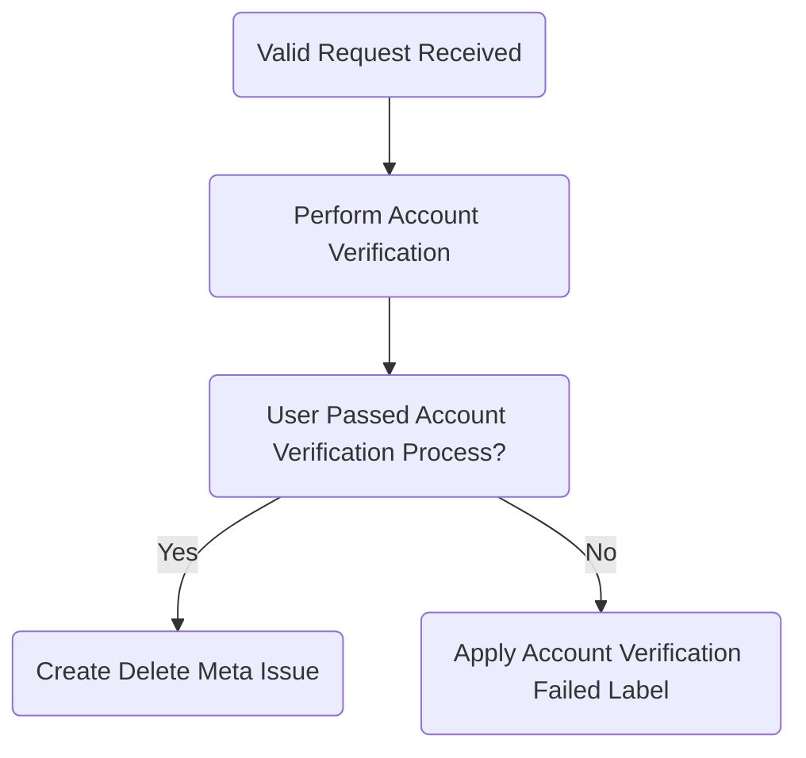

## On this page
{:.no_toc .hidden-md .hidden-lg}

- TOC
{:toc .hidden-md .hidden-lg}

## Purpose

The Personal Data Access and Account Deletion Request Standard defines scope, roles and responsibilities, data deletion categories and workflows to process personal data access and account deletion requests.

## Scope

This process applies to personal data requests submitted by both personal users or corporate GitLab.com SaaS subscription holders and customers. Account deletion requests for corporate subscription holders require validation and approval by the paid namespace account holder with a current GitLab subscription contract. As part of this approval process, the account holder of the paid namespace (owner) must remove the subscription holder (user account) from their paid namespace.

**NOTE:** If the user account is a free (personal) account, add the `account-deletion::personal` label to the issue. If the user account is tied to a paid namespace with a signed contract in Salesforce (a corporate request), add the `account-deletion::corporate` label to the issue.

## Roles and Responsibilities

| Role | Responsibility|
| ---- | ------ |
| Support Team | Maintaining this deletion process handbook page and related deletion request project and issue templates |
| Support and Legal Team | Responsible for approving significant changes to this standard |
| Support and Legal Team | Responsible for approving exceptions to this standard |
| Support Global Readiness | Responsible for resourcing, namely that there are enough Support Engineers to complete requests in a timely manner |
| GitLab system owners | Processing user deletion for each system as required by the data deletion issue created through this process |

## General Overview

Under numerous global and national data privacy laws, users can request to have their GitLab.com accounts (and/or any other information that we have stored about them) deleted. They can also request to obtain more details about their data, including information about _what_ data GitLab has stored about them.

Users requesting data deletion are required to confirm their intent to delete at the time of their request submission. For GitLab.com and full deletion requests _only_, form entries for username, email, and paid namespace memberships will be automatically validated. All other requests require manual review and validation (where applicable) until further improvements have been implemented.

## Before You Begin

Account deletion and data access requests go through a few stages before they can be closed.

You can use [this main issue board](https://gitlab.com/gitlab-com/gdpr-request/-/boards/4379198) to help track the progress of each request by filtering for issues assigned to you (typing in `Assignee = yourusername` in the search field), or you can [create your own issue board](https://docs.gitlab.com/ee/user/project/issue_board.html#create-an-issue-board) under the [Account Deletion and Other Requests project](https://gitlab.com/gitlab-com/gdpr-request), using the same labels to create lists for your own tracking purposes.

## Submission Handling Workflows

Users may send in deletion or personal data access requests in a few different ways, however the official request must be sent in through GitLab’s [Personal Data Request form](https://support.gitlab.io/account-deletion/). The following walks you through how to handle submissions when requests come in through other channels.

### Zendesk Submissions

When a request is received through a Zendesk ticket, do the following:

1. For **account deletions**, apply the [Support::SaaS::Account Deletion Instructions - GitLab.com](https://gitlab.zendesk.com/agent/admin/macros/360027176693) macro, and mark the ticket as solved.
1. For **data access requests**, apply the [General::Personal Data Access Request Instructions](https://gitlab.com/search?utf8=%E2%9C%93&group_id=2573624&project_id=17008590&scope=&search_code=true&snippets=false&repository_ref=master&nav_source=navbar&search=id%3A+360043149613) macro, and mark the ticket as solved.

### Email Submissions

If a request to the [Personal Account Requests Service Desk](https://gitlab.com/gitlab-com/gdpr-request/-/issues/service_desk) is submitted via email, update the issue with the following closure snippet, then add the `account-deletion::invalid` label to the issue, and close it.

  
Request Closed - Request Submitted Directly

  
Greetings,

  
It looks like you've emailed this request in to us directly. In order for us to best assist you please re-submit this request via our [Personal Data Request form](https://support.gitlab.io/account-deletion/). Doing so will allow us to process your request more quickly and efficiently. This request will now be closed. We eagerly await your resubmission. Thank you!

  
Regards,

**NOTE:** Requests sent in through the form will include a copy of the form entries in the initial description of the issue.

### Spam Submissions

If the request submitted is spam, apply the label `Invalid Request::Spam`, and close the issue.

### Form Submissions

When a user submits a personal request using the [Personal Data Request form](https://support.gitlab.io/account-deletion/), an issue is automatically created in the [Personal Account Requests Service Desk](https://gitlab.com/gitlab-com/gdpr-request/-/issues/service_desk), *even for invalid requests*.

Comments made in the issue will be emailed to the user. This is the only form of submission we will process. You will communicate with the user through the issue on the progress of their request.

If the user submits multiple requests, apply the `/duplicate` marker to the duplicate issues, and respond with the following before closing the duplicates:

 
Request Closed - Duplicate 

 
Greetings,

 
It looks like you have submitted multiple requests for the same purpose. 

 
I'm closing this issue in favour of #123, and we will continue processing your request on the other issue.

 
Regards,

Proceed with the request workflows to process their request.

## Request Workflows

Find the appropriate workflow below to process user submissions to our [Personal Account Requests Service Desk](https://gitlab.com/gitlab-com/gdpr-request/-/issues/service_desk), based on their request type. **All requests must be filled within 30 days.**

### Deletion Requests

A user has the option to request deletion of the following:

- GitLab.com account deletion (delete the GitLab.com account only)
- Portal account deletion (delete data in customers.gitlab.com only)
- Full deletion (delete everything across all systems)
- Marketing account deletion (delete marketing and sales-related data only)

Currently, _only_ requests to delete a GitLab.com account or perform a full deletion are auto-checked upon form submission. Use the following workflows based on the type of deletion request submitted.

#### **GitLab.com or Full Deletion Requests**

Use this workflow for requests to delete GitLab.com accounts or full deletion requests.

The following user entries are verified using built-in automated checks:

- username (must exist)
- email address (must exist)
- username and email must match for the same account
- account is not part of a paid namespace
- (for deletion requests only) user checked the box confirming their intent to delete

After submission, the automated checks will either fail or succeed.

#### Invalid Form Entries (Fail)
{:.no_toc}

If any of the automated checks fail, the user will receive an auto-generated response detailing the reason we are unable to process their request. The issue created will be marked as invalid with `Invalid request received` noted in the title.

These issues are scheduled to automatically close, and the label `account-deletion::invalid` will be applied. **No action is required.**

#### Form Entries Verified (Success)
{:.no_toc}

If all of the automated checks succeed, the user will receive a set of [Verification Challenge questions](https://gitlab.com/gitlab-com/support/internal-requests/-/wikis/Account-Verification-Challenges) in an auto-generated response. Users have a total of **14 days** to respond to the challenge questions.

During this period, add the `Awaiting::Challenge Answers` label.

#### No Response After 14 days
{:.no_toc}

If the user fails to respond after 14 days, apply the `Account Verification Failed` label to the issue, and close it using the following snippet:

  
Request Closed - No Response

  
Greetings,

  
We have not heard back from you with responses to our verification challenge questions, which are required in order to verify your identity before we process your request. We will now close this request. If you still wish to proceed please feel free to submit a new request via our [Personal Data Request Form](https://support.gitlab.io/account-deletion/).

  
Regards,

#### Response Received
{:.no_toc}

Once the user responds with their answers to the challenge questions, evaluate their answers using the [Account Verification workflow](https://about.gitlab.com/handbook/support/workflows/account_verification.html#evaluating-challenge-answers) with a data classification of `RED` and the [appropriate risk factor worksheet for data and privacy requests](https://docs.google.com/spreadsheets/d/1RyPghnls0NbrWQK7-qtlVW9_jj8mQAygX83n96Asxlo/edit) (internal) to confirm if the verification passes or fails.

#### Challenge Questions Verification Fail
{:.no_toc}

If the user fails the challenge questions, apply the `Account Verification Failed` label, and respond with the following snippet before closing the issue:

  
Request Closed - Verification Failed

  
Greetings,

  
Unfortunately, the answers to our verification challenges have failed. As a result, we are unable to process your account deletion request. This issue will be closed.

  
Regards,

#### Challenge Questions Verification Pass
{:.no_toc}

If the user passes the challenge questions, proceed with processing their request by doing the following:

1. Let the customer know they passed the ownership verification process, and that you are initiating the deletion process. Take care to enter the proper type of deletion request.

  
Verification Succeeded - Deletion Process Started

  
Greetings,

  
Thank you for stepping in the process with us to verify your account ownership. We have now started the process for the &lt;TYPE_OF_DELETION_REQUEST&gt;.

     
  
Please note that it takes up to 30 days for the request to be processed as it's handled by different teams.

     
  
I will let you know once the deletion process is complete.

  
Regards,

1. In the [gdpr-request issue tracker](https://gitlab.com/gitlab-com/gdpr-request/-/issues/new), create a new confidential issue using one of the following templates, populating the title with the email address of the original request:

   a. [Deletion Meta Issue - Full](https://gitlab.com/gitlab-com/gdpr-request/issues/new?issuable_template=Deletion%20Meta%20Issue%20-%20Full) template for **full deletion**
  
   b. [Deletion Meta Issue - GitLab-com](https://gitlab.com/gitlab-com/gdpr-request/issues/new?issuable_template=Deletion%20Meta%20Issue%20-%20GitLab-com) template for **GitLab.com account deletion**

1. **Follow the instructions in the top of the template**, then complete each step in the issue that begins with `Support Engineer:` in order.

#### Deletion Flow Chart
{:.no_toc}

An overview of this process is outlined in the chart below.

#### **Portal Account Deletion Requests**

Use this workflow for requests to delete user data from the Portal (customers.gitlab.com).

1. In the [gdpr-request issue tracker](https://gitlab.com/gitlab-com/gdpr-request/-/issues/new), create a new confidential issue using the [Deletion Meta Issue - Customers Portal](https://gitlab.com/gitlab-com/gdpr-request/-/issues/new?issuable_template=Deletion%20Meta%20Issue%20-%20Customers%20Portal) template, populating the title with the email address of the original request.
1. **Follow the instructions in the top of the template**, then complete each step in the issue that begins with `Support Engineer:` in order.

#### **Marketing or Sales Account Deletion Requests**

Use this workflow for requests to delete user data from Sales or Marketing systems.

1. In the [gdpr-request issue tracker](https://gitlab.com/gitlab-com/gdpr-request/-/issues/new), create a new confidential issue using the [Deletion Meta Issue - Marketing](https://gitlab.com/gitlab-com/gdpr-request/-/issues/new?issuable_template=Deletion%20Meta%20Issue%20-%20Marketing) template, populating the title with the email address of the original request.
1. **Follow the instructions in the top of the template**, then complete each step in the issue that begins with `Support Engineer:` in order.

----

### Data Access Requests and General Questions

Users can request the following to obtain information about their data:

- Data Access Request (provide all data from all systems GitLab have related to the user)
- General Questions (any other inquiries related to the users data)

Use the following workflows based on the type of request submitted.

#### **Data Access Requests**

Use this workflow for requests to access full details about what data we have on the user.

1. In the [gdpr-request issue tracker](https://gitlab.com/gitlab-com/gdpr-request/-/issues/new), create a new confidential issue using the [personal_data_access_request](https://gitlab.com/gitlab-com/gdpr-request/-/issues/new?issuable_template=personal_data_access_request) template, populating the title with the email address of the original request.
1. **Follow the instructions in the top of the template**, then complete each step in the issue that begins with `Support Engineer:` in order.

#### **General Questions**

Use this workflow for general question submissions.

1. If the question is something Support can answer, respond to the user's inquiry.
1. If needed, [engage the Legal team](information-request.html#other-legal-related-questions) for guidance and messaging.
1. Close the issue once the users question(s) have been answered.

## Exceptions

Exceptions to this procedure will be tracked as per the [Information Security Policy Exception Management Process](https://about.gitlab.com/handbook/engineering/security/#information-security-policy-exception-management-process).

## References

- [Controlled Document Procedure](https://about.gitlab.com/handbook/engineering/security/controlled-document-procedure.html)
