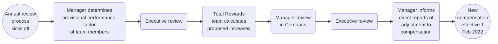

## On this page
{:.no_toc .hidden-md .hidden-lg}

- TOC
{:toc .hidden-md .hidden-lg}

## Introduction

On this page, we explain how carry out the Compensation Review Cycle. For more information on the process and input review for the Compensation Review Process, please see the following [handbook page](/handbook/total-rewards/compensation/compensation-review-cycle/review-cycle-inputs/). 

If you have any feedback or questions about the compensation review cycle, please contact [People Connect](/handbook/people-group/#how-to-reach-the-right-member-of-the-people-group).

## Annual Compensation Review 

The most up to date timeline of the Annual Compensation Review process can be found in the [Total Rewards Schedule](/handbook/total-rewards/#total-rewards-schedule).

Increases for Compensation Review Cycles are based on: 
1. Assessing market changes in the [compensation calculator](/handbook/total-rewards/compensation/compensation-calculator/) inputs  
2. Talent Assessments outlining performance in the role. 

The increase percentage for cash and the equity refresh grant may vary for each person. If a team member was recently adjusted, the annual adjustment might yield no additional cash compensation during the annual compensation review. This review acts as a sweep for each team member’s compensation to be evaluated at least once per year. If there is an increase in Location Factor and/or Benchmark, team members affected will have the new location factors applied to their compensation, but would not receive an automatic percent increase. For example, if the location factor in a region increases by 10% the team member will not receive an automatic 10% adjustment. The team member would receive an increase aligned to their benchmark, location factor, and performance taking any budget constraints into account.

#### Process overview

<figure class="video_container">
  <iframe src="https://drive.google.com/file/d/1cd9WHdBGJRayT1TnnW6wPJA6ZQ6qON28/preview" width="640" height="480" allow="autoplay"></iframe>
</figure>

### Eligibility

Eligible team members for Annual Compensation Review have a hire date on or before: 
* October 31st for a cash compensation increase. 
* September 5th for an equity refresh. Team members are eligible for a refresh grant if they have been at the company for six months ahead of the grant date cutoff. The grant date is slated to be March 15th and the cutoff is March 5th. Note: in FY22 we moved from stock options to RSUs for team members hired on or before Sept 3rd. 

Team members hired after October 31st will be reviewed to ensure their salary does not fall below the bottom of their compensation band (market range) based on increases to benchmark or location factor. If this does occur, the team member will be adjusted to the bottom of the band during the Annual Compensation Review cycle.

### Annual Compensation Review Timeline

##### November:
1. A member of the Total Rewards team will join the People Business Partner sync on a monthly basis at least one month before Annual Compensation Review begins.
1. Benchmarks and Location Factors
  * The Total Rewards team will review all benchmarks and location factors associated with the Compensation Calculator and propose revised inputs to the Compensation Group for approval/implementation.
1. Performance Factors
   * The Total Rewards team will reach out the managers and People Business Partner to obtain performance factors for each active team member with a hire date on or before October 31st.
   * Remember that this is also a good time to update your team’s position description if it does not reflect the role.
   * Performance Factors should be confirmed in the assessment tool/BambooHR no later than November 30th.

##### December:
1. Once all performance factors have been reviewed and approved the executive leaders of each group will review the breakdown with the Total Rewards team along with the People Business Partner for their group.
     * In this breakdown, leaders will be able to analyze all individual performance factors, the distribution of performance factors overall and by department, as well as an [underrepresented group audit](/handbook/total-rewards/compensation/compensation-review-cycle/review-cycle-inputs/#underrepresented-group-audit). Total Rewards will outline any concerns based on the aggregated data for the leader and people business partner to review.
1. The Total Rewards Team will schedule a sync with the Talent Acquisition team to review proposed iterations.
1. Using the revised inputs above, the Total Rewards team will calculate a minimum market increase for each team member to stay at the minimum of the FY23 range using the exchange rate as of 2021-12-01.
1. Anyone on a formal Performance plan (PEP, PIP) that is ongoing through December 15 will be excluded from the Annual Compensation review. December 15th is the due date for emailing Total Rewards with PBP in CC about team members on a formal performance plan.
1. Anyone who is departing from GitLab, with an end date in until February 1, will be excluded from the Annual review cycle. The People Business Partner will make sure to loop in Total Rewards on any terminations.
1. December 10th: All data in BambooHR will be pulled to Compaas. The People Ops / PBP team will ensure all promotions, manager changes, title changes, etc are up to date in the system. 
1. December 15th - December 18th: People Business Partners bring any preliminary budgets concerns to Divisional leaders (or department leaders as applicable).

##### January:
1. January 6th - January 20th: [Manager Review](/handbook/total-rewards/compensation/compensation-review-cycle/#manager-review) in Compaas
  * Each division leader is responsible for making sure their group stays within budget. The company has a [6% budget](/handbook/total-rewards/compensation/compensation-review-cycle/#compensation-program-budget) for all Performance increases and market adjustments for team members who have not received an increase through the fiscal year.
  * Managers and indirect managers will review the minimum recommended increase from Total Rewards and then propose an increase based on the performance factor for their team members. The minimum recommended increase from Total Rewards is not a cap, but instead a minimum value to ensure alignment to the new ranges based on performance and market adjustments.
  * Depending on budget constraints, the increases for the individual team members may be adjusted up or down by management and reviewed by Total Rewards.
  * _Managers will want to review the total holdings (cash and equity) and determine increases to equity and cash compensation as appropriate to ensure team members are incentivized through their total rewards package in the next fiscal year._ 
1. The People Business Partner team would advise managers to directly align proposed increases for team members with their manager (Senior Manager/Director) over 1-1s before Submitting.
  * Hereafter divisional leaders (or department leaders as applicable) can review and discuss tentative budgetary impact for the division (or department as applicable).
  * The People Business Partner will notify Total Rewards via Slack for team members that will be reviewed for promotion for Q1. Total Rewards will update the relevant profile in Compaas with the new cash range and equity promotion grant. All promotions proposals will need to be submitted by the 20th as well. 
1. January 13th: People Business Partner check on the progress/Budget impact.
1. January 18th: Aim to have all Managers/Senior Managers/Directors reviewed their slates. Justifications must be included in the notes section for all increases exceptions (for example: any above 10%, out of band exceptions due to contract factor updates, etc.) for slates to be complete. These justifications will be reviewed and approved by Department and Division leaders.
1. January 18th - January 20th: Department Heads/People Business Partners review budget impact and deficiencies, before moving to E-Group.
1. January 21st - January 24th: For E-Group to review and approve final compensation changes.
1. January 25th - January 31st: Total Rewards will present all compensation changes to the Compensation Group for final approval.

##### February:
1. February 1st - February 4th: Total Rewards Analysts will update [BambooHR](https://www.bamboohr.com/d/), and notify all payroll providers to be effective February 1st. Total Rewards will be generating a "Total Rewards Statement" inclusive of Cash Compensation changes and current equity value for managers to use in communicating compensation changes in FY22. Total Rewards will also be iterating to include Total Benefits & incentives awarded throughout FY22. 
1. Managers will have from February 4 - 11 to communicate increases and promotions (where applicable) to their team members. 
**Note**: Information for team members who invoice GitLab needs to be communicated by February 5th, as these team members need to finalize increase amounts by February 7, 2022. These statements have been added to BambooHR on February 3, 2022.
1. Team member visibility to their increases in BambooHR will be turned on February 14th.

## Talent Assessment and Annual Compensation Review 

<figure class="video_container">
<iframe src="https://drive.google.com/file/d/1qn1vOhpuMWPXxcE9VLjg6ymJLzmL6T68/preview" width="640" height="480" allow="autoplay"></iframe>
</figure>

Performance and Growth Factors are assessed as part of the [Talent Assessments](/handbook/people-group/talent-assessment/#the-performancegrowth-matrix).  The factors (developing - performing - exceeding) will be used as an input to calibrate on compensation increases, reinforcing GitLab’s pay for performance Compensation Philosophy.

### Performance Factor

Recommendations from Total Rewards for discretionary cash compensation increases based on performance factor:
* Developing in role = 0-3% increase
* Performing in role = 3-7% increase
* Exceeding in role = 6-10% increase

**Your compensation increase may vary (up or down) from these percentages.** These guidelines are meant to help ensure company-wide consistency. Actual increases may vary based on:

* Changes to local market rates
* Where you fall in the compensation range
* Previous increases
* Budget constraints

Do not expect that the final discretionary increases will fall into these ranges, as performance is only one factor out of many that goes into compensation adjustments.

When determining an increase, managers should account for increases in the current fiscal year,
due to factors such as:
* Promotion.
* Transfer.
* Recent hire who is already aligned to market/performance rates.
* Anything else that has already increased salary during the current fiscal year.

After a manager determines the performance increase (in percentages), that manager should be able to clearly communicate to the team member how it was derived.

Increases are not capped at 10%. If a manager would like to suggest an increase higher than the guidelines, they will want to add a justification for each indirect manager to review and approve.

If a manager has a team member on their team who is red circled (paid over the top end of the compensation range), in order for the person to receive an increase, they will need to submit a compensation exception request with their People Business Partner to Total Rewards which will then be reviewed and approved by the Compensation Group. The Total Rewards team will notify the People Business Partners of the team members red-circled once the new ranges are set for proactive review.

#### Communicating Performance Factor

Once all Performance Factors have been reviewed and approved and the Performance Factor Executive Audit has been complete, managers will be communicated to that they can share the final performance factor with their direct report. This will occur before Annual Compensation Review takes place intentionally so that way it is more focused on the growth and development of the team member rather than how this ties into compensation.

### Growth Factor 

While Performance Factors are used to calibrate on cash compensation increases, reinforcing GitLab’s pay for performance Compensation Philosophy, we encourage managers to use the Growth Factor (developing - growing - exceeding) as an input to calibrate on the equity refresh. The refresh is a long term incentive which can reinforce the long term growth potential of the team member. 

In calibrating the equity refresh, we recommend managers to take the following into account: 
* [Growth factor](/handbook/people-group/talent-assessment/#what-is-growth)
* Unvested Equity Holdings
* Value Vesting the next fiscal year 

Cash and equity are two levers available to managers to determine an appropriate Total Compensation for team members. 

### Key Talent 

For team members designated as [key talent](https://about.gitlab.com/handbook/people-group/talent-assessment/#key-talent), we would encourage managers to review team members' total compensation (cash + equity) and recommend increases to ensure team members are incentivized through the next fiscal year in the total compensation package. 

## Determining Compensation Increases

When you review your team member's card in Compaas, you will see the recommended cash increases for performance as well as details on how the market rates changed. If applicable, there will be a minimum recommended market adjustment to ensure team members end up within their compensation band. Also, managers will be able to view the total unvested holdings and value vesting in the next 12 months. All the factors should be reviewed and used to develop a holistic increase for cash compensation and recommendation on the refresh grant. We recommend the following steps and best practices:

1. Managers to take a holistic view of cash compensation and equity compensation. 
  * The recommendation for cash compensation is not to add automatically adjust based on market changes, rather to use the new range an overall factor in determining what the increase should be.
  * The recommendation for equity compensation is not to formulaicly tie the refresh grant to the growth factor, but instead to ensure the team member has a competitive total rewards package for the next fiscal year. 
1. Managers should use the minimum market adjustment from Total Rewards to make sure the team member is within their band if they are performing at a commendable level. As a manager you can review the Compensation band in the [Compensation calculator](/handbook/total-rewards/compensation/compensation-calculator/).
1. Managers should take into account any changes in compensation during FY22 when analyzing the FY23 compensation. 
1. Managers should review how team members fall within their band after the proposed increase to ensure pay equality amongst peers. (This is also audited by Total Rewards as part of the cycle).  

**Understanding the Total Rewards Notes for Recommendations on Increases:** 
1. Is the recommended minimum increase from Total Rewards within the recommended range of the Performance factor?
  * Yes: The total recommended increase would be within the performance factor range.
E.g. The minimum increase to stay in range is 6% and the performance range is 3-7%. The PBP/Total Rewards team would recommend a 6-7% total increase.
  * No, it’s below: We would recommend a total increase within the Performance factor range.
E.g. The minimum increase to stay in range is 0% and the performance range is 3-7%. The PBP/Total Rewards team would recommend a 3-7% total increase.
  * No it’s above: We recommend a total increase which is aligned with the minimum recommended increase of Total Rewards.
E.g. The minimum increase to stay in range is 15% and the performance range is 3-7%. The PBP/Total Rewards team would recommend a 15% total increase.
1. Use placement within the compensation range and previous increases/start date to finalize the increase.
1. **Important note:** Any increase above 10% or out of band exceptions due to contract factor updates must come with additional justification entered into the notes section for planning to be complete. These justifications will be reviewed and approved by the department leader, division leader and compensation group.
1. Also: Anyone on a formal Performance plan (Written Letter for Performance, PIP) will be excluded from the review. This must be communicated to Total Rewards and PBP by December 15th.

**For Promotions:** 
When determining compensation increases for promotions the same general guidelines apply. We want to take a look holistically at the compensation change. It is important to **not** formulaicly allocate an annual compensation review increase and on top the promotion increase. Instead, we would ask managers to look a the new range (which will be seen in Compaas once the promotion is applied) and then make a recommendation based on the holistic view considering [the promotion compensation increase guidance](https://about.gitlab.com/handbook/people-group/promotions-transfers/#recommend-a-compensation-increase), placement in the band compared to peers who were promoted and annual compensation review increase recommendations. For more information on how to assess equity refresh grants for promotions in Compaas please view the [stock tab details](https://about.gitlab.com/handbook/total-rewards/compensation/compensation-review-cycle/#for-slate-owners). 

## Manager Review

As part of the new [Annual Compensation Review](/handbook/total-rewards/compensation/compensation-review-cycle/#annual-compensation-review-timeline), managers and indirect managers will review, approve, and enter proposed salary increases to ensure that we are paying each team member to market and prioritizing increases based on performance while staying aligned to budget. Please verify the compensation review inputs (performance, level, title) are accurate in Compaas.

It is very important that GitLab team-members understand their performance and how it impacts their salary.

While some GitLab team-members may not receive an increase due to already being at the right [competitive rate](/handbook/total-rewards/compensation/#competitive-rate) for their Level, Role, and Location, there are other circumstances where an increase should be avoided. If there are any reasons as to why the team member should not receive the proposed increase to be aligned with market rates in our calculator, please email total-rewards@ domain with the reasoning and cc your People Business Partner. This could be due to a current performance issue, pending termination, etc. If you would like to delay the increase, please outline a proposed plan of action and deadline. Team members who are currently struggling to perform at their current level should have that communicated clearly and the manager should consider delaying the increase until performance reaches a commendable level.

For any feedback around the manager review portion of Compensation Review or the cycle via compaas, please add it to the following [issue](https://gitlab.com/gitlab-com/people-group/total-rewards/-/issues/396). 

### Manager Review in Compaas

<figure class="video_container">
  <iframe src="https://drive.google.com/file/d/10U64VYWCNjqjw6MxarAx6ko5inDayc8_/preview" width="640" height="480" allow="autoplay"></iframe>
</figure>

[Compaas](https://www.compa.as/) is GitLab's compensation platform where managers can login, review, change, and submit their proposed increases during Annual Compensation Review.

### Logging into Compaas 

1. Navigate to [Compaas](https://app.compa.as/login) and select the option to sign in with Google.
* 
1. Select to sign in with your originally assigned GitLab email address.
* If you select to sign in with an alias, you will receive an error and not be able to sign in. You can confirm your original GitLab email address on the Personal tab of BambooHR.
* 
1. If you have not used Compaas in the past, you will need to Select the Terms and Conditions box and click Submit. If a user has already visited Compaas Rewards they will automatically be taken to their slate view.
* 

### For Slate Owners

1. After logging in, you will land on the Summary tab of your slate. This will have the status of your budget (if applicable), along with a card for each of the team members you will be recommending a raise for. The card will have team member information as well as current and future compensation for cash and equity. 
* 
1. Your Reports: Under each report will be the team member's name, title, benchmark, and department. 
  * Underneath the job title is the [benchmark role](/handbook/total-rewards/compensation/compensation-calculator/#sf-benchmark). This is the input that is used for determining the compensation before other inputs such as level are evaluated. For example, the benchmark role for a Senior Backend Engineer is a Backend Engineer, Individual Contributor.
1. The Performance/Growth column depicts the [performance/growth factor](https://about.gitlab.com/handbook/people-group/talent-assessment/) from the November 2021 Talent Assessment. 
1. The Raise (and Raise as %) is where the manager or indirect manager can enter in the proposed increase for the team member for FY23 Cash Compensation. Please note this is all in USD and will be converted to local currency once the cycle has closed.
1. The team member's compensation before (light) and after (bold) any adjustments is listed to the right of the percent increase.
  * If there is an "OTE" next to the compensation values, this indicates that part of cash compensation is a bonus component. Total Rewards works in OTE during Annual Compensation Review and then allocates to base/variable based on the desired split per role.
1. Stock is the place to enter the proposed FY23 Equity Refresh Grant. 
1. Next 12 mo. TDC Before / After: This is the total compensation for FY23 before an raise or refresh is applied and after. The TDC or Total Direct Compensation is calculated by the cash compensation + value vesting in the next 12 months for current equity holdings and the FY23 grant. 
1. The talk bubble at the right of the team member's card can be clicked on to leave a note on the team member's record. This can be used to record reasons for decisions, details about specific compensation change, or open questions for approvers or the People Group. The option to delete a note is also available.
* 
* 

**Card Details:** 
Clicking the background of a person's card expands it to reveal additional information you can use in determinging Total Rewards for FY23. 
1. The timeline shows any historical compensation data Compaas has available for each person. Clicking the card again closes the timeline and notes.
1. Please note this data pulls from the Compensation and Job Information table in BambooHR. Any changes in the Job Information table automatically are entered as "Promotion" in Compaas in the timeline, but may have been a manager change or other title change not related to a promotion. Pay Rate changes will show in local currency as this is how it is entered in BambooHR in the Compensation Table.
* 
1. Total Rewards has added notes to each person in Compaas to help managers assess increases. 
  * Benchmark % increase: How much the SF benchmark changed from FY22 to FY23. 
  * Location Factor % increase: How much the location factor changed from FY22 to FY23.
  * [Market Adjustment Minimum](https://about.gitlab.com/handbook/total-rewards/compensation/compensation-review-cycle/#minimum-market-increase): The minimum % increase for a team member to stay within the range. 
  * Minimum Recommended Increase and Maximum Recommended Increase: Recommendations to cash compensation taking into account the Market Adjustment Minimum and performance [company wide recommendations](https://about.gitlab.com/handbook/total-rewards/compensation/compensation-review-cycle/#performance-factor). This final range is the minimum Total Rewards would advise a manager to increase a team member to ensure alignment to the compensation calculator range as well as their performance. This is not a capped value and managers can add additional discretionary budget to team members as appropriate while ensuring alignment to budget. For more information on how to use this information see the [Determining the Total Increase in Compaas](/handbook/total-rewards/compensation/compensation-review-cycle/#determining-compensation-increases) handbook section.
  * Unvevsted Equity as of 2022-02-01: Total Amount of unvested equity in USD using the conversion price of the IPO Cover Price ($77). 
  * Value Vesting from 2022-02-02 to 2023-01-31: Amount in USD vesting through the next 12 months (FY23) using the conversion price of the IPO Cover Price ($77). 
* 

**Raise Tab**
1. The raise tab is dedicated to allocating cash compensation to your team members. Each team member has a card with the same details from the summary tab. 
1. The card also includes the added details of the team member's cash compensation range including their position in the range before and after the raise allocation is applied. 
* 
1. Your slate can be filtered by what part of the pay range your reports currently fall into: Below, Bottom, Lower-middle, Upper-middle, Upper, Above.
* 
1. If the team member is being recommended for a promotion during this cycle, you would enter the promotion amount in the raise tab instead. The range for their new role will be shown in the range penetration column. If you would like to recommend a team member for a promotion, please ensure you work with your People Business Partner on this prior to submitting your slate in Compaas. Total Rewards will update the team member to reflect the pending promotion once notified by your People Business Partner.
*  
* Ensure you only enter an increase in the promo field so the promotion increase is processed correctly.
*  

**Stock Tab**
1. The stock grant is where a slate owner can recommend a grant to the team members they are reviewing. This will be submitted as a dollar amount in USD to vest over 4 years. 
1. Similar to the other tabs, each team member will have a card with information to help you propose a grant. 
1. On this card, there will be the team member's performance/growth rating, when their last grant was approved, a box to allocate the recommended grant, and a target range. The target range is the same as the refresh range in the compensation calculator. 
1. Clicking on the card will expand it to reveal information on the team member's current grants and custom notes. The custom notes that are important for review on the tab is the team member's Total Unvested Equity and Value Vesting.
* 
1. If the team member is being recommended for a promotion, they will still be eligible for a refresh grant based on their current (pre-promotion) range. The Total Rewards team will add in the pending promotion grant value to the custom notes that appear when clicking on the card for additional context. **Slate owners do not need to recommend extra in the grant to account for the promotion as this is being done automatically by Total Rewards.**
* 

Note: The equity values for Spain and Denmark are 1/4th of the refresh range. This is due to local compliance regulations around equity vesting. All grants in Denmark & Spain will be annual refresh grants vesting quarterly over 1 year. 

**Saving & Submitting**
1. The slate can be saved as a draft at any time. When you choose to "Save and Submit", you will see a screen summarizing your proposed raises. You may choose to cancel, leaving the slate in a draft state, or "Submit and Lock" which automatically submits your recommendations for approval to the next level manager.
* 
* **Note: Even slates for 0% increases need to be submitted via Compaas so the slate does not appear as "incomplete" while it moves through the process.**
1. Once the slate has been submitted for approval, it will be locked. You will no longer be able to make changes, but while the annual compensation cycle is open you will be able to log in and review your team's compensation adjustments.
* If any changes are made by a slate approver, these will be visible in your review screen.
* 

### For Approvers

1. Once you have logged in, you will see your dashboard and all available slates. Your dashboard will link you to the slates you own, as well as link to your Approvals (slates you review and can approve). 
* 
1. From the dashboard, approvers will be able to view their own slate in the "Slates" section and can follow the steps outlined above.
1. Navigate to your approvals screen by clicking the green 'View my Approvals' button. Below is an example of what the ‘Slates’ tab on your approvals screen will look like.  This page also shows the status of your budget (if applicable, budget is held by the executive of each group).
* 
1. The approver is able to click in to all of the Slates located within the Slates tab by clicking the slate owner's name. Each row can be expanded by clicking the green ‘+’ icon to show the individuals within each slate, along with basic information about their status. 
* 
* When a Slate changes to “Ready” Status, a green circle will appear in the Status column. This means that the approver can review, adjust, and approve the slates that roll up to them for approval.
* When a slate has a status of 'Not Ready', this means you can click into that slate to see where the slate owner is in their compensation recommendation but will not be able to provide any updates yourself.
     * If you need to override a slate approval, please reach out to the Total Rewards team as only admins can submit on behalf of another account.
* When a slate status is 'Approved', this means that you have approved the compensation recommendations. Once all of the slates in your list of approvals are marked as 'Approved', no further action is required on your end.
* If you would like to create an export of the employee raise data for your slates, and the slates in your approval queue, click on the ‘Export Raises’ button at any time. This data will reflect current cycle data.
* 
1. When you click into a ready slate, you will access all of the tabs and information a slate owner (manager) sees when reviewing their slate. Please review the slate owner instructions above for more information on what can be found on each tab.
1. Once you are finished making edits to a slate you are an approver for, you can choose to "Save & Submit". You will be taken to a screen summarizing the proposed raises. You may choose to cancel, leaving the slate unapproved, or "Submit and Lock" which automatically submits your recommendations for approval to anyone higher up in the approval chain. It is recommended that you keep all slates in draft form until you are ready to approve all slates in your group. Once you submit you will no longer be able to make any changes. For more information and screenshots please see the `Saving & Submitting` section above. 
1. Approvers who have multiple slates to submit may wish to utilize the "Approve All" button to finalize all of the slates that roll into them at once. This button will become available to click once all slates are ready for your approval and is located in the upper right corner of the Slates view.
* 
* After the "Approve All" button is selected, a window will pop up asking you to confirm whether you would like to approve all slates. Clicking "Confirm" will submit and lock each of your slates and send them for further approval, if applicable.
* 
1. After you have approved a slate, it will no longer be editable on your list of slates. After approving, you will still be able to visit the slate and view a current summary of any proposed compensation adjustments including any adjustments made by an approver higher up in the approval chain.

### Budget In Compaas

Raise budget is held by the executive of each group who has the discretion to cascade their budget down their reporting line. The raise budget is inclusive of both annual raises and promotional raises. Stock budget is held at the VP level and will not be cascaded down any further.

**Slate Owners** 
1. If budget for raises has been cascaded down, this will be visible on your Summary and Raise tab. Regardless of whether budget has been cascaded down, slate owners are able to track their spend including a breakdown of what has been allocated for annual raises and what has been allocated for promotional raises on the Raise tab.
1. Slate Owners can track equity grant spend on the Stock tab, but will not have a budget.

**Approvers**
1. As an approver, if budget has been cascaded down, you will see the budget for raise and stock for your direct and indirect reports on the Summary screen. On this screen, you will also see the total allocated among all of the slates you are an approver for including your own.
1. If you are an approver with a slate of direct reports, your slate view will only show budget (if applicable) and allocation information for this slate and not your broader population.

### Iterations to Compaas

We have now completed multiple compensation reviewed utilizing Compaas. Based on some awesome feedback from our GitLab team, we are working to have the following iterations to our process in Compaas. There are certain items that we may not be able to have implemented since any change to Compaas updates their tool for all clients. Where that is the case we will outline that it is a limitation for future reference.

The following iterations we will continue to review having implemented in Compaas:
* Managers and team members to be able to log in and see where they fall in compensation for Compaas Analytics.
* Ability to review who has/has not logged in with which ID: On Compaas's backlog.
* Mobile responsive
* Approver and slate owner navigation so you don't have to toggle back and forth, but instead everything is in once place. Update: Still on separate slates, but you can see everyone by navigating to "All Employees" tab.
   * In development: All employees tab grouped by slate with budget status.
* Okta integration. Update: Ready when we are.
* A clear picture of overall budgetary impact for the leader vs by slate. 
* Ability to see details (comp ranges, notes, etc) once a slate is submitted. 
   * Update: Notes available, Compaas working on the rest.
* Notification to a slate owner if an approver changes a recommended increase 

### Communicating Compensation Increases

All increases for Annual Compensation Review will be finalized by Feb 1st. FY23 compensation will be uploaded into BambooHR no later than Feb 4th for payroll to make changes in all subsequent systems. The Total Rewards team will turn off the ability to see compensation in BambooHR using Employee or Contractor Self Service from Jan 25th until Feb 11th for Employees and until Feb 4th for Contractors. Managers will have the ability to communicate any increases to their team before end of day on the 4th for Contractors and end of day on the 11th for Employees.

For FY23, each team member with a compensation change will have a [Total Rewards Statment](/handbook/total-rewards/compensation/compensation-review-cycle/#total-rewards-statement) generated. Managers are able to utilize this letter when having conversations with your team members about their increase and overall Total Rewards Compensation package at GitLab. More information on these letters can be found in the handbook section below.

Communication Guidelines can be found in the [here](/handbook/leadership/compensation-review-conversations/).

If your direct report has any questions on the calculation of their increase please feel free to have them reach out to the Total Rewards team.

#### Total Rewards Statement

Each team member who receives an update during the Annual Compensation Review cycle will receive a Total Rewards Statement detailing their Total Rewards package (cash, equity, benefits). This letter will be available for managers to review in BambooHR no later than Feb 4th. Managers should share the letter in BambooHR once they have reviewed this with the team member. Please reach out to Total Rewards if the letter hasn't been shared by Feb 5th (Contractors) or Feb 11th (Employees) and we'll share this with you. Instructions for downloading and reviewing the letter are as follows:
1. Log into [BambooHR](https://gitlab.bamboohr.com/).
1. If you are a manager, navigate to the profile of one of your direct reports first. Select the Documents tab and expand the `Annual Compensation Review Total Rewards Statements` folder. You can either select the linked document name to open a quick view of the Total Rewards Statement in BambooHR or select the download button that appears to the right of the letter. If you are a manager and are unable to see the Documents tab for your team member, please reach out to `total-rewards@ gitlab` and we will review your access level.
   * 
1. There are a few different letter formats depending on the contract type of your team member. Please see the following examples below: 
* [Entity Total Rewards Statement](https://docs.google.com/document/d/1EqEdyiZJcyDimxX9DVQb_vYwWXm_sV0ZfB4-IyRFYZM/edit?usp=sharing)
* [PEO Total Rewards Statement](https://docs.google.com/document/d/1UusXHTJHybPzCqs9P89hn0g11z-jOQuemSLmkqQnI0o/edit?usp=sharing)
* [Contractor Total Rewards Statement](https://docs.google.com/document/d/1YXc7ezgpeiZv_qxnIcTsEguhe0WivzLV_kA6LLQZf9c/edit?usp=sharing)
1. To share the letter directly with the team member once their increase has been communicated, select the gear button to the right of the letter, select "Share with Employee", and, in the pop up prompt, select "Share" again.
   *  

##### Total Rewards Statement Details  
1. Total Direct Compensation: The total direct compensation is the sum of your annualized salary, bonus, and equity value vesting in FY23. Value vesting in FY23 is different than the total value of the grant, please review the equity table for additional details. 
2. Cash Compensation: Outlining the compenents of cash compensation, the subsequent increase, and why the increase took place. Note: If applicable, the % increase is rounded up (example of a 7,5% increase will show as 8% increase). For communication around Compensation increases we would recommend to check out [this page](/handbook/leadership/compensation-review-conversations/#compensation-communication-recommendations). 
3. Equity Compensation in USD: The equity compensation table outlines the equity holdings team members have already been granted along with the total value of the new grants in FY23. Please note that we use a specific conversion price in the letter that is subject to change based on market fluctuations. 
4. General Benefits: details on benefits available or used in CY21 for team members. 
5. Entity-Specific Benefits: This is the cost of benefits paid by GitLab in CY21 for team members employed via an entity. This box would not appear on the PEO or contractor statements. 
6. Remote Benefits: outlining the benefits available to team members specific to remote work. 

## Compensation Program Budget

The promotion and annual compensation review budget is separate and calculated based on the following conditions:

### Promotion Budget
  * Promotion budget is calculated assuming that 12% of the team is promoted with an average of a 10% increase to OTE for the population as of Oct 31st of the prior fiscal year. More details on the philosophy behind this calculation can be found [here](/handbook/people-group/promotions-transfers/#promotion-compensation-guidelines).
  * Divisions will be allocated an annualized budget on a quarterly basis, aligned with our [quarterly promotion cadence](/handbook/people-group/promotions-transfers/#promotions-process--timeline).
  * If promotion budget is not used for any given quarter, **it will not rollover to future quarters**. 
  * In the case where more than or less than the given budget is projected for any given quarter, please follow the following process to review the possibility of identifying tradeoffs for unused or surplus promotion budget. 
  1. Work with your [People Business Partner](/handbook/people-group/#people-business-partner-alignment-to-division) to share promotion projections with Total Rewards for an initial analysis. 
  2. Work with your Finance Business Partner to identify potential tradeoffs. Finance requires a minimum of two weeks notice ahead of the commencement of the next quarter to review this possibility. For example, as Q2 begins May 1, the final date to confirm a repurpose budget rollover request would be April 15. _Note: This is not a guarantee, but something leaders can explore with their Finance Business Partner._

### Annual Compensation Review Budget
  * 6% of those who were not promoted. Therefore 6% of 88% of the population.
  * The annual compensation review budget is held by each e-group leader. The leader can allocate budget however appropriate within their division, but cannot move funds to another division.
  * The budget for [grade 12](/handbook/total-rewards/compensation/compensation-calculator/#gitlab-job-grades) and above is managed by the Compensation Group internally to GitLab.
1. Relocation Budget
  * Relocations are not considered in the budget. Theoretically throughout the year, there would be a net zero from those moving to higher-cost and lower-cost regions.
1. Budgets _cannot_ be transferred to a different division.

**Calculating Budget Actuals**
1. Promotion Budget
   * The Total Rewards team will calculate what the budget is for each Division to be managed by the executive of the group.
   * Take total OTE (TTC) as of October 31st of the current fiscal year x 12% x 10%. To get to each quarterly budget divide the annual amount by four so promotions budgets are the same throughout the year. We want to ensure predictability in financial models, so while the budget is set at the beginning of each fiscal year, we will also analyze spend per quarter.
   * Any additional increases over budget must be approved by the CPO and CFO and may be taken from the following quarter's pool.
   * Considerations when reviewing increases in BambooHR:
     * Any promotion with a percent increase of more than 10% to base salary must be approved by the CPO
     * Any promotion where the employee has had less than one year of tenure in the current level must be approved by the CPO
     * Any promotion to Director and above must be approved by the Compensation Group
   *  The Total Rewards team will track and report on budgets throughout the quarter while the data team works to automate this in Sisense.
1. Annual Compensation Review Budget
  * Per Division take the total OTE (TTC) of the group as of October 31st x 88%. Review removing any overspend or allocate additional budget per division from the promotion budget.
  * Verify totals with the Manager, FP&A.

