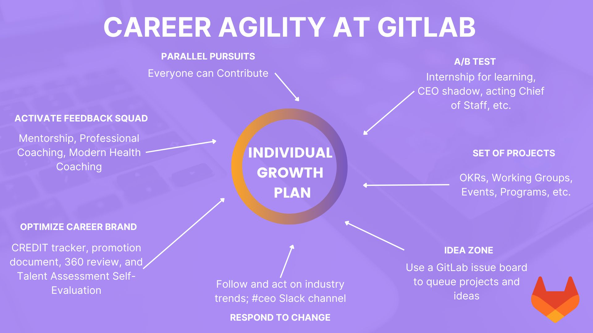

## On this page
{:.no_toc}

- TOC
{:toc}

# Overview

{: .shadow.medium.center}

**Calling all Women TMRG Members!**

- Do you have a career goal at GitLab, but not sure how to make it happen?
- Are you confused, overwhelmned, or unsure about the career development resources available to team members?
- Are you strapped for time and capacity to work on the goals you've set for yourself?
- Do you feel a bit lost in your career development and not sure where to start?
- Are you interested in learning and developing yourself and want to be part of a new challenge?

**If any of these questions apply to you, then `Activate your Agile Career` might be for you!**

`Activate your Agile Career` is a 5-month, career development **pilot program** running from October 2022 through February 2023. 50 participants will attend live training sessions, complete self-paced homework and reflection, read a book authored by the training facilitator, and collaborate with their accountability cohort.  

Applications for this pilot are currently closed.

# Benefits for Participants

As a participant in this program, GitLab team members will:

1. Understand how to apply the concept of career agility to their own career goals and Individual Growth Plan (IGP).
2. Complete an IGP. Share and discuss their IGP with their manager.
3. Evaluate and integrate at least one resource offered by GitLab into their agile career, including mentor program, internship for learning, growth and development benefit, CEO Shadow, etc.
4. Contribute to, and benefit from, a support and accountability network.
5. Gain clarity on how resources at GitLab can support their career goal achievement in the next 6-12 months.

{: .shadow.medium.center}

# Eligibility

All members, including allys, in the Women TMRG are welcome to participate. If you are not yet a member of the TMRG, please follow [these instructions](/company/culture/inclusion/tmrg-gitlab-women/#how-to-join) to join before applying.

The size of this cohort is limited to 50 total participants. Applications for this pilot are currently closed.

# Expectations

Participants interested in `Activate your Agile Career` should expect and commit to the following:

1. Apply via Google Forms by 2022-10-17
2. Complete all pre and post program assessments and feedback forms
3. Attend 3 live training sessions. Recordings will be available for those who cannot attend live. If your working hours are outside these live sessions, please still consider applying. You can watch the recordings and collaborate with a cohort that meets within your timezone.
     - 2022-10-19 @ 3pm UTC - 60 minutes
     - 2022-11-09 @ 4pm UTC - 90 minutes
     - 2023-01-11  @ 4pm UTC - 90 minutes
4. Complete post-session self paced homework and reflections (total of 7-10 hours)
5. Read or listen to [Activate Your Agile Career: How Responding to Change Will Inspire Your Life's Work](https://www.amazon.com/Activate-Your-Agile-Career-Responding/dp/0998953121). You can [expense work related books](/handbook/finance/expenses/#-expense-policy-summary).
6. Attend monthly cohort accountability sync sessions (5 total) along with participants with similar career goals - 25 minutes each
7. Complete a personal IGP and have a career development conversation with their manager

# FAQ

**What if I miss one of the live sessions?**

Sessions will be recorded and available to participants. 45 days after the last live session 2022-01-11, access to session recordings will be removed.

**What if I already have an Individual Growth Plan (IGP)?**

Excellent! Bring your IGP with you to any and all live sessions. One of our goals is that this process helps you activate your IGP, so you're already one step ahead!

**How will this be different than other career development opportunities at GitLab?**

GitLab offers multiple career development resources. The goal of this program specifically is to provide a framework and accountability network around your career development.

**The live sessions are outside my working hours. Can I still participate?**

Yes! All 3 live sessions will be recorded. Cohorts will be organized across timezones, so the accountability and book reading discussions will happen in your working hours. We understand the value in attending training sessions live and hope that results from this program will allow us to expand in future quarters to provide additional live sessions.

# Resources

[Marti Konstant](https://www.martikonstant.com/) is the creator of the Agile Career Framework. Her model relates to GitLab [CREDIT values](https://about.gitlab.com/handbook/values/), leaning into iteration as a key component of an agile career.

Below, use the infographic and list to understand what resources are available to you as a GitLab team member and how they fit into the Agile Career Framework.

{: .shadow.medium.center}

| Resource | Details | Integrate It |
| ---------- | ------------ | ------------ |
| [Individual Growth Plan (IGP)](https://about.gitlab.com/handbook/people-group/learning-and-development/career-development/#individual-growth-plan)** | Organize career goals in one place. | **Idea Zone** and **Respond to Change** |
| [Growth and Development Benefit](https://about.gitlab.com/handbook/total-rewards/benefits/general-and-entity-benefits/growth-and-development/) | Complete academic study, professional certification, and more. | **Respond to Change** |
| Coaching with [Modern Health](https://about.gitlab.com/handbook/total-rewards/benefits/modern-health/) or [Coaching Right Now (job grade 8+)](https://about.gitlab.com/handbook/total-rewards/benefits/general-and-entity-benefits/growth-and-development/#professional-coaching)**| Coaching (and therapy) sessions available. | **Activate your Feedback Squad |
| [CEO Shadow](https://about.gitlab.com/handbook/ceo/shadow/) (and other shadow programs) | Did you know of all the others shadow programs at GitLab: [Development Director](https://about.gitlab.com/handbook/engineering/development/shadow/director-shadow-program.html), [Security](https://about.gitlab.com/handbook/security/security-shadow.html), [Engineering Fellow](https://about.gitlab.com/handbook/engineering/fellow/shadow/), [CFO](https://about.gitlab.com/handbook/finance/growth-and-development/cfo-shadow-program/), [CMO](https://about.gitlab.com/handbook/marketing/cmo-shadow/), [Support](https://about.gitlab.com/handbook/support/support-ops/workflows/support_shadowing.html), and [People Connect](https://about.gitlab.com/handbook/people-group/people-connect-shadow-program/). | **Work as a Set of Projects** |
| [Internship for Learning](https://about.gitlab.com/handbook/people-group/learning-and-development/career-development/#internship-for-learning) | Spend time during your work week on a new team, exploring and contributing to a new project. | **A/B test your Career** |
| Self-Paced Learning | Use free licenses from resources like [LinkedIn Learning](https://about.gitlab.com/handbook/people-group/learning-and-development/linkedin-learning/#how-to-access-linkedin-learning), [O'Reilly Learning](https://about.gitlab.com/handbook/people-group/learning-and-development/self-paced-learning/#oreilly-learning), and [the Linux Foundation](https://about.gitlab.com/handbook/people-group/learning-and-development/self-paced-learning/#linux-foundation-courses)  | **Respond to Change** |
| [Attend Group Conversations ](https://about.gitlab.com/handbook/group-conversations/) | Check the GitLab Team Meetings calendar for schedule. | **Idea Zone** |
| [Join a TMRG](https://about.gitlab.com/company/culture/inclusion/erg-guide/) | Review the handbook for active groups | **Activate your Feedback Squad** |

