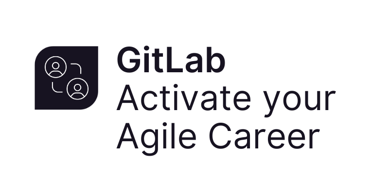
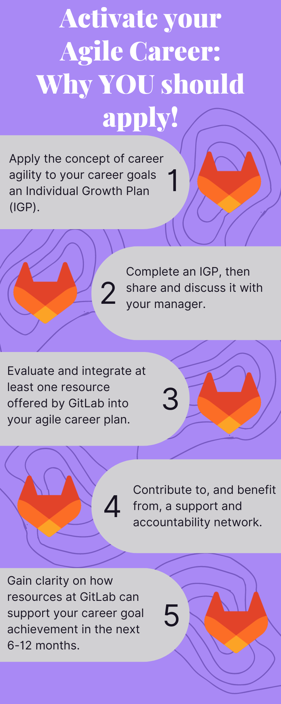

## On this page
{:.no_toc}

- TOC
{:toc}

# Overview

{: .shadow.medium.center}

**Calling all Women TMRG Members!**

- Do you have a career goal at GitLab, but not sure how to make it happen?
- Are you confused, overwhelmned, or unsure about the career development resources available to team members?
- Are you strapped for time and capacity to work on the goals you've set for yourself?
- Do you feel a bit lost in your career development and not sure where to start?
- Are you interested in learning and developing yourself and want to be part of a new challenge?

**If any of these questions apply to you, then `Activate your Agile Career` might be for you!**

`Activate your Agile Career` is a 5-month, career development **pilot program** running from October 2022 through February 2023. 50 participants will attend live training sessions, complete self-paced homework and reflection, read a book authored by the training facilitator, and collaborate with their accountability cohort.  

[Apply here](https://docs.google.com/forms/d/e/1FAIpQLSfKJ8VzOUnPr6czoxAwFBY1kjvh0gvcwoxrNJXhvauimAUECg/viewform?usp=sf_link) and keep reading to learn more about the program.

# Benefits for Participants

As a participant in this program, GitLab team members will:

1. Understand how to apply the concept of career agility to their own career goals and Individual Growth Plan (IGP).
2. Complete an IGP. Share and discuss their IGP with their manager.
3. Evaluate and integrate at least one resource offered by GitLab into their agile career, including mentor program, internship for learning, growth and development benefit, CEO Shadow, etc.
4. Contribute to, and benefit from, a support and accountability network.
5. Gain clarity on how resources at GitLab can support their career goal achievement in the next 6-12 months.

{: .shadow.medium.center}

# Eligibility

All members, including allys, in the Women TMRG are welcome to participate. If you are not yet a member of the TMRG, please follow [these instructions](/company/culture/inclusion/tmrg-gitlab-women/#how-to-join) to join before applying.

The size of this cohort is limited to 50 total participants. Applications will close either when this cap is hit, or on 2022-10-17. 

[Apply here](https://docs.google.com/forms/d/e/1FAIpQLSfKJ8VzOUnPr6czoxAwFBY1kjvh0gvcwoxrNJXhvauimAUECg/viewform?usp=sf_link)

# Expectations

Participants interested in `Activate your Agile Career` should expect and commit to the following:

1. Apply via Google Forms by 2022-10-17
2. Complete all pre and post program assessments and feedback forms
3. Attend 3 live training sessions. Recordings will be available for those who cannot attend live.
     - 2022-10-19 @ 3pm UTC - 60 minutes
     - 2022-11-09 @ 4pm UTC - 90 minutes
     - 2023-01-11  @ 4pm UTC - 90 minutes
4. Complete post-session self paced homework and reflections (total of 7-10 hours)
5. Read or listen to [Activate Your Agile Career: How Responding to Change Will Inspire Your Life's Work](https://www.amazon.com/Activate-Your-Agile-Career-Responding/dp/0998953121). You can [expense work related books](/handbook/finance/expenses/#-expense-policy-summary).
6. Attend monthly cohort accountability sync sessions (5 total) along with participants with similar career goals - 25 minutes each
7. Complete a personal IGP and have a career development conversation with their manager

# FAQ

**What if I miss one of the live sessions?**

Sessions will be recorded and available to participants. 45 days after the last live session 2022-01-11, access to session recordings will be removed.

**What if I already have an Individual Growth Plan (IGP)?**

Excellent! Bring your IGP with you to any and all live sessions. One of our goals is that this process helps you activate your IGP, so you're already one step ahead!

**How will this be different than other career development opportunities at GitLab?**

GitLab offers multiple career development resources. The goal of this program specifically is to provide a framework and accountability network around your career development.

