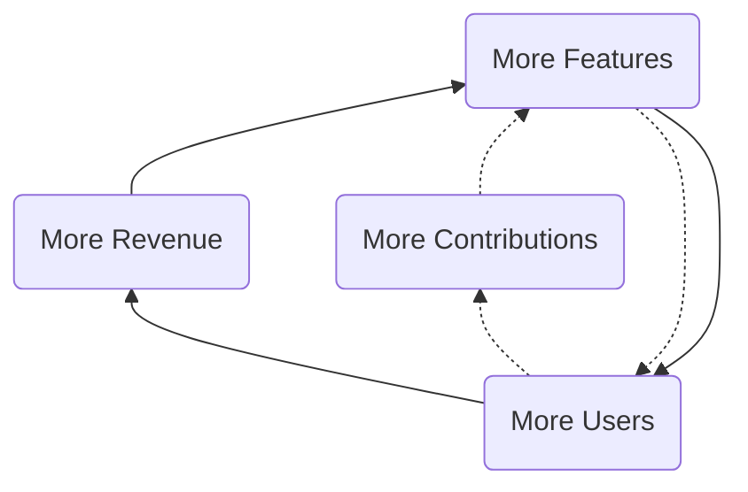
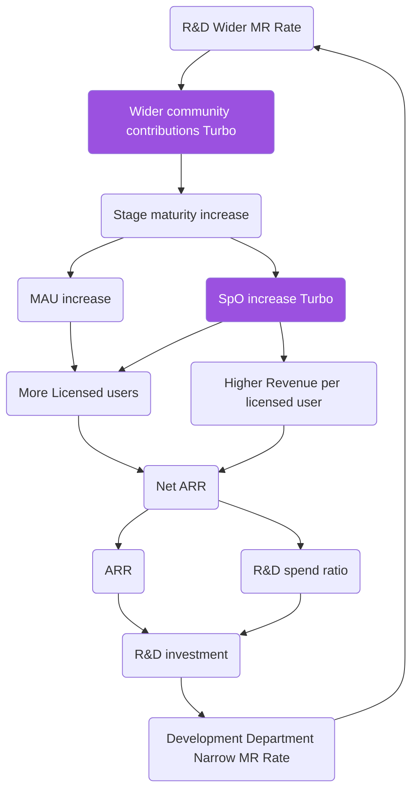

## On this page
{:.no_toc}

- TOC
{:toc}

**This strategy page is an early draft to better align the strategy to the OKR process. Expect updates as we discuss this within the company.**

## Three Year Strategy

Our strategy is looking 3 years out and [fits into our cadences](/company/cadence/#strategy){:data-ga-name="strategy"}{:data-ga-location="body"}. It also maps to and reflects GitLab's [mission](/company/mission/){:data-ga-name="mission"}{:data-ga-location="body"}, [vision](/company/vision/){:data-ga-name="vision"}{:data-ga-location="body"} and [values](/handbook/values/){:data-ga-name="values"}{:data-ga-location="body"}. It is a living strategy, so we will revisit on a regular basis and [iterate](/handbook/values/#iteration){:data-ga-name="iterate"}{:data-ga-location="body"} when there is reason to do so.

Along the road to realizing our mission of **everyone can contribute**, our
strategic goal is to be the leading complete [DevSecOps Platform](/solutions/devops-platform/){:data-ga-name="devops platform"}{:data-ga-location="body"}. We help our customers build better software faster including developing cloud native applications, building mobile applications, and incorporating machine learning and artificial intelligence into their products and solutions. We believe that our [dual flywheels](#dual-flywheels){:data-ga-name="flywheel"}{:data-ga-location="body"} (single application + open-core model) will propel us to efficiently be the default choice in the Enterprise market.

To achieve this, we will endeavor to:

### 1) ARR: Customer Results
Ensure that GitLab is the default when customers buy DevSecOps software.
**Note:** See our SEC filings on the SEC's Edgar website for information regarding ARR.

1. Even easier to buy
  1. [Dedicated](https://docs.gitlab.com/ee/subscriptions/gitlab_dedicated/)
  1. E-commerce experience => [Fulfillment efficiency](/company/top-cross-functional-initiatives/#current-top-cross-functional-initiatives)
  1. [Consumption add-ons](https://about.gitlab.com/pricing/)
  1. Sales efficiency
    1. [LAM as the top metric](/company/top-cross-functional-initiatives/#current-top-cross-functional-initiatives)
    1. Segmentation
    1. Non-US revenue
    1. Channel
    1. Renewals
    1. [Project Matterhorn--a limited access initiative](/company/top-cross-functional-initiatives/#current-top-cross-functional-initiatives) 
  1. [Registration features](/direction/registration-initiatives/
1. Prove value
  1. Advocate Training
  1. Advocate Certification
  1. Standardize customer value data
  1. [Exec dashboards](https://gitlab.com/gitlab-org/gitlab/-/issues/370887) 
#registration-features)
1. Co-create
  1. [Leading Organizations](/handbook/marketing/community-relations/leading-organizations/)
    1. Reaching 1000 monthly contributors
    1. Internal experts at our largest customers
    1. Ensure customers see it as their own product
  1. [Dogfooding](/handbook/values/#dogfooding)
    1. [Professional Services](/services/)
    1. Information technology service management 
    1. [Service desk](/stages-devops-lifecycle/service-desk/) 

### 2) Product: Mature the product
Build upon our current platform to meet current and future user needs. 

1. Be recognized as the leader in the DevSecOps Platform Category
  1. [GitHub best in class comparison](/devops-tools/github-vs-gitlab/) and differentiation 
  1. GitHub Differentiation 
  1. DIY best in class comparison
  1. [Plan](/direction/plan/)
    1. Provide mature planning solution to Ultimate customers
    1. Custom fields
    1. Workflow automation
    1. Great importers
  1. [Create](/direction/create/)
    1. Code suggestions 
    1. Remote Dev 
  1. [Verify](/direction/ops/#verify)
    1. Build, test, and deployment automation
    1. Increase speed
  1. [Ops](/direction/ops)
    1. Monitor UI library 
    1. Agent using environments 
    1. [GitOps](/topics/gitops/)
  1. [Incubation engineering](/handbook/engineering/incubation/) 
    1. [OKRs](/company/okrs/)
    1. [MLOps](/handbook/engineering/incubation/mlops/)
1. Scaling
  1. Dedicated (see ARR strategy pillar for details)
  1. Free user limits 
  1. Storage measurement 
  1. [Disaster Recovery time](/company/team/structure/working-groups/disaster-recovery/) 
  1. Standardize Usage data 
  1. [Pods](/direction/pods/) 
  1. Data archival 
  1. Import sandbox 
  1. Yubikeys
  1. Clickhouse sharding 
1. Curated experience 
  1. Fulfillment efficiency (see ARR strategy pillar for details)
  1. Usability benchmarking 
  1. Customer Executive Dashboards
  1. AI removes security dupes 
  1. [Governance documentation](https://docs.gitlab.com/ee/administration/compliance.html)
  1. [DORA documentation](https://docs.gitlab.com/ee/api/dora/metrics.html)
  1. Snyk migration 
  1. Duplicate efforts

More detail on our product strategy can be found on our [direction page](/direction/#vision){:data-ga-name="direction page"}{:data-ga-location="body"}.

### 3) People: Growing careers
Support GitLab team members in excelling within GitLab and beyond. Be a company to externally emulate and have a training impact that extends beyond the wider-community. 

1. Accountability
  1. [Bias for action](/handbook/values/#bias-for-action)
  1. [Iteration](/handbook/values/#iteration)
  1. Fast pace
  1. [Identifying underperformance early](/handbook/leadership/underperformance/)
1. [Increase team diversity](/company/culture/inclusion/)
  1. Ethnicity
  1. Gender
  1. Geo
1. Great training
  1. [TeamOps](/handbook/teamops/) 
  1. [Low voluntary turnover](/handbook/people-group/people-success-performance-indicators/#voluntary-team-member-turnover-rolling-12-months)
  1. People who leave voluntarily do very well
  	1. Note: we are confirming our ability to measure this
  1. [Vision](/company/vision/) 
  1. GitLab Foundation 

As we execute on our strategy, it is important to use our financial targets as guide rails and mature our internal processes for building a durable business for the long-term.

## Principles

1. Fast follower: we don't have to be first to market and we don't suffer from Not Invented Here (NIH)
1. Values: make decisions based on [our values](/handbook/values/){:data-ga-name="our values"}{:data-ga-location="body"}, even if it is inconvenient.
1. Reach: go for a broad reach, no focus on business verticals or certain programming languages.
1. Seed then nurture: [plant seeds and nurture the product to build out depth](#seed-then-nurture).
1. Speed: ship every change in the next release to maximize responsiveness and learning.
1. Life balance: we want people to stay with us for a long time, so it is important to [take time off](/handbook/paid-time-off/){:data-ga-name="take time off"}{:data-ga-location="body"} and work on life balance; being [all-remote](/company/culture/#all-remote-work){:data-ga-name="all remote"}{:data-ga-location="body"} is a large part of the solution.
1. Open Source Stewardship: be a good [steward of GitLab](/company/stewardship/){:data-ga-name="steward of GitLab"}{:data-ga-location="body"} and [collaborate with the wider community](/community/contribute/){:data-ga-name="collaborate with wider community"}{:data-ga-location="body"} to [improve the product together](/handbook/engineering/development/performance-indicators/#mr-rate){:data-ga-name="improve the product"}{:data-ga-location="body"}.

### Seed then nurture

Our GitLab product [vision](/direction/#vision){:data-ga-name="vision"}{:data-ga-location="body"} is to deliver a single application for the entire DevOps lifecycle.  This is a very expansive product vision that requires us to build an enormous amount of product surface area.  Because we want to be efficient with capital, we want to build GitLab as a community. When we are early in a particular area of the product, we will plant seeds by shipping a small [MVC](/handbook/values/#minimal-viable-change-mvc){:data-ga-name="mvc"}{:data-ga-location="body"}. Shipping functionality that is incomplete to expand the scope sometimes goes against our instincts. However, planting those seeds even in an incomplete state allows others to see our path and contribute. With others contributing, we'll iterate faster and will accelerate the [maturity](/direction/maturity/){:data-ga-name="maturity"}{:data-ga-location="body"} of our offering faster than GitLab could on its own.  We can have a **long tail** of categories that are at a minimal [maturity](/direction/maturity/){:data-ga-name="maturity"}{:data-ga-location="body"} that don't get investment until they show traction. While these come with a [low level of shame](/handbook/values/#low-level-of-shame){:data-ga-name="low level of shame"}{:data-ga-location="body"} they allow the wider community to contribute and people to express interest. It is much more common for people to contribute to categories that already exist and express interest in categories already shipping in the product. A minimal category is the placeholder to channel energy, and it is our responsibility to till the earth with minimal iterations.

GitLab the product should eventually have depth in every category it offers.  To build out real depth requires a shift in focus, from planting seeds to nurturing the product area to maturity. We should concentrate our nurture investments in the categories that have demonstrated [monthly active usage](/handbook/product/performance-indicators/#structure){:data-ga-name="monthly active usage"}{:data-ga-location="body"}, revenue contribution, and demonstrated customer demand.  As a product team, we'll be particularly focused on driving monthly active usage at the stage and group level.  This should lead to more Stages per Organization, which is important as each stage added [triples paid conversion](/direction/#product-strategy){:data-ga-name="triples paid conversion"}{:data-ga-location="body"}!  We'll also be heavily focused on driving usability, by measuring our [system usability score](/handbook/product/ux/ux-resources/#system-usability-score){:data-ga-name="system usability score"}{:data-ga-location="body"}, which is a measure of the user perception of GitLab's usability.

If we effectively seed and then nurture, we can fully activate GitLab's [two growth turbos](/company/strategy/#flywheel-with-two-turbos){:data-ga-name="two growth turbos"}{:data-ga-location="body"}, by creating wider community contributions and driving more stages per user.

## Assumptions

1. [Open source user benefits](http://buytaert.net/acquia-retrospective-2015): significant advantages over proprietary software because of its faster innovation, higher quality, freedom from vendor lock-in, greater security, and lower total cost of ownership.
2. [Open Source stewardship](/company/stewardship/){:data-ga-name="open source stewardship"}{:data-ga-location="body"}: the wider community comes first, we [play well with others](/handbook/product/gitlab-the-product/#plays-well-with-others){:data-ga-name="play well with others"}{:data-ga-location="body"} and share the pie with other organizations commercializing GitLab.
3. [Innersourcing](/blog/2014/09/05/innersourcing-using-the-open-source-workflow-to-improve-collaboration-within-an-organization/){:data-ga-name="innersourcing"}{:data-ga-location="body"} is needed and companies will choose one solution top-down.
4. A single application where [interdependence creates exceptional value](https://medium.com/@gerstenzang/developer-tools-why-it-s-hard-to-build-a-big-business-423436993f1c#.ie38a0cls) is superior to a collection of tools or a network of tools. Even so, good integrations are important for network effects and making it possible to integrate GitLab into an organization.
5. To be sustainable we need an open core model that includes a proprietary GitLab EE.

## Pricing

Please see our [pricing model](/company/pricing/){:data-ga-name="pricing"}{:data-ga-location="body"} for details

## Dual flywheels

GitLab has two flywheel strategies that reinforce each other: our open core flywheel and our development spend flywheel.
A flywheel strategy is [defined as](https://medium.com/evergreen-business-weekly/flywheel-effect-why-positive-feedback-loops-are-a-meta-competitive-advantage-6d0ed55b67c5) one that has positive feedback loops that build momentum, increasing the payoff of incremental effort.
You can visualize how the flywheels work in congruence via the diagram below. The KPI and responsibilities table lists the relevant indicator and department for every part of the flywheel.

In the open core flywheel, more features drive more users which in turn drive more revenue and more contributions which lead to more users.

The driving force behind the flywheel is that by using a DevOps platform to replace multiple point solutions, GitLab customers can achieve cost saving and efficiency gain. Therefore, when GitLab develops more features to improve the product maturity, it becomes easier to replace point solutions and GitLab will attract more users.

### KPIs and Responsible departments

| Part of flywheel | Key Performance Indicator (KPI) | Department |
|-------------- ---|---------------------------------|------------|
| More Users | [Stage Monthly Active Users](/handbook/product/metrics/#stage-monthly-active-user){:data-ga-name="stage monthly active user"}{:data-ga-location="body"} | Product |
| More Contributions | [Unique Wider Community Contributors per month](/handbook/engineering/quality/performance-indicators/#unique-wider-community-contributors-per-month){:data-ga-name="community contributors per month"}{:data-ga-location="body"} | Community Relations and Engineering |
| More Contributions | [MRARR](/handbook/engineering/quality/performance-indicators/#mrarr){:data-ga-name="MRARR"}{:data-ga-location="body"} | Community Relations and Engineering |
| More Contributions | [Wider community contributions per release](/handbook/marketing/community-relations/code-contributor-program/#wider-community-contributions-per-milestone){:data-ga-name="wider community contributors per release"}{:data-ga-location="body"} | Community Relations and Engineering |
| More Features | [Merge Requests per release per engineer in product development](/handbook/engineering/development/performance-indicators/#average-mrs-development-engineers-month){:data-ga-name="mrs per engineer"}{:data-ga-location="body"} | Engineering and Product Management |
| More Revenue | [IACV](/handbook/sales/#incremental-annual-contract-value-iacv){:data-ga-name="IACV"}{:data-ga-location="body"} vs. plan | Sales and Marketing |

### Flywheel with two turbos

GitLab is a [complete DevOps platform](/solutions/devops-platform/){:data-ga-name="complete devops platform"}{:data-ga-location="body"}, delivered as a [single application](/handbook/product/single-application/){:data-ga-name="single application"}{:data-ga-location="body"}, with [contributions from the wider community](/community/contribute/){:data-ga-name="contribute"}{:data-ga-location="body"}.

Compared to other DevOps platforms, GitLab leverages one or two unique turbos that boost the company:

1. [Advantages of a single application](/handbook/product/single-application/){:data-ga-name="single application"}{:data-ga-location="body"}, leading to more [Stages per Organization](/handbook/product/performance-indicators/#stages-per-organization-spo){:data-ga-name="stages per organization"}{:data-ga-location="body"}
1. [Open Source stewardship](/company/stewardship/){:data-ga-name="stewardship"}{:data-ga-location="body"}, leading to [Wider community contributions](/community/contribute/){:data-ga-name="Wider community contributions"}{:data-ga-location="body"}

The advantage of a single application manifests itself if people start using more stages of the application.
In the graph below this is visualized with [Stages per Organization (SpO), knowing that an organization using an extra stage triples conversion](/direction/#product-strategy){:data-ga-name="SpO"}{:data-ga-location="body"}.
Increasing SpO drives both more seats and higher revenue per seat.

In the development spend flywheel, we capture the relationship between merge requests (MRs), changes in ARR from one period to the next (Delta ARR), hyper growth R&D spend and the resulting impact on MRs. We see that more MRs increase stage maturity which drives more monthly active users and stages per user which in turn drives more seats and more revenue which funds R&D spend and leads to more MRs.

Legend with links to the relevant metrics:

1. [Wider community contributions Turbo](/handbook/marketing/community-relations/code-contributor-program/#wider-community-contributions-per-milestone){:data-ga-name="contributions per milestone"}{:data-ga-location="body"}{:data-ga-name="contributions per milestone"}{:data-ga-location="body"}
1. [R&D Overall MR Rate](/handbook/engineering/performance-indicators/#rd-overall-mr-rate){:data-ga-name="mr rate"}{:data-ga-location="body"}
1. [Stage maturity](/direction/maturity/){:data-ga-name="maturity"}{:data-ga-location="body"} increase
1. [MAU](/handbook/product/metrics/#monthly-active-users-mau){:data-ga-name="MAU"}{:data-ga-location="body"} increase
1. [SpO](/handbook/product/performance-indicators/#stages-per-organization-spo){:data-ga-name="spo"}{:data-ga-location="body"} increase Turbo which is only possible in a [single application with multiple stages](/handbook/product/single-application/){:data-ga-name="single application with multiple stages"}{:data-ga-location="body"}
1. More [Licensed users](/handbook/sales/#licensed-users){:data-ga-name="licensed users"}{:data-ga-location="body"} is due to an increase in unlicensed users (MAU) and the increase in [SpO](/handbook/product/performance-indicators/#stages-per-organization-spo){:data-ga-name="spo"}{:data-ga-location="body"} leading to a higher conversion from free to paid and a higher gross retention.
1. Higher [Revenue per licensed user](/handbook/sales/#revenue-per-licensed-user-also-known-as-arpu){:data-ga-name="revenue per licensed user"}{:data-ga-location="body"} due to the [Advantages of a single application](/handbook/product/single-application/){:data-ga-name="advantages of a single application"}{:data-ga-location="body"}
1. [Net ARR](https://docs.google.com/document/d/1UaKPTQePAU1RxtGSVb-BujdKiPVoepevrRh8q5bvbBg/edit#bookmark=id.a35sth38hahw) stands for Annual Recurring Revenue is our [most important KPI](/handbook/ceo/kpis/#gitlab-kpis){:data-ga-name="most important kpi"}{:data-ga-location="body"}
1. [ARR](/handbook/sales/#annual-recurring-revenue-arr){:data-ga-name="ARR"}{:data-ga-location="body"} stands for Annual Recurring Revenue and IACV increases it.
1. R&D spend ratio becomes higher if the growth rate is higher due to the [Hypergrowth Rule](/handbook/finance/financial-planning-and-analysis/hypergrowth-rule/){:data-ga-name="hypergrowth rule"}{:data-ga-location="body"}
1. R&D investment is the amount of money spend on Product Management and Engineering excluding Support
1. [Development Department Narrow MR Rate](/handbook/engineering/development/performance-indicators/#development-department-narrow-mr-rate){:data-ga-name="development department narrow mr rate"}{:data-ga-location="body"}

## Publicly viewable OKRs and KPIs

To make sure our goals are clearly defined and aligned throughout the organization, we make use of [Objectives and Key Results (OKRs)](/company/okrs/){:data-ga-name="OKRs"}{:data-ga-location="body"} and [Key Performance Indicators (KPIs)](/handbook/ceo/kpis/){:data-ga-name="KPIs"}{:data-ga-location="body"} which are both publicly viewable. 

## North Star KPI

Our North Star KPI is [Net ARR](https://about.gitlab.com/handbook/sales/sales-term-glossary/arr-in-practice/#net-arr){:data-ga-name="net arr"}{:data-ga-location="body"} vs. plan. While our ARR data is [limited access](/handbook/communication/confidentiality-levels/#limited-access) given that it is [material nonpublic information (MNPI)](/handbook/product/product-safe-guidance/#materially-non-public-information), ARR versus plan is a leading indicator of our likelihood of success in achieving revenue targets. Predictable revenue attainment is critical for continued business success.

## Plan

Our yearly plans are linked from the [relevant cadence section](/company/cadence/#year){:data-ga-name="cadence"}{:data-ga-location="body"}.

## Why is this page public?

Our strategy is completely public because transparency is one of our [values](/handbook/values/){:data-ga-name="transparency values"}{:data-ga-location="body"}.
We're not afraid of sharing our strategy because, as Peter Drucker said,
"Strategy is a commodity, execution is an art."
