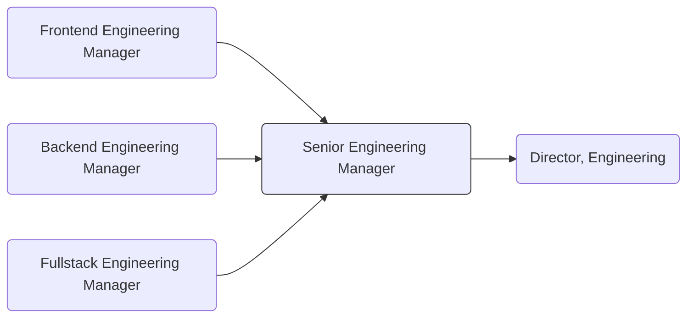

Engineering Managers at GitLab see their team as their product. While they are technically credible and know the details of what engineers work on, their time is spent safeguarding their team's health, hiring a world-class team, and putting them in the best position to succeed. They own the delivery of product commitments and are always looking to improve productivity. They must also coordinate across departments to accomplish collaborative goals. Engineering Leadership at GitLab is cross-discipline. 
A Senior Engineering Manager will manage [Backend Engineering Managers](/job-families/engineering/development/backend/manager/), 
[Frontend Engineering Managers](/job-families/engineering/development/frontend/manager/),  
and [Fullstack Engineering Managers](/job-families/engineering/development/management/fullstack-manager/).

## Responsibilities

* Hire and build a globally-distributed, happy, and successful team
* Plan and execute long term strategies that benefit your team and the product stage(s)
* Understand [Engineering KPIs](/handbook/engineering/performance-indicators/#key-performance-indicators) and seek to improve them
* Manage two or more [engineering teams](/handbook/engineering/#engineering-departments-sub-departments--teams) with at least two managers, engineering.
* Conduct managerial interviews for candidates, and train engineering managers to do said interviews
* Generate and implement process improvements, especially cross-team processes
* Hold regular [1:1s](/handbook/leadership/1-1/) with team managers and [skip-level](/handbook/leadership/skip-levels/) 1:1s with all members of their team
* Provide your team with management mentorship
* Enable [quad planning team](/handbook/product/product-processes/#pm-em-ux-and-set-quad-dris) [collaboration](/handbook/values/#collaboration) within [product groups](/company/team/structure/#product-groups)
* Enable [Product](/handbook/product/performance-indicators/), [Quality](/handbook/engineering/quality/performance-indicators/), and [UX](/handbook/product/ux/performance-indicators/) performance via solid [stable-counterpart](/handbook/leadership/#stable-counterparts) partnership
* Ensure psychological safety on your team
* Give regular and clear feedback around the [individual's performance](/handbook/leadership/1-1/suggested-agenda-format/)
* Draft quarterly [OKRs](/company/okrs/) and [Engineering KPIs](/handbook/engineering/performance-indicators/#key-performance-indicators)
* Improve product quality, security, and performance
* Participate in the [Incident Management on-call rotation](/handbook/engineering/infrastructure/incident-management/#incident-manager-responsibilities) to help ensure the availability goals for GitLab.com are met, by working with reliability engineers and development team members.

## Requirements

* Exquisite brokering skills: regularly achieve consensus amongst stakeholders
* [Collaborate](/handbook/values/#collaboration) effectively with others
* Excellent written and verbal communication skills
* Share [our values](/handbook/values/), and work in accordance with those values
* Build teams that excel through our values
* Technical credibility: Past experience as a product engineer and leading teams thereof
* Management credibility: Significant past experience as an engineering manager
* Ability to understand, communicate and improve the quality of multiple teams
* Demonstrate longevity at at least one recent job
* Ability to be successful managing at a remote-only company
* Demonstrated successful partnership with stable counterparts
* Exemplify [diversity, inclusion, and belonging](/handbook/values/#diversity-inclusion) in leadership
* Humble, servant leader
* Ability to use GitLab

## Nice-to-haves

* Experience in a peak performance organization
* Enterprise software company experience
* Computer science education or equivalent experience
* Passionate about open source and developer tools
* Experience contributing to open source software
* Experience working with modern frontend frameworks (for example React, Vue.js)
* Working knowledge of Ruby on Rails and/or Golang
* Domain knowledge relevant to the product stage in which you are looking to join (for example someone with CI/CD experience applying for the Verify and Release team)
* Be a user of GitLab, or familiar with our company
* Prior Developer Platform or Tool industry experience
* Prior high-growth startup experience
* Experience working on systems at massive (that is, consumer) scale
* Deep open source experience
* Experience working with global teams
* Be inquisitive: Ask great questions

## Job Grade

The  Senior Engineering Manager is a [grade 9](/handbook/total-rewards/compensation/compensation-calculator/#gitlab-job-grades).

## Performance Indicators

* [Development Hiring Actual vs. Plan](/handbook/engineering/development/performance-indicators/#development-hiring-actual-vs-plan)
* [Team/Group MR Rate](/handbook/engineering/development/performance-indicators/#development-department-member-mr-rate)
* [Development Handbook Update Frequency](/handbook/engineering/development/performance-indicators/#development-handbook-update-frequency)

## Career Ladder

## Hiring Process

Candidates for this position can generally expect the hiring process to follow the order below. Note that as candidates indicate preference or aptitude for one or more [specialties](#specialties), the hiring process will be adjusted to suit. Please keep in mind that candidates can be declined from the position at any stage of the process. To learn more about someone who may be conducting the interview, find their job title on our [team page](/company/team/).

1. Selected candidates will be invited to schedule a 30 minute [screening call](/handbook/hiring/#screening-call) with one of our Technical Recruiters
1. Candidates will be invited to schedule a 60 minute first interview with a VP of Development
1. Candidates will be invited to schedule a 45 minute second interview with a Director of Engineering
1. Candidates will be invited to schedule a 45 minute third interview with another member of the Engineering team
1. Candidates will be invited to schedule a 45 minute fourth interview with a member of the Product team
1. Candidates will be invited to schedule a 45 minute fifth interview with a VP of Engineering
1. Candidates may be asked to schedule a 50 minute final interview with our CEO
1. Successful candidates will subsequently be made an offer via email

Additional details about our process can be found on our [hiring page](/handbook/hiring/).
