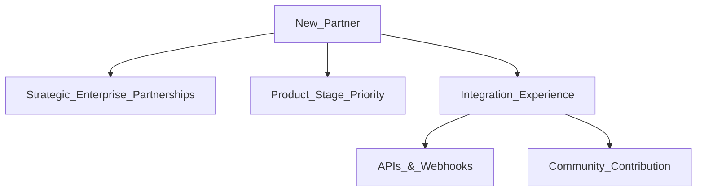

- TOC
{:toc}

| ------ | ------ |
| **Stage** | [Ecosystem](/direction/ecosystem/) |
| **Maturity** | [Viable](/direction/maturity/) |
| **Last reviewed** | 2022-05-06 |

- [Issue List](https://gitlab.com/groups/gitlab-org/-/issues?scope=all&state=opened&label_name[]=group%3A%3Aintegrations)
- [Epic List](https://gitlab.com/groups/gitlab-org/-/epics/1515)
- [Overall Ecosystem Direction](/direction/ecosystem/)

## Ecosystem:Integrations Vision

GitLab's vision is to be the best [single application for every part of the DevOps toolchain](/handbook/product/single-application/).

As we expand on how our team can make the most significant impact towards that vision, we've identified a narrower vision for the Ecosystem:Integrations Group:

**We want GitLab to enable [intuitive collaboration with tools our customers rely on](https://about.gitlab.com/handbook/product/gitlab-the-product/#plays-well-with-others) so they can capture the most value possible from the GitLab product and its many features.**

GitLab will have a robust catalog of lovable, feature-complete integrations that serve customers across all key Industries and Functions that utilize GitLab. Our customers will enjoy learning about and using our APIs and webhooks to design creative solutions and intelligent workflows, and they'll share GitLab as an example of incredible Third-party developer experience. Partners will have diverse but straightforward paths for contributing or coordinating integrations that expand our Ecosystem and the larger Developer Ecosystem in ways that provide tremendous value to the Developer Community. And we'll do this all in ways that align with GitLab's Culture and Values, by promoting transparency, focusing on iteration, and incentivizing collaboration/contribution throughout the community.

## Strategy

Given unlimited resources and time, we'd love to prioritize and support all possible integrations, but our Strategy will provide the guiding rules and logic for how we want to focus our team's efforts. 

**Our Strategy for the upcoming 2-3 years is based on three pillars: 
1. `Strategic Enterprise Partnerships` 
1. 2. `API Strategy` 
1. 3. `Integration Experience`**

- These 3 categories organize the workstreams that we believe will help us to best execute on our Vision for the GitLab Ecosystem, leveraging the resources and competencies we have at our disposal.
- The following statements further highlight how we'll execute in these areas.

**To achieve our Vision, we feel it's important to focus first on solving the pain of our Key Enterprise customers.**
- Enterprise customers have more complex tools, some of which they are committed to using and motivated to make work with other tools in their toolchain.
- Enterprise customers have many users/seats which means issues they raise, if solved, could benefit a large number of users at once.
- Enterprise customers represent a larger amount of potential revenue to be gained or lost.
- By [reducing the cost of products that are complements](https://www.joelonsoftware.com/2002/06/12/strategy-letter-v/) of GitLab (cost being the cost of using other complementary products _with_ GitLab), we can increase the value of GitLab and the share of wallet for Enterprise customers to spend more with GitLab. This is a strategic leverage point for the Ecosystem:Integrations team in particular.
- Key Enterprise Customers within this strategy will be defined as [Large Accounts (2,000+ Employees) as per our MQL Scoring](https://about.gitlab.com/handbook/sales/field-operations/gtm-resources/#mql-definition-and-scoring).

**We will identify the top 20 `Strategic Enterprise Partnerships` to focus on for the next 2-3 years between the Ecosystem:Integrations team & Alliance team and identify DRIs that will help us achieve a Solution Complete Enterprise Toolchain, pairing with the top ISVs.**

When evaluating `Strategic Enterprise Partnerships`, we want to design a robust and opinionated Ecosystem comprised of the most heavily used complementary and competitive Enterprise tools our customers leverage. This Ecosystem should provide customers with a complete solution that covers each GitLab Stage, while driving adoption and usage across more stages. Our strategy here will be to choose one or two top partners in each Product Stage or Industry Category and prioritize based on our resourcing and GitLab's greatest gaps/needs (e.g. Slack for Chat/Communications, Jira for Project Management, DataDog for Monitoring/Observability, ServiceNow for Customer Service, and CircleCI as a CI alternative). We'd like to have a "complete" Ecosystem that gives our customers first-class Integration options in each category before expanding to add other tools.

Key Categories include:
- Communication Tools (Slack, Google Chat, Teams)
- Customer Service / ITSM (ServiceNow)
- Collaboration Tools (Figma, Miro, Mural)
- Security
- Observability & Monitoring
- Compliance
- Data & Analytics
- Project Management
- CI/CD

We're actively building/iterating on our [Top 20 Strategic Enterprise Partnerships [Internal]](https://docs.google.com/spreadsheets/d/1npb2SFl8STh4Oj8EF8JwZ3Az_H1EOXPoclBfC6VmuaQ/edit?usp=sharing).

To achieve this, we plan on leveraging our GitLab expertise and resources as follows:

- Ecosystem:Integrations will prioritize integrations that offer the highest impact across the entire platform - tools that offer the broadest applicability/utility, and therefore also have the greatest usability challenge of offering a consistent experience across all product stages. For example, Communication, Collaboration, Data & Analytics. Secondarily, we will focus on integrations with tools that complement GitLab but may not fit well into a single existing product category (for example, ServiceNow or ZenDesk as a Customer Service Provider).
- Product Managers in other stages will be stable counterparts in identifying the top opportunities in their area and may drive integrations based on their roadmap.  Many times, individual groups will have more in-depth knowledge of tools that are relevant to their core product as those teams will have the deepest experience and understanding of customer pain points and how integrations should work within their product stage. The Alliance team and Ecosystem team will support in establishing relationships and facilitating the Ecosystem expansion. The Ecosystem Integrations team will also assist in technical design and code reviews. The Ecosystems Integrations team's focus will be to establish processes and build tools for teams to efficiently build and maintain their own integrations, rather than building all GitLab integrations.
- The Alliance Partner Integration Engineering team (PIE) - which is being newly assembled - will serve a solutions engineering role in guiding and supporting Community Contributors. The PIE team will guide any other potential partners in how to establish integrations through our Integration Experience (Community Contributions or by leveraging our APIs/webhooks). This team can and should scale based on the needs and impact of Community Contributions.
- When it comes to the design of our opinionated Ecosystem, we want to prioritize relationships that pair well with Google Cloud and AWS over Microsoft Azure, so we may focus first on building a robust ecosystem that supports businesses that are not as tightly integrated into Azure. This should give us a differentiator by building deeper/tighter integrations, while Microsoft is likely to focus first on making their Ecosystem more closed and locked-in to their cloud.
- We'll have a strong emphasis on partnerships/tools that fill gaps for our product, complement our product, and add value for Enterprise customers. For example, Security & Observability capabilities drive higher value for Enterprise customers.
- As we work to expand our strategic partnerships, we'll prioritize achieving a Lovable state for each integration, with a focus on stability, reliability, performance, and usability, before we prioritize new integrations. This will provide a stable foundation for our Ecosystem and allow us to move more quickly on new integrations.

**In alignment with GitLab's values, we want to encourage and make it easier for users to contribute. To do so, we want to prioritize workflows, tools, and processes that make it possible for contributors to more easily self-serve.**

Beyond `Strategic Enterprise Partnerships`, our other two pillars of the Ecosystem:Integration team will support this strategic objective:

**1. Guide, facilitate, and lead implementation of an `API Strategy`. This will be executed on first through an API Working Group.**

The Ecosystem:Integrations team will drive and facilitate discussion around our APIs with a key objective of improving usability, reliability, and performance for customers and partners in our Ecosystem. To identify the key areas of focus, we feel this particular topic will require significant cross-functional support. We've established a [working group](https://about.gitlab.com/company/team/structure/working-groups/api-vision/) to drive these topics forward, and will update this section based on the exit criteria below:

- Define the vision of the GitLab API for the future years.
- Set the foundation of a cohesive development strategy going forward.
- Improve the API or capture the work needed to have a world-class API.
- Clarify the lifecycle of the API.
- Improve the documentation of the API.
- Create learning paths and content to contribute to the API.
- Define minimum levels of performance and stability, with appropriate checks and monitoring.

**2. Guide, facilitate, and lead the implementation of a standard, scalable `Integration Experience` including Discovery, Configuration Management, and Contribution of New Integrations.**

- We want to define or refine a robust process for discovery of first-class integrations for our customers. What is the optimal experience for our users to explore all possible options for connecting their tools. For example, how might we establish a searchable/browsable catalog and make it simple for users to understand what to expect when configuring/enabling an integration?
- We'll also want to make it easier to manage and maintain Integrations with GitLab (via `Project > Integrations`). How do we make it clear to users what the status of an integration is, how to troubleshoot, add/remove users, or configure capabilities for projects or groups? How can we do this consistently so each integration follows similar patterns?
- From a development standpoint, we'll want to improve the process of contributing/maintaining first-class integrations, with as little overhead to GitLab as possible, whether you're an internal Product Stage team building a new integration, or a third-party contributor.
  - What are the required inputs?
  - What are the standard UX patterns/flows?
  - What is the required documentation?
  - What are the performance/uptime requirements?
  - Have proper tests been established before release?
- Lastly, we'll also want to establish clear paths for contributors. If they are `Strategic Enterprise Partnerships`, we'll want to maintain an Alliance & Ecosystem:Integration team relationship. Product Stages will lead technical support/delivery on integrations relevant to their Stage, and the Partner Integration Engineering (PIE) team will focus support on Community Contributions for those not on the top 20 list. We'll want to improve documentation/tools to increase the velocity of each of these pathways/pipelines to grow and scale over time, to support more and more partners/contributors. 

**Integration Experience as an External Partner/Contributor**

## Insights 

### Customer Insights

[Top Growth Opportunities](https://docs.google.com/document/d/1RzZpN-_trbyPZu6-vL4YpDW-3PLj_TaRynJMvt6ZzSc/edit?usp=sharing)

### Partner/Ecosystem Insights

- Consider our integration efforts so far. What integrations have been most successful up to this point? [Jira, Slack, Prometheus](https://app.periscopedata.com/app/gitlab/577690/Integrations-Usage-Dashboard). 
Why? Our hypothesis is that they serve larger Enterprises with real, complex challenges that would be valuable to solve. These Enterprises have many users that are trying to follow standard processes, using standard tools chosen by their org.
- Secondarily, these partners (Atlassian, Slack) have large TAMs - they work with mutual customers and prospects that could gain value from pairing their products with GitLab.

### GitLab Values & Product Principles

- [Prioritize relentlessly.](https://about.gitlab.com/handbook/product/product-principles/#our-product-principles) It is better to do a few things well than many things poorly. We should focus first on what we're best at and what our customers need most, with a preference for simplicity. Customers will tell us when we're missing something they need, but they’re unlikely to tell us when we're overwhelming them with unwanted features.

### Resourcing & Capabilities Insights

Our Integrations team became a Stage only recently and is working to staff up and resume full working capacity following security allocation. However, even with a full team, there's a limit to the number of integrations we can prioritize and complete in a given period. We can explore the [number of customer impacting releases](https://gitlab-com.gitlab.io/cs-tools/gitlab-cs-tools/what-is-new-since/?tab=features&selectedCategories=Integrations&selectedStages=create&selectedStages=ecosystem) here to see that the Integrations team has primarily focused on two key integrations since 13.0: Jira and Slack, in addition to critical core changes to allow for enabling integrations across a project, group, or instance. At a high level, we might estimate no more than 4 new integrations or major integration updates could be developed within a single fiscal year by the Ecosystem:Integrations team. Keeping in mind as well that our team has other responsibilities for supporting our API Strategy and any technical improvements we plan for the Integration Experience.

## Why are we wanting to update/refresh our Vision & Strategy?

To set up a foundation for success, it's critical for our team to have a clear understanding of where we're trying to go, how we want to get there with the people/expertise we have, and how we plan to achieve real business objectives, while providing real customer value.

This is an extension of GitLab's overall Vision/Goals and how the Ecosystem:Integration team can make the most impact, and our strategy should explain why we made the decisions we did to create the most possible focus for our team. We'd like to reassess regularly and if we are not achieving our objectives, we'll want to adjust our strategy.

See below for more background: 

- [Product Strategy: The Missing Link - Marty Cagan](https://www.youtube.com/watch?v=x4H_gluZI10)

- [The Mile 3 Marker Says GTLB - Sid](https://gitlab.edcast.com/insights/mile-3-presentation)

## Key Objectives

Based on our Vision/Strategy, we will follow and track the following key objectives to identify if our Strategy is effective:

* ARR / # of Integrations
* Total CMAU
* Deal Blockers - Track Opportunities Won where an Integration is cited by customer as a key requirement
* [Customer Churn](https://www.crossbeam.com/blog/tech-ecosystem-maturity-track-churn-and-youre-3-6x-more-likely-to-have-dedicated-budget-for-integrations/) - Overall Customer Churn should decrease as we increase the stickiness of our product via our Ecosystem
* New Revenue through Partnerships
* \# of Community Contributions (based on improvements to our API Strategy and Integration Experience)

## Maturity

The Integrations group tracks [Maturity](/direction/maturity/)
on a per-integration basis. Each integration is evaluated based on the following
criteria:

* A **Minimal** integration meets a single basic need for a small set of customers, and may only push data one way from one system to the other without surfacing much data or functionality directly in the UI.
* A **Viable** integration meets the core needs of most customers, and is robust or configurable enough to meet all the needs of some customers.
* A **Complete** integration meets the needs of the vast majority of usecases for the majority of users, and the integration allows users to work painlessly between the two products.
* A **Lovable** integration not only meets the needs of the vast majority of users, but it makes the experience of using both products as productive and easy as possible. This may mean things like special consideration taken to intra-product navigation and how we surface notifications from the other service, for example.

## Current High-priority Integrations

_You can view a list of all of our current integrations on our [Integrations page](https://docs.gitlab.com/ee/user/project/integrations/overview.html)_

| Integration           | Maturity Level      | Documentation                                                                               | Issues / Planning Epic    |
| ---                   | ---                 | ---                                                                                         | --- |
| Webhooks              | Viable              | [Documentation](https://docs.gitlab.com/ee/user/project/integrations/webhooks.html)         | [Open Issues](https://gitlab.com/groups/gitlab-org/-/issues?scope=all&utf8=%E2%9C%93&state=opened&label_name[]=Integration%3A%3Awebhooks) |
| Atlassian Jira        | Viable              | [Documentation](https://docs.gitlab.com/ee/integration/jira/)             | [Open Issues](https://gitlab.com/gitlab-org/gitlab/-/issues?scope=all&utf8=%E2%9C%93&state=opened&label_name[]=Integration%3A%3AJira) |
| Slack                 | Viable              | [Documentation](https://docs.gitlab.com/ee/user/project/integrations/slack.html)            | [Open Issues](https://gitlab.com/gitlab-org/gitlab/-/issues?scope=all&utf8=%E2%9C%93&state=opened&label_name[]=Integration%3A%3ASlack) |
| Jenkins               | Viable              | [Documentation](https://docs.gitlab.com/ee/integration/jenkins.html)                        | [Open Issues](https://gitlab.com/gitlab-org/gitlab/-/issues?scope=all&utf8=%E2%9C%93&state=opened&label_name[]=Integration%3A%3AJenkins) |
| ServiceNow            | Minimal             | [Documentation](https://docs.gitlab.com/ee/user/project/integrations/servicenow.html)       | [Epic](https://gitlab.com/groups/gitlab-org/-/epics/1712) |
| Microsoft Teams       | Minimal             | [Documentation](https://docs.gitlab.com/ee/user/project/integrations/microsoft_teams.html)  | [Epic](https://gitlab.com/groups/gitlab-org/-/epics/880) |
| Rally                 | Under Consideration | _n/a_                                                                                       | [Issue](https://gitlab.com/gitlab-org/gitlab/issues/169) |
| Jama                  | Under Consideration | _n/a_                                                                                       | [Issue](https://gitlab.com/gitlab-org/gitlab/issues/16182) |

## What's next and why

### Improve our Slack integration

Slack notifications are the most common integration on GitLab projects, giving
users the ability to send important activity to the relevant channels in their Workspace.
We also have a lightweight Slack application that supports a variety of ChatOps related Slash Commands

* [Refactor Slack integration to support latest Slack APIs](https://gitlab.com/groups/gitlab-org/-/epics/6187)
* [Displaying helpful text when linking to private repos](https://gitlab.com/gitlab-org/gitlab/-/issues/14194)
* [Fine-grained Slack Notifications](https://gitlab.com/gitlab-org/gitlab/-/issues/18278)
* [Unfurl links to code in Slack](https://gitlab.com/gitlab-org/gitlab/-/issues/215143)

### Make Jira and GitLab work well in concert

Jira is one of our most popular integrations, and a common thread we hear is that "developers want
to be able to stay in GitLab", and not need to visit Jira to do daily tasks. The goal of our upcoming work is to get the features to a point where a typical developer can stay in GitLab for the majority of their Jira needs. We have released an MVC for a Jira Cloud issues integration for GitLab SaaS customers and will be expanding that to [self-managed GitLab instances](https://gitlab.com/groups/gitlab-org/-/epics/5650).

### Build a native ServiceNow integration

ServiceNow is a key component in how many of our largest customers handle Change Management. Through ServiceNow, they maintain an audited chain of custody with code changes, approve/deny changes based on a strict approval workflow, and manage deployment on a scheduled cadence. ServiceNow allows these customers to take these audit logs and centralize them with other data that they're using to monitor and report about their compliance regime.

### Create a joint REST and GraphQL API strategy

GitLab offers a REST and GraphQL API to give customers options on how to best integrate with GitLab. Until now, we have not developed a cohesive strategy that optimizes for parity between them and efficiency in maintaining both implementations.

### Improve our Webhooks

Webhooks are a generic way for projects to be integrated with any other service. GitLab's APIs allow other services to _reach in to_ our data, Webhooks proactively send data to another service when certain events happen. These are increasingly important for external vendors, as they offer a key way to integrate with GitLab that doesn't require them building inside our codebase.

* [Open Issues](https://gitlab.com/groups/gitlab-org/-/issues?scope=all&utf8=%E2%9C%93&state=opened&label_name[]=Integration%3A%3Awebhooks)

## What we're not doing

### Building a "marketplace"

GitLab does not utilize a plugin model for integrations with other common tools and services, or provide a marketplace for them. As an [open core project](https://en.wikipedia.org/wiki/Open-core_model), integrations can live directly inside the product. Learn more about our reasons for this in our [Product Handbook](/handbook/product/product-principles/#avoid-plugins-and-marketplaces).

This does not mean we will **never** build a "marketplace" for GitLab, it just means we have no intention of doing it at this time.

### Integrating "everything"

There are dozens of products and services that customers have requested that we build an integration with, and we sincerely wish we had the time and funding to be able to build all of them. However, since we are a team of limited size and there are only so many hours in a day, we are focused on the priorities listed above.

However, we're happy to [partner with your company](/partners/technology-partners/integrate/) if you'd like to contribute an integration with your product. As an [open core project](https://en.wikipedia.org/wiki/Open-core_model), anyone in our community is welcome to add the integrations they need.

## Contributing

This group develops and maintains specific integrations inside the GitLab codebase, but that doesn't preclude you and your team from adding your own. At GitLab, one of our values is that everyone can contribute. If you're looking to contribute your own integration, or otherwise get involved with features in the Integrations area, [you can find open issues here](https://gitlab.com/groups/gitlab-org/-/issues?scope=all&state=opened&label_name[]=group%3A%3Aintegrations).

Feel free to reach out to the team directly if you need guidance or want
feedback on your work by using the ~"group::integrations" label on your open merge requests.

You can read more about our general contribution guidelines [here](https://gitlab.com/gitlab-org/gitlab/-/blob/master/CONTRIBUTING.md).

## Partnership

If your company is interested in partnering with GitLab, check out the [Partner with GitLab](https://about.gitlab.com/partners/integrate/) page for more info.

## Integration design guidelines

Special considerations apply to integrations that don't apply to building native functionality. The product handbook [has a set of recommendations and guidelines](/handbook/product/product-principles/#integrate-other-applications-thoughtfully) to consider when working on these types of projects.

## Influences

We're inspired by other companies with rich, developer-friendly experiences like [Salesforce](https://developer.salesforce.com/), [Shopify](https://help.shopify.com/en/api/getting-started), [Twilio](https://www.twilio.com/docs/), [Stripe](https://stripe.com/docs/development), and [GitHub](https://developer.github.com/).

A large part of the success of these companies comes from their enthusiasm around enabling developers to integrate, extend, and interact with their services in new and novel ways, creating a spirit of [collaboration](https://about.gitlab.com/handbook/values/#collaboration) and [diversity](https://about.gitlab.com/handbook/values/#diversity-inclusion) that simply can't exist any other way.

## Feedback & Requests

_This direction is constantly evolving, and [everyone can contribute](#contributing):_

* Please comment, thumbs-up (or down!), and contribute to the linked issues and epics on this group page. Sharing your feedback directly on GitLab.com is the best way to contribute to our vision.
* If there's an integration that you'd like to see GitLab offer, please [submit an issue](https://gitlab.com/gitlab-org/gitlab/-/issues/new?issue) with the label `~"group::integrations"` on any relevant issues.
* Feel free to mention the Ecosystem:Integrations PM [@g.hickman](https://gitlab.com/g.hickman) for visibility. If you're a GitLab user and have direct
  knowledge of your need from a particular integration, we'd love to hear from you.

