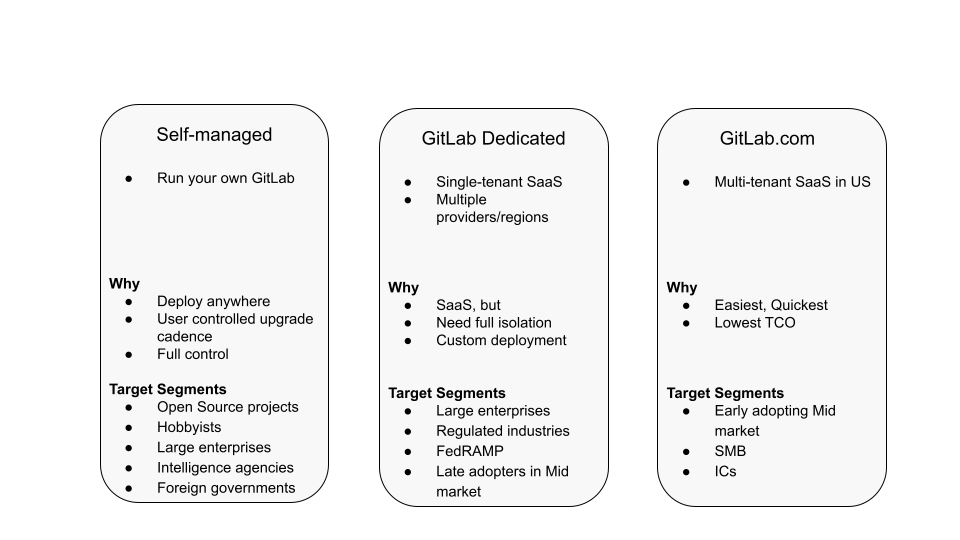
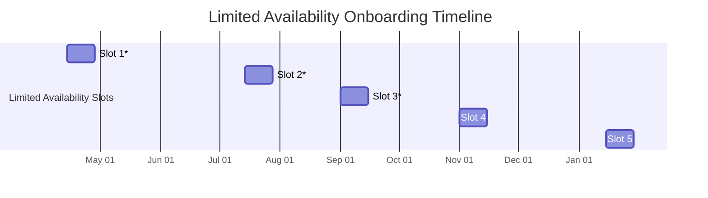

- TOC
{:toc}

This page outlines the Direction for the GitLab Dedicated category and belongs to the [GitLab Dedicated](https://about.gitlab.com/handbook/product/categories/#gitlab-dedicated-group) group. To provide feedback or ask questions about this product category, reach out to the [Product Manager](mailto:athomas@gitlab.com).

This document and linked pages contain information related to upcoming products, features, and functionality. It is important to note that the information presented is for informational purposes only. Please do not rely on this information for purchasing or planning purposes. As with all projects, the items mentioned in this document and linked pages are subject to change or delay. The development, release, and timing of any products, features, or functionality remain at the sole discretion of GitLab Inc.

<!--more-->

You can contribute to this category by:

- Commenting on a relevant epic or issue in [our project](https://gitlab.com/gitlab-com/gl-infra/gitlab-dedicated/team)(GitLab internal), or opening a new issue in the [GitLab Dedicated issue tracker](https://gitlab.com/gitlab-com/gl-infra/gitlab-dedicated/team/-/issues/new?issue%5Bmilestone_id%5D=).
- Joining the discussion in the [#f_gitlab_dedicated](https://gitlab.slack.com/archives/C01S0QNSYJ2) Slack channel

## Overview
<!-- A good description of what your category is today or in the near term. If there are
special considerations for your strategy or how you plan to prioritize, the
description is a great place to include it. Provide enough context that someone unfamiliar
with the details of the category can understand what is being discussed. -->

GitLab Dedicated's objective is to provide a GitLab SaaS offering to large enterprises and customers in industries with strict security and compliance requirements. When adopting DevOps tools, customers [increasingly prefer SaaS](https://about.gitlab.com/direction/enablement/dotcom/#market-opportunity) to reduce operational cost, but customers in highly-regulated industries (e.g. Healthcare, Finance, and Public sectors) can't compromise on their security and compliance requirements when moving to SaaS. These requirements (e.g. isolated storage of source code IP) often dictate the need to be on separate Cloud Infrastructure from other tenants. This makes it challenging for these customers to adopt a shared-tenancy SaaS solution like gitlab.com.

Additionally, customers in regulated industries often require the ability to connect users or services running in their corporate network to their source code repositories running in the cloud via a private network connection. As a public-facing SaaS service, GitLab.com can't support this type of private connectivity easily by default. Finally, large, globally-distributed enterprises need the ability to control the location and number of Geo Replica sites to reduce latency for their workforce around the world. Some of our Self-Managed customers have 5+ Geo sites, and for them to consume SaaS they may need more global coverage than [what we offer on GitLab.com today](https://about.gitlab.com/direction/enablement/dotcom/#overview).

For these customers, a higher level of tenant isolation and deployment customization is required. While some customers may be satisfied leveraging a [partner MSP](#channel-partner-role-in-gitlab-dedicated), customers may prefer to consume the service directly from GitLab so that they have a single-point of contact for operational accountability.

GitLab Dedicated will solve these needs by offering a fully isolated, private GitLab instance, deployed in the customer's cloud regions of choice. The instance is fully hosted and managed by GitLab Inc enabling customers to offload operational overhead and focus on more business-critical tasks.

In addition to delivering customer value, GitLab Dedicated will also benefit internal GitLab teams. We envision the tooling we build for Dedicated being used as the single method going forward for running all of GitLab Inc's SaaS services. This will allow us to achieve even greater returns on our initial investment by enabling any future SaaS services to quickly get started with a robust and standardized foundation.

## Why is this important?
<!--
- Why is GitLab building this feature?
- What impact will it have on the broader devops workflow?
- How confident are we? What is the effort?
-->

There are two major trends emerging when it comes to the delivery of Cloud based solutions:

- Move to SaaS [as detailed in the .com strategy](https://about.gitlab.com/direction/enablement/dotcom/#market-opportunity) (IDC predicts that the market for SaaS-based DevOps tools (currently 38% of the market) will overtake the self-managed market (62%) by 2022 and account for $10.3B in revenue (or 58% of DevOps software tools market) by 2024),
- Adoption of Private Cloud, which makes it easier for enterprises to meet their security and compliance needs. Increasing fragmentation of global policy [regarding data protection](https://insights.comforte.com/13-countries-with-gdpr-like-data-privacy-laws) drives new compliance requirements, which can be better met with Private Cloud deployments. 16% of cloud services are expected to be delivered as a hosted private cloud offering [by 2025](https://www.reportlinker.com/p05826094/Global-Private-Cloud-Server-Market.html?utm_source=PRN).

GitLab Dedicated is for organizations that want to benefit from both SaaS and Private Cloud. By delivering this offering we will set ourselves up to achieve customer success as these two trends further accelerate in 2025.

### Target Audience
<!--
List the personas (https://about.gitlab.com/handbook/marketing/strategic-marketing/roles-personas#user-personas) involved in this category.

Look for differences in user's goals or uses that would affect their use of the product. Separate users and customers into different types based on those differences that make a difference.
-->

#### Target Customer

GitLab Dedicated is initially targeted at large enterprises and customers in highly-regulated industries. These customers want a SaaS solution but prefer not to use multi-tenant systems like GitLab.com due to strict security and compliance requirements or the desire to be on separate infrastructure to meet custom deployment needs. Additionally, our target segment is comfortable with a 2000 seat minimum order (otherwise Dedicated is cost prohibitive) and is willing to pay an [additional fee](#pricing) on top of licenses for a GitLab instance to be hosted and managed on their behalf. Finally, our target segment has the flexibility to work with the [launch timelines](https://gitlab.com/gitlab-com/gl-infra/gitlab-dedicated/team/-/blob/main/README.md#timeline)(GitLab internal) we've established.

#### Positioning

GitLab Dedicated is for customers that need isolation from other tenants at the infrastructure level or need custom deployments of GitLab [as discussed above](#overview). The main value proposition with Dedicated is that we're giving customers their own GitLab Instance, isolated from other tenants, and hosted as a SaaS service on the customer's behalf. With this extra value comes an additional management fee. Customers who want SaaS, but are OK with the shared-tenant model of .com or don't want to pay an extra fee should use gitlab.com. Availability will not be a point of differentiation between GitLab Dedicated and .com as both offerings target a 99.95% Availability SLA. Meanwhile, customers who want full control over their GitLab installation should use the self-managed option.

See below for a comparison of the different ways to deploy GitLab:

#### Target User Persona

- [Sidney (Systems Administrator)](https://about.gitlab.com/handbook/product/personas/#sidney-systems-administrator)

#### Target Buyer

- [Kennedy (Infrastructure Engineering Director)](https://about.gitlab.com/handbook/marketing/strategic-marketing/roles-personas/buyer-persona/#kennedy---the-infrastructure-engineering-director)

### Challenges to address
<!--
- What needs, goals, or jobs to be done do the users have?
- How do users address these challenges today? What products or work-arounds are utilized?

Provide links to UX Research issues, which validate these problems exist.
-->

Overall, the main challenge our target customer has is maintaining an up-to-date GitLab instance that fulfills their security and compliance requirements. More granular customer needs are documented in the sections below.

#### Migration

- Users want to seamlessly migrate their data, which can exceed many TBs in size, to GitLab Dedicated in a timely and reliable fashion from their existing DevOps solution, whether it's a third-party offering like BitBucket, a self-managed GitLab instance, or gitlab.com.

#### Security and Compliance

- Our target customer base, large enterprises and customers in highly-regulated industries, expect the offering to implement security best practices including encryption of data at rest and in transit, periodic encryption key rotation, ability to specify their own encryption key, integration with their own identity management systems, protection against DDoS attacks, intrusion detection, role-based access control for operators, segregation of duties with least privilege access configured among operator accounts, and approved escalation in order to access customer environments during break-glass scenarios.
- Upgrades: Customers want regular, zero-downtime upgrades to their instance along with timely security patches for high-sev issues when necessary.
- Data residency: Customers want their Dedicated instance and data (including logs and backups) to be hosted in their cloud region of choice to help meet their security and compliance requirements.
- Private Networking: Customers want to be able to securely connect applications running in their VPC including their Runner pool to GitLab Dedicated via a private connection without the traffic leaving the Cloud Provider backbone.
- Public Networking: Some customers work with third-parties (e.g. contractors), who do not authenticate through their main network and thus need to access the Dedicated instance over the public internet. In this scenario, customers need the ability to restrict access to their instance based on an allowlist of trusted IP ranges.

#### Observability

- Customer admins want to access telemetry data including health metrics and application/system logs so that they can monitor their instance and keep their internal teams informed regarding an outage or performance degradations with their DevOps environment. Users also want access to audit logs to achieve compliance requirements and the ability to monitor network flow (e.g. VPC flow logs) to ensure outbound connections are made to only known/trusted hosts.

#### Scalability

- Large enterprises want their chosen DevOps solution to automatically scale based on their number of users and usage patterns.

#### Availability

Large enterprises demand strict uptime SLAs (at least 'three-nines') and expect the following capabilities related to system availability:

- High Availability Deployment (especially their code repositories) including leveraging multiple availability zones within a region to mitigate against an AZ outage.
- Disaster Recovery: Failovers to the included secondary site in case the primary instance experiences an unrecoverable outage and guaranteed recovery times.
- Backups: customers expect their data to be backed up on a regular basis in case of a data loss event and to meet committed recovery point and time objectives during restoration.

#### Performance

- Customers want replicas of their instance to be deployed in multiple regions around the globe to reduce latency for their global user base.

## Where we are Headed
<!--
Describe the future state for your category.
- What problems are we intending to solve?
- How will GitLab uniquely address them?
- What is the resulting benefits and value to users and their organizations?

Use narrative techniques to paint a picture of how the lives of your users will benefit from using this
category once your strategy is at least minimally realized. In order to challenge your level of ambition
(with the goal to make it sufficiently high), link to the current market leaders long-term vision and address how
we plan to displace them. -->

The main goal for FY23 is to make GitLab Dedicated [available to external customers](https://gitlab.com/gitlab-com/gl-infra/gitlab-dedicated/team/-/blob/master/README.md#timeline)(GitLab internal). The initial version of the service will be [fully automated, but will contain a minimal feature set](https://gitlab.com/gitlab-com/gl-infra/gitlab-dedicated/team/-/blob/master/README.md#product-development-principle-100-automation-1-features)(GitLab internal). After releasing the offering, we plan to deliver application features and operational capabilities that were [not included in the first launch](https://docs.gitlab.com/ee/subscriptions/gitlab_dedicated/#features-not-available-at-launch) based on customer demand.

The product will be made available to customers over the course of the following milestones.

### Product Milestones

#### Limited Availability

GitLab Dedicated was launched in Limited Availability (LA) with select customers at the end of Q1 FY23.

The goal of this phase is to be able to operate a small set of paid, production-level instances for select customers. Compared to Beta, Limited Availability delivers the availability, scalability, performance, security, and durability that customers need in a production environment.

#### General Availability

In this phase, we plan to make the offering available to all customers who are willing to pay for it. Compared to LA, the focus in GA is on scaling the platform from a handful of early customers in specific geos to our broader customer base around the Globe. 

### Prioritization Framework

Dedicated follows the overall [Product prioritization framework](https://about.gitlab.com/handbook/product/product-processes/#prioritization-framework) to determine which items to work on during a given milestone.
Because Dedicated is a SaaS offering, we prioritize "Keep the lights on" activities (e.g. operating customer environments, tech debt, and corrective actions) above all else to ensure we provide customers a high level of service that continually meets our reliability and performance SLAs. Next, we prioritize security enhancements (e.g. supporting new compliance certifications) since our customer base comprises of large enterprises with strict compliance requirements, followed by enhancements to our overall system SLAs (uptime, rto/rpo targets, etc). Next, we prioritize config changes to customer environments followed by feature requests and then, finally, initiatives to improve our automation and scaling of the system (including Switchboard).

### Roadmap

Based on the prioritization framework, during Limited Availability we will focus on the following areas:

| Priority | Category | Description |
|-----------------------------|--------------------------|-----------------------|
| 0 | KTLO - On Call | Operating Tenant Production Environments |
| 1 | Security | Supporting security certifications and addressing findings from audits | 
| 2 | Improve SLAs (Availability, RTO, RPO) | Geo, failover testing, automated restore |
| 3 | Support Customer Config Changes |  Customers will need config changes during onboarding and weekly maintenance windows. |
| 4 | Enable GitLab Functionality | Dependency proxy, Pages, advanced search |
| 5 | Switchboard (management portal for customer admins) |  Deliver MVC |

The full roadmap for LA can be [found here](https://gitlab.com/groups/gitlab-com/gl-infra/-/epics/484#roadmap-during-limited-availability)(GitLab internal).
The full roadmap for GA [is documented in this Epic](https://gitlab.com/groups/gitlab-com/gl-infra/-/epics/485#post-ga-roadmap)(GitLab internal).

### What's Next & Why
<!-- This is almost always sourced from the following sections, which describe top
priorities for a few stakeholders. This section must provide a link to an issue
or [epic](https://about.gitlab.com/handbook/product/product-processes/#epics-for-a-single-iteration) for the MVC or first/next iteration in the category.-->

From the table above, we plan to focus on security enhancements and improving SLAs as those items are highest in our priortization framework.

### What is Not Planned Right Now
<!-- Often it's just as important to talk about what you're not doing as it is to
discuss what you are. This section should include items that people might hope or think
we are working on as part of the category, but aren't, and it should help them understand why that's the case.
Also, thinking through these items can often help you catch something that you should
in fact do. We should limit this to a few items that are at a high enough level so
someone with not a lot of detailed information about the product can understand
the reasoning-->

The following items are not planned to be delivered at launch and are under consideration for the Post-GA timeframe:

- Hosted Runners
- Bring Your Own Key (BYOK) Encryption
- Authentication via LDAP
- Multiple Geo secondaries beyond the secondary site included by default
- Custom Domain
- Choice of Cloud Providers (e.g. GCP)

### Maturity Plan
<!-- It's important your users know where you're headed next. The maturity plan
section captures this by showing what's required to achieve the next level. The
section should follow this format:

This category is currently at the XXXX maturity level, and our next maturity target is YYYY (see our [definitions of maturity levels](https://about.gitlab.com/handbook/product/categories/maturity/#legend)).

- Link to maturity epic if you are using one, otherwise list issues with maturity::YYYY labels) -->

This category is currently at the `Minimal` maturity level, and our next maturity target is `Viable`, which will be met when the service reaches the General Availability milestone.

## Go-to-market plans

### During Limited Availability

_The following links are internal to GitLab_

- Timelines
  - Product launch milestones are [documented here](https://gitlab.com/gitlab-com/gl-infra/gitlab-dedicated/team/-/blob/main/README.md#timeline)
- [Comms Plan](https://gitlab.com/groups/gitlab-com/gl-infra/-/epics/616) 
- [Field Enablement Guide](https://internal-handbook.gitlab.io/handbook/engineering/horse/field-enablement/index.html)
- Customer Onboarding Plan
  - Selection criteria [documented here](https://gitlab.com/gitlab-com/gl-infra/gitlab-dedicated/team/-/issues/190)
  - Slot availability timeline [documented below](#LA-Onboarding-Timeline)

### Customer Communication Guidelines

When engaging with customers, we encourage everyone to be very intentional about when and how to mention GitLab Dedicated. This is a new deployment method which will take time to mature, and we do not want to disrupt prospective and existing customers by introducing Dedicated too early, or when it's a bad fit.

Prior to discussing GitLab Dedicated with an opportunity/customer:

1. Review the [target customer profile](#target-customer-profile) to ensure it is a good fit
1. Review the estimated [timeline](https://gitlab.com/gitlab-com/gl-infra/gitlab-dedicated/team/-/blob/main/README.md#timeline)(GitLab internal) to ensure it meets the customer's desired onboarding timeframes. Note, there will be a limited number of customers we can support during the Limited Availability period. Once we move to GA, the offering will be available to all customers who are willing to [pay for it](#pricing).
1. Review [pricing](#pricing), as this will cost more than our other offerings and will have a minimum seat count
1. Review the [features unavailable at launch](https://docs.gitlab.com/ee/subscriptions/gitlab_dedicated/#features-not-available-at-launch)

### LA Onboarding Timeline

\* indicates Slot already filled by a customer

### Channel Partner Role in GitLab Dedicated

GitLab Dedicated creates a business opportunity for both GitLab and GitLab channel partners who offer hosted GitLab services. We are creating this offering to meet the needs of customers who want to consume hosted solutions directly from the DevOps vendor (in this case GitLab, Inc.) to more closely align operational and DevOps application needs. Customers who are interested in purchasing hosting services that include value-add managed services (for example, helping meet industry-specific specific requirements like HIPAA) would benefit from working with a Managed Service Provider (MSP) [Partner](https://partners.gitlab.com/English/directory/) Additionally, many customers have existing relationships with Channel Partners. Per the [services ROE](https://about.gitlab.com/handbook/sales/selling-professional-services/), these customers should continue consuming GitLab through their Channel Partner. By following the segmentation laid out above, we can minimize any disruption to existing [channel-sourced ARR](https://gitlab.my.salesforce.com/00O4M000004aqhB)(GitLab internal).

With this effort, we also see an opportunity to grow the overall market for GitLab-hosted services through collaboration with partners. In the short-term we plan to enable MSP partners with design guidance and certifications so that they can offer better hosted GitLab solutions for their customers. We will work with the GitLab Channel Partner team to create a partner certification (available at GA) that will provide MSP partners with technical certifications, training, deployment and maintenance guidelines, and access to some of the same underlying tooling that powers GitLab Dedicated (e.g. GitLab Environment Toolkit and official Reference Architectures). We plan to keep the other underlying services (e.g. Switchboard and Amp) as well as the `GitLab Dedicated` branding proprietary to GitLab, Inc. Longer-term opportunities for consideration include enabling partners [to resell GitLab Dedicated](https://gitlab.com/gitlab-com/gl-infra/gitlab-dedicated/team/-/issues/499)(GitLab internal). These partners would provide customers value-added services or integrated vendor stacks while the GitLab Dedicated team would still host the GitLab instance on behalf of the partner.

### Pricing

The pricing for GitLab Dedicated is comprised of the following components:

- Ultimate licenses (2000 seat minimum)
- Infrastructure & Management fee (which covers our costs of operating and hosting the service)
  - Fixed annual fee that varies based on the Infrastructure Size (e.g. S, M, L, XL, XXL)
- Storage
  - Amount of GB the customer wants to buy for their projects. [Free storage quota](https://docs.gitlab.com/ee/user/usage_quotas.html) applies.

More details can be found [this document](https://docs.google.com/document/d/19oKZVAc0TP-ilR_wXWcLL0bDg71PWcEF8Iwcb0Iklek/edit#heading=h.jfuw60crdjwq) (GitLab internal only).
To see the total price of this offering for a specific customer based on their needs (e.g. number of licenses, storage, architecture size), please use the [Pricing Calculator](https://docs.google.com/spreadsheets/d/1jS5WEtsdpFyVTh-tGFtWHKSn0fUCsdCCMA8eUYZ_9xQ/edit#gid=0)(GitLab internal). Before using it, first make a copy (File -> Make a Copy) so that your calculations don't interfere with others.

Per legal guidance, pricing details should not be shared with customers without first seeking approval from the GitLab Dedicated team.

## User success metrics
<!--
- What specific user behaviors are indicate that users are trying these features, and solving their problems?
- How will users discover these features?
-->

- Primary Performance Indicator
  - Paid GMAU
- Secondary Indicators
  - Customer Satisfaction
  - Uplift revenue: defined as revenue the offerings contributes beyond licenses. This includes the infra+management fee plus revenue from consumption pricing.
  - Gross Margin

## Competitive Landscape
<!-- The top two or three competitors, and what the next one or two items we should
work on to displace the competitor at customers, ideally discovered through
[customer meetings](https://about.gitlab.com/handbook/product/product-processes/#customer-meetings). We’re not aiming for feature parity with competitors, and we’re not just looking at the features competitors talk
about, but we’re talking with customers about what they actually use, and
ultimately what they need.-->

The main competitor to Dedicated is [GitHub AE](https://docs.github.com/en/github-ae@latest/admin/overview/about-github-ae), which offers a fully-managed GitHub Enterprise instance in the customer's desired region on Azure. Other competitors offering single-tenant, fully-managed devops solutions include AWS CodeCommit, Azure Devops, and GitLab Host.

## Analyst Landscape
<!-- What analysts and/or thought leaders in the space talking about, what are one or two issues
that will help us stay relevant from their perspective.-->

## Top Customer Success/Sales issue(s)
<!-- These can be sourced from the CS/Sales top issue labels when available, internal
surveys, or from your conversations with them.-->

This will be filled in during the Limited Availability period once we start receiving feedback from customers.

## Top user issue(s)
<!-- This is probably the top popular issue from the category (i.e. the one with the most
thumbs-up), but you may have a different item coming out of customer calls.-->

This will be filled in during the Limited Availability period once we start receiving feedback from customers.

## Top internal customer issue(s)
<!-- These are sourced from internal customers wanting to [dogfood](https://about.gitlab.com/handbook/values/#dogfooding)
the product.-->

This will be filled in during the Limited Availability period once we start receiving feedback from customers.

## Top Strategy Item(s)
<!-- What's the most important thing to move your strategy forward?-->
